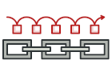
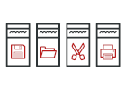
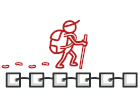
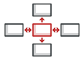
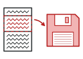
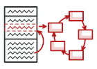
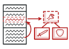
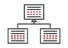
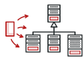

# Behavioral Design Pattern

Behavioral Pattern quan tâm đến việc giao tiếp hiệu quả và phân công nhiệm vụ giữa các đối tượng.

## Chain of Responsibility

Cho phép bạn truyền các yêu cầu dọc theo một chuỗi xử lý. Khi nhận được yêu cầu, mỗi trình xử lý sẽ quyết định xử lý yêu cầu hoặc truyền nó cho trình xử lý tiếp theo trong chuỗi.

## Command

Biến một yêu cầu thành một đối tượng độc lập bao gồm tất cả thông tin của yêu cầu đó. Chuyển đổi này giúp bạn truyền các yêu cầu dưới dạng tham số của phương thức, trì hoãn hoặc chờ đợi việc thực thi một yêu cầu hay hỗ trợ các hoạt động hoàn tác. 

## Iterator

Duyệt phần tử của một tập hợp mà không để lộ dạng cơ bản của nó (danh sách, ngăn xếp, cây, ...)

## Mediator

Giúp bạn giảm các phụ thuộc hỗn tạp giữa các đối tượng. Pattern hạn chế các giao tiếp trực tiếp giữa các đối tượng và buộc nó giao tiếp thông qua đối tượng mediator.

## Memento

Lưu và phục hồi trạng thái trước đó của một đối tượng mà không để lộ chi tiết triển khai của nó

## Observer

Giúp bạn định nghĩa một cơ chế đăng ký để thông báo cho nhiều đối tượng về bất kỳ sự kiện nào diễn ra với đối tượng mà chúng đang quan sát.

## State

Chỉnh sửa hành vi của một đối tượng khi trạng thái bên trong nó thay đổi. Nó xảy ra nếu như một đối tượng thay đổi lớp của nó.

## Strategy

Giúp bạn xác định một nhóm thuật toán, đặt chúng vào một lớp riêng biệt và làm cho các đối tượng của chúng có thể hoán đổi lẫn nhau.

## Template Method

Định nghĩa bộ khung của thuật toán ở lớp cha (superclass) nhưng các lớp con (subsclasses) có thể ghi đè lên các bước cụ thể của thuật toán mà không làm thay đổi cấu trúc của nó.

## Visitor

Tách các thuật toán khỏi đối tượng mà chúng đang hoạt động trên đó.
