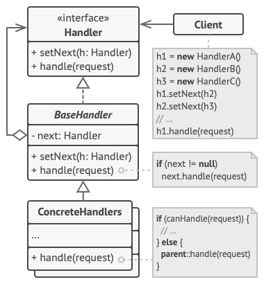
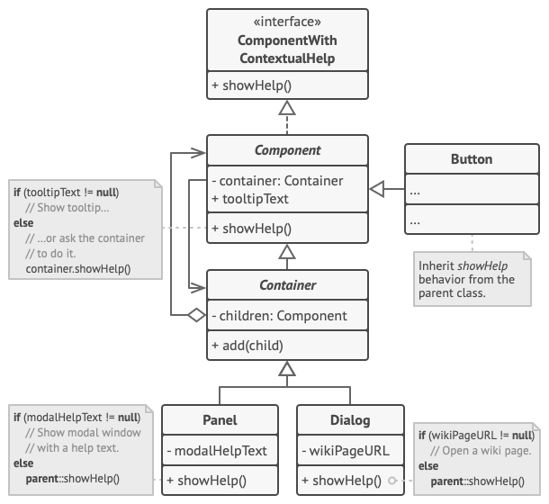
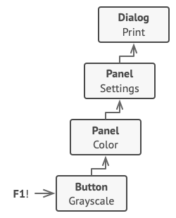

# Chain of Responsibility

## 📜 Mục đích

**Chain of Responsibility** là một design pattern trong nhóm behavioral cho phép bạn truyền các yêu cầu dọc theo một chuỗi xử lý. Khi nhận được yêu cầu, mỗi trình xử lý sẽ quyết định xử lý yêu cầu hoặc truyền nó cho trình xử lý tiếp theo trong chuỗi.


## 😟 Vấn đề

Tưởng tượng bạn đang làm việc với hệ thống đặt hàng trực tuyến. Bạn muốn giới hạn truy cập đến hệ thống để chỉ những người dùng đã xác thực mới có thể đặt đơn hàng. Còn người quản trị viên (admin) có thể truy cập đến tất cả đơn hàng.

Sau khi lên kế hoạch, bạn nhận ra là các trình kiểm tra(check) phải làm việc liên tục. Vì ứng dụng có thể phải xác thực người dùng bất cứ khi nào hệ thống nhận về yêu cầu có kèm theo chứng thư của người dùng. Tuy nhiên, nếu chứng thư không hợp lệ và việc xác thực thất bại, thì sẽ không có bất kỳ trình kiểm tra nào khác xử lý nó.


Trong nhiều tháng tiếp theo, bạn đã phải triển khai rất nhiều các trình kiểm tra liên tục:
- Một người đồng nghiệp đề nghị rằng sẽ không an toàn khi truyền dữ liệu thuần thẳng đến hệ thống. Bạn cần thêm một bước xác nhận tính hợp lệ của dữ liệu trong yêu cầu.
- Sau đó, một ai đó nói rằng hệ thống của bạn dễ bị tấn công brute force để dò mật khẩu. Để tránh điều đó, bạn phải thêm một trình kiểm tra để lọc các yêu cầu thất bại lặp lại bởi cùng một địa chỉ IP.
- Tiếp đến bạn có thêm đề nghị là nên tăng tốc hệ thống bằng cách sử dụng kết quả từ bộ đệm với những yêu cầu lặp lại cùng một dữ liệu. Do đó, bạn phải thêm tiếp một trình kiểm tra khác để chỉ truyền các yêu cầu đến hệ thống khi nó không phù hợp với phản hồi từ cache.


Code cho trình kiểm tra của bạn đã lộn xộn, giờ đây nó còn tệ hơn lúc trước khi bạn thêm các tính năng mới. Thay đổi một trình kiểm tra thỉnh thoảng sẽ ảnh hưởng lên cả những cái khác. Và tệ hơn nữa là khi bạn muốn dùng lại trình kiểm tra cho các bộ phận khác trong hệ thống, bạn phải sao chép một phần code vì bộ phận đó chỉ yêu cầu vài trình kiểm tra chứ không phải tất cả.

Hệ thống sẽ trở nên rất khó hiểu và khó hơn để bảo trì. Sau nhiều ngày đấu tranh với code bạn quyết định refactor tất cả mọi thứ.

## 😊 Giải pháp

Giống như các behavioral khác, **Chain of Responsibility** dựa trên việc chuyển đổi các hành vi riêng biệt thành các đối tượng độc lập được gọi là **handlers**. Trong trường hợp này, mỗi trình kiểm tra sẽ mở rộng các lớp của nó với một phương thức đơn nhất thực hiện công việc kiểm tra. Yêu cầu và dữ liệu của nó, được truyền đến phương thức này như là một tham số.

Pattern gợi ý bạn liên kết các handler thành một chuỗi(chain). Mỗi handler được liên kết có một trường cho lưu trữ tham chiếu đến handler kế tiếp trong chuỗi. Thêm vào đó, để xử lý một yêu cầu, handler truyền yêu cầu đến xa hơn theo chuỗi. Yêu cầu sẽ chạy khắp chuỗi cho đến khi tất cả handler có cơ hội xử lý nó.

Điều quan trọng ở đây: handler có thể quyết định không truyền yêu cầu sâu hơn trong chuỗi và dừng bất kỳ việc xử lý nào một cách hiệu quả.

Ở ví dụ với hệ thống đặt hàng, một handler thực hiện xử lý sau đó quyết định truyền yêu cầu sâu hơn. Giả định yêu cầu bao gồm dữ liệu hợp lệ, tất cả handler có thể thực thi hành vi chính của nó, cho dù đó là kiểm tra xác thực hay bộ nhớ đệm.


Tuy nhiên, có một cách tiếp cận khác nhẹ nhàng hơn (và chuẩn hơn), mỗi khi nhận được yêu cầu, một handler quyết định liệu nó có thể xử lý hay không. Nếu nó có thể, sẽ không phải truyền yêu cầu xa hơn. Thế nên, sẽ chỉ có một handler để xử lý yêu cầu hoặc không có cái nào cả. Cách tiếp cận này rất giống với xử lý sự kiện trong ngăn xếp phần tử ở giao diện đồ hoạ người dùng.

Ví dụ, khi người dùng click một button, sự kiện sẽ truyền đến chuỗi phần tử GUI, bắt đầu với button, tiếp đến là container(có thể là form hoặc panel) và kết thúc ở của sổ chính của ứng dụng. Sự kiện sẽ được xử lý ở phần tử đầu tiên trong chuỗi có thể xử lý nó. Ví dụ này đáng lưu tâm vì nó cho thấy một chuỗi có thể mở rộng từ một đối tượng cây.


Điều quan trọng là tất cả lớp handler phải triển khai cùng interface. Mỗi handler cụ thể chỉ nên quan tâm một thứ theo sau phương thức thực thi. Cách này giúp bạn có thể tạo chuỗi khi đang chạy, sử dụng handler khác nhau mà không cần ghép code với lớp cụ thể của nó.

## 🚗 Thế Giới Thực

Bạn vừa mua và cài đặt một vài phần cứng mới lên máy tính của bạn. Ví lý do cá nhân, nên máy tính bạn có nhiều hệ điều hành. Bạn thử boot tất cả và xem phần cứng có được hỗ trợ không. Window nhận ra nó và tự động enable phần cứng. Nhưng, Linux yêu dấu của bạn lại từ chối làm việc với phần cứng mới. Bất lực, bạn quyết định gọi đến số điện thoại hỗ trợ khi mua phần cứng.

Thứ đầu tiên mà bạn nghe là giọng robot phản hồi tự động. Nó đề nghị các giải pháp phổ biến với nhiều vấn đề khác nhau nhưng không cái nào liên quan đến trường hợp của bạn. Sau đấy, robot kết nối bạn với nhà điều hành trực tiếp.

Xui xẻo, nhà điều hành cũng không thể đề xuất được điều gì cụ thể. Anh ta cứ nói theo hướng dẫn sử dụng, và không chịu lắng nghe bạn. Sau khi nghe: "bạn đã thử tắt máy và bật lại chưa" khoảng 10 lần, bạn đề nghi kết nối đến kỹ sư thích hợp.

Sau cùng, nhà điều hành chuyển cuộc gọi của bạn đến kỹ sư, một người có lẽ khao khát được nói chuyện trực tiếp với con người hàng giờ khi anh ta ngồi cô đơn trong phòng server ở một hầm tối nào đó trong toà nhà nào đó. Kỹ sư nói với bạn nơi tải về drive thích hợp cho phần cứng của bạn và cách cài đặt nó trên Linux. Cuối cùng vấn đề được giải quyết. 


## 🏢 Cấu trúc



1. **Handler** khai báo interface chung cho tất cả concrete handler. Nó thường chỉ bao gồm một phương thức đơn nhất cho tất cả yêu cầu xử lý, nhưng thỉnh thoảng nó có thể chứa phương thức khác cho cài đặt handler tiếp theo trong chuỗi.
2. **Base Handler** là lớp tuỳ chọn, nơi bạn có thể đặt code mẫu vào tất cả lớp handler.
Thông thường, lớp này định nghĩa một trường lưu trữ tham chiếu đến handler kế tiếp. Client có thể tạo chuỗi bằng cách truyền handler đến hàm khởi tạo hoặc setter của handler trước đó. 

    Lớp còn có thể triển khai các xử lý mặc định: nó có thể truyền thực thi sang handler tiếp theo sau khi kiểm tra sự tồn tại của nó.
3. **Concrete Handler** bao gồm đoạn code thực cho yêu cầu xử lý. Khi nhận yêu cầu, mỗi handler phải quyết định xử lý nó hoặc truyền nó dọc theo chuỗi.
Handler thường là khép kín và bất biến, nhận mỗi dữ liệu cần thiết chỉ một lần thông qua hàm khởi tạo.
4. **Client** có thể tạo chuỗi chỉ một lần hoặc tạo động, dựa trên logic của ứng dụng. Lưu ý yêu cầu có thể được gửi đến bất kỳ handler nào trong chuỗi, không nhất thiết phải là đầu tiên.

## 👨‍💻 Mã giả

Trong ví dụ này, Chain of Responsibility chịu trách nhiệm hiển thị thông tin trợ giúp cho người dùng theo ngữ cảnh ở các phần tử GUI đang hoạt động.



Ứng dụng GUI thường có cấu trúc là một đối tượng cây. Ví dụ, lớp `Dialog`, thứ sẽ hiển thị cửa sổ chính của ứng dụng, sẽ là *root* của đối tượng cây. Dialog bao gồm `Panels`, sẽ chứa những panel khác hoặc phần tử đơn giản hơn như `Button` hay `TextFields`.

Một phần tử đơn giản có thể hiển thị `tooltips` theo ngữ cảnh dễ dàng, miễn là thành phần đó có một số văn bản trợ giúp được chỉ định. Nhưng các thành phần phức tạp hơn xác định cách riêng của chúng để hiển thị trợ giúp theo ngữ cảnh, chẳng hạn như hiển thị đoạn trích từ sách hướng dẫn hoặc mở trong trình duyệt.



Khi người dùng click vào một phần tử và nhấn phím `F1`, ứng dụng sẽ xác định thành phần được click và gửi yêu cầu trợ giúp. Yêu cầu chạy qua tất cả các container của phần tử cho đến khi đến được phần tử có khả năng hiển thị thông tin trợ giúp.

```c
// Interface handler khai báo một phương thức cho tạo chuỗi
// handler. Nó còn khai báo một phương thức thực thi yêu cầu.
interface ComponentWithContextualHelp is
    method showHelp()


// Lớp cơ sở cho các thành phần đơn giản.
abstract class Component implements ComponentWithContextualHelp is
    field tooltipText: string

    // Thành phần của container hành độn như một liên kết 
    // tiếp theo trong chuỗi handler.
    protected field container: Container

    // Thành phần hiển thị tooltip nếu nó có văn bản trợ giúp
    // được chỉ định cho nó. Nếu không nó chuyển tiếp cuộc gọi
    // đến container.
    method showHelp() is
        if (tooltipText != null)
            // Hiển thị tooltip.
        else
            container.showHelp()


// Container có thể bao gồm thành phần đơn giản hoặc container khác.
// Chuỗi quan hệ được thiết lập ở đây. Lớp kế thừa hành vi `showHelp`
// từ cha của nó.
abstract class Container extends Component is
    protected field children: array of Component

    method add(child) is
        children.add(child)
        child.container = this


// Thành phần nguyên thuỷ có thể ổn với triển khai
// trợ giúp mặc định...
class Button extends Component is
    // ...


// Nhưng với thành phần phức tạp, nó có thể ghi đè triển khai mặc
// định. Nếu văn bản trợ giúp không thể được cung cấp theo cách mới, 
// thành phần có thể gọi triển khai cơ sở (xem lớp Component).
class Panel extends Container is
    field modalHelpText: string

    method showHelp() is
        if (modalHelpText != null)
            // Hiển thị cửa sổ modal với văn bản trợ giúp.
        else
            super.showHelp()

// ...giống như trên...
class Dialog extends Container is
    field wikiPageURL: string

    method showHelp() is
        if (wikiPageURL != null)
            // Hiển thị trang wiki trợ giúp.
        else
            super.showHelp()


// Code ở client.
class Application is
    // Mọi ứng dụng cấu hình chuỗi khác nhau.
    method createUI() is
        dialog = new Dialog("Budget Reports")
        dialog.wikiPageURL = "http://..."
        panel = new Panel(0, 0, 400, 800)
        panel.modalHelpText = "This panel does..."
        ok = new Button(250, 760, 50, 20, "OK")
        ok.tooltipText = "This is an OK button that..."
        cancel = new Button(320, 760, 50, 20, "Cancel")
        // ...
        panel.add(ok)
        panel.add(cancel)
        dialog.add(panel)

    // Hãy tưởng tượng điều gì xảy ra ở đây.
    method onF1KeyPress() is
        component = this.getComponentAtMouseCoords()
        component.showHelp()
```

## 💡 Ứng dụng
**🐞 Sử dụng Chain of Responsibility khi chương trình của bạn phải xử lý các loại yêu cầu khác nhau bằng nhiều cách khác nhau, nhưng kiểu yêu cầu chính xác và trật tự của nó thì không biết trước.**

⚡ CoR giúp bạn liên kết nhiều handler thành một chuỗi và khi nhận yêu cầu, sẽ "hỏi" mỗi handler có thể xử lý nó không. Cách này giúp tất cả handler có cơ hội xử lý yêu cầu.

**🐞 Sử dụng CoR khi nó là thiết yếu để thực thi nhiều handler trong một trật tự cụ thể**

⚡ Vì bạn có thể liên kết các handler trong chuỗi theo bất kỳ thứ tự nào, tất cả yêu cầu có thể đi qua chuỗi theo chính xác những gì bạn định ra.

**🐞 Sử dụng CoR khi tập hợp handler và thứ tự của chúng thay đổi theo thời gian**

⚡ Nếu bạn cung cấp setter cho trường tham chiếu trong lớp handler, bạn có thể chèn, xoá hoặc thay đổi thứ tự handler.

## 📋 Triển khai

1. Khai báo interface handler và mô tả signature của một phương thức để xử lý các yêu cầu.
    Quyết định cách client sẽ truyền dữ liệu yêu cầu vào phương thức. Cách linh hoạt nhất là chuyển yêu cầu thành một đối tượng và chuyển nó đến phương thức xử lý dưới dạng một tham số.

2. Để loại bỏ code mẫu trùng lặp trong concrete handler, cần tạo một lớp handler cơ sở trừu tượng, bắt nguồn từ interface handler.

    Lớp này phải có một trường để lưu trữ một tham chiếu đến handler tiếp theo trong chuỗi. Xem xét việc làm cho lớp trở nên bất biến. Tuy nhiên, nếu bạn định sửa đổi chuỗi trong thời gian chạy, bạn cần xác định một setter để thay đổi giá trị của trường tham chiếu.

    Bạn cũng có thể triển khai hành vi mặc định thuận tiện cho phương pháp xử lý, đó là chuyển tiếp yêu cầu đến đối tượng tiếp theo trừ khi không còn đối tượng nào. Các concrete handler có thể sử dụng hành vi này bằng cách gọi phương thức cha.

3. Từng cái một tạo các lớp con của concrete handler và thực hiện các phương pháp xử lý của chúng. Mỗi handler phải đưa ra hai quyết định khi nhận được yêu cầu:
    - Liệu nó có xử lý yêu cầu hay không.
    - Liệu nó có chuyển yêu cầu theo chuỗi hay không.

4. Client có thể tự lắp ráp chuỗi hoặc nhận chuỗi được tạo sẵn từ các đối tượng khác. Trong trường hợp sau, bạn phải triển khai một số lớp factory để xây dựng chuỗi theo cấu hình hoặc cài đặt môi trường.

5. Client có thể kích hoạt bất kỳ handler nào trong chuỗi, không chỉ handler đầu tiên. Yêu cầu sẽ được chuyển dọc theo chuỗi cho đến khi một số handler từ chối chuyển thêm hoặc cho đến khi nó đến cuối chuỗi.

6. Do tính chất động của chuỗi, client nên sẵn sàng xử lý các tình huống sau:
    - Chuỗi có thể bao gồm một liên kết duy nhất.
    - Một số yêu cầu có thể không đến cuối chuỗi.
    - Những yêu cầu khác có thể đến cuối chuỗi không được xử lý.

## ⚖️ Ưu nhược điểm

### Ưu điểm

✔️ Bạn có thể kiểm soát thứ tự xử lý yêu cầu.

✔️ *Single Responsibility Principle*. Bạn có thể tách các lớp gọi hoạt động từ các lớp thực hiện hoạt động.

✔️ *Open/Closed Principle*. Bạn có thể thêm handler mới vào ứng dụng mà không ảnh hưởng đến code client hiện có.

### Nhược điểm

❌ Một số yêu cầu có thể không được giải quyết.

## 🔁 Quan hệ với các pattern khác

**Chain of Responsibility**, **Command**, **Mediator** và **Observer** giải quyết các cách khác nhau để kết nối người gửi và người nhận yêu cầu:

- **CoR** chuyển một yêu cầu tuần tự dọc theo một chuỗi động gồm những người nhận tiềm năng cho đến khi một trong số họ xử lý nó.
- **Command** thiết lập các kết nối một chiều giữa người gửi và người nhận.
- **Mediator** loại bỏ các kết nối trực tiếp giữa người gửi và người nhận, buộc họ phải giao tiếp gián tiếp thông qua một đối tượng trung gian.
- **Observer** cho phép người nhận đăng ký động và hủy đăng ký nhận yêu cầu. 

**Chain of Responsibility** thường được sử dụng cùng với **Composite**. Trong trường hợp này, khi một thành phần leaf nhận được một yêu cầu, nó có thể chuyển nó qua chuỗi của tất cả các thành phần mẹ xuống gốc của cây đối tượng.

Handler trong **Chain of Responsibility** có thể triển khai như **Command**. Trong trường hợp này bạn có thể thực thi các hành động khác nhau trên cùng một đối tượng ngữ cảnh, được biểu diễn bởi yêu cầu.

Tuy nhiên, có cách tiếp cận khác, khi bản thân yêu cầu là một đối tượng **Command**. Trong trường hợp này bạn có thể thực thi cùng một hành động trên một loạt các ngữ cảnh khác nhau được liên kết thành một chuỗi.

**Chain of Responsibility** và **Decorator** có cấu trúc lớp rất giống nhau. Cả hai pattern đều dựa vào thành phần đệ quy để truyền việc thực thi qua một loạt các đối tượng. Tuy nhiên, có một số khác biệt quan trọng.

Các handler trong **CoR** có thể thực hiện các hoạt động tùy ý độc lập với nhau. Nó cũng có thể ngừng chuyển yêu cầu thêm vào bất kỳ lúc nào. Mặt khác, các **Decorator** khác nhau có thể mở rộng hành vi của đối tượng trong khi vẫn giữ cho nó nhất quán với interface cơ sở. Ngoài ra, **Decorator** không được phép phá vỡ quy trình của yêu cầu.

# Nguồn

[refactoring](https://refactoring.guru/design-patterns/chain-of-responsibility)
