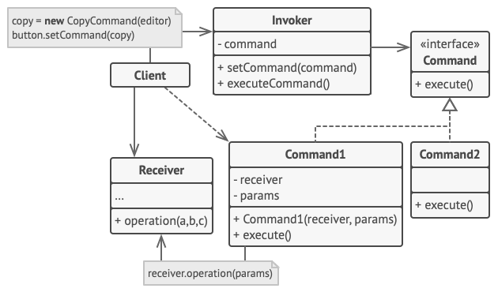
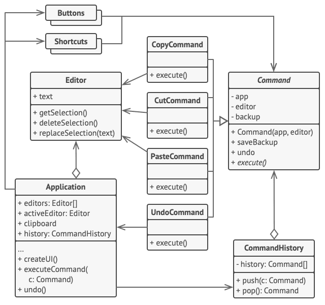

# Command

## 📜 Mục đích

**Command** là một design pattern thuộc nhóm behavioral, nó biến một yêu cầu thành một đối tượng độc lập bao gồm tất cả thông tin của yêu cầu đó. Chuyển đổi này giúp bạn truyền các yêu cầu dưới dạng tham số của phương thức, trì hoãn hoặc chờ đợi việc thực thi một yêu cầu hay hỗ trợ các hoạt động hoàn tác. 


## 😟 Vấn đề

Tưởng tượng bạn đang làm việc với một ứng dụng soạn thảo văn bản. Công việc hiện tại của bạn là tạo một thanh công cụ với nhóm button cho các thao tác khác nhau của editor. Bạn đã tạo một lớp `Button` gọn gàng để có thể dùng cho các button khác của thanh công cụ, cũng như cho các button chung ở các cửa sổ khác.


Trong khi tất cả button này trông giống nhau, thì chúng lại hỗ trợ những công việc khác nhau. 

Vậy bạn sẽ đặt code cho các xử lý thao tác click khác nhau của chúng ở đâu ? Giải pháp đơn giản nhất là tạo hàng nghìn lớp con cho từng nơi mà button được sử dụng. Các lớp con này sẽ bao gồm code cho thực thi thao tác click.


Rất nhanh chóng, bạn nhận ra cách tiếp cận này tồn đọng rất nhiều thiếu sót. Đầu tiên, bạn sẽ có một số lượng rất lớn lớp con, và nó sẽ không ổn khi bạn sửa đổi lớp `Button` cơ sở vì bạn phải thay đổi tất cả các lớp con của nó. Nói một cách đơn giản, code GUI của bạn đã trở nên phụ thuộc một cách khó hiểu vào những đoạn code dễ thay đổi của logic nghiệp vụ. 


Và phần tồi tệ hơn ở đây. Một vài thao tác như copy/paste, sẽ cần được gọi từ rất nhiều nơi. Ví dụ, người dùng có thể click vào button "Copy" trên thanh công cụ, hoặc thực hiện thông quan menu hay chỉ đơn giản là Ctrl+C trên bàn phím.

Ban đầu, khi ứng dụng của bạn chỉ có một thanh công cụ, có thể đặt việc triển khai các hoạt động khác nhau vào các lớp con của button. Nói cách khác, ta có code để sao chép văn bản bên trong lớp con `CopyButton`. Nhưng sau đó, khi bạn triển khai menu, lối tắt và những thứ khác, bạn phải sao chép code của thao tác trong nhiều lớp hoặc làm cho menu phụ thuộc vào các button, mọi thứ sẽ trở nên tệ hoặc tệ hơn nữa.

## 😊 Giải pháp

Một thiết kế phần mềm tốt thường dựa trên *nguyên tắc tách biệt các mối quan tâm*, điều này thường dẫn đến việc chia ứng dụng thành nhiều lớp. Ví dụ phổ biến nhất: một lớp cho giao diện người dùng đồ họa và một lớp khác cho logic nghiệp vụ. Lớp GUI chịu trách nhiệm hiển thị hình ảnh đẹp mắt trên màn hình, thu nhận bất kỳ đầu vào nào và hiển thị kết quả về những gì người dùng và ứng dụng đang làm. Tuy nhiên, khi cần làm điều gì đó quan trọng, như tính toán quỹ đạo của mặt trăng hoặc soạn báo cáo hàng năm, lớp GUI sẽ ủy quyền công việc cho lớp logic nghiệp vụ cơ bản.

Trong đoạn code, nó có thể trông như thế này: một đối tượng GUI gọi một phương thức của đối tượng logic nghiệp vụ, truyền cho nó một số tham số. Quá trình này thường được mô tả như một đối tượng gửi một yêu cầu khác.


Command gợi ý rằng các đối tượng GUI không nên gửi trực tiếp các yêu cầu này. Thay vào đó, bạn nên trích xuất tất cả các chi tiết yêu cầu, chẳng hạn như đối tượng được gọi, tên của phương thức và danh sách các đối số vào một lớp command riêng biệt với một phương thức kích hoạt yêu cầu này.

Các đối tượng command đóng vai trò là liên kết giữa các đối tượng GUI và logic nghiệp vụ khác nhau. Từ bây giờ, đối tượng GUI không cần biết đối tượng logic nghiệp vụ nào sẽ nhận được yêu cầu và cách xử lý yêu cầu. Đối tượng GUI chỉ cần kích hoạt command, nó sẽ xử lý tất cả các chi tiết.


Bước tiếp theo là làm cho các command của bạn triển khai cùng một interface. Thông thường nó chỉ có một phương thức thực thi duy nhất mà không cần tham số. Interface này cho phép bạn sử dụng các command khác nhau với cùng một người gửi yêu cầu mà không cần kết hợp nó với các lớp command cụ thể. Như vậy, giờ đây bạn có thể chuyển đổi các đối tượng command được liên kết với người gửi, hay thay đổi một cách hiệu quả hành vi của người gửi trong thời gian chạy.

Bạn có thể nhận thấy một phần còn thiếu của vấn đề, đó là các tham số yêu cầu. Một đối tượng GUI có thể đã cung cấp cho đối tượng lớp nghiệp vụ một số tham số. Vì phương thức thực thi của command không có bất kỳ tham số nào, như vậy chúng ta sẽ chuyển các chi tiết yêu cầu đến người nhận như thế nào? Hóa ra command phải được cấu hình trước với dữ liệu này hoặc có khả năng tự lấy nó.


Hãy quay lại trình soạn thảo văn bản. Sau khi áp dụng Command, ta không còn cần đến tất cả các lớp con của button đó để thực hiện các hành vi click chuột khác nhau. Chỉ cần đặt một trường vào lớp `Button` cơ sở là đủ để lưu trữ tham chiếu đến đối tượng command và làm cho button thực hiện command đó khi click chuột.

Bạn sẽ triển khai một loạt các lớp command cho mọi hoạt động có thể và liên kết chúng với các button cụ thể, tùy thuộc vào hành vi dự kiến của các button.

Các phần tử GUI khác, chẳng hạn như menu, lối tắt hoặc toàn bộ hộp thoại, có thể được thực hiện theo cách tương tự. Chúng sẽ được liên kết với một command được thực thi khi người dùng tương tác với phần tử GUI. Như bạn có thể đoán bây giờ, các phần tử liên quan đến các hoạt động giống nhau sẽ được liên kết với các command giống nhau, ngăn chặn bất kỳ sự trùng lặp code nào.

Kết quả là, các command trở thành một lớp trung gian thuận tiện giúp giảm sự ghép nối giữa GUI và các lớp logic nghiệp vụ. Và đó chỉ là một phần nhỏ trong số những lợi ích mà Command có thể mang lại!

## 🚗 Thế Giới Thực


Sau khi đi bộ qua thành phố, bạn đến một nhà hàng sang trọng và ngồi vào bàn bên cửa sổ. Một người phục vụ thân thiện tiếp cận bạn và nhận đơn đặt hàng của bạn, viết nó ra một tờ giấy. Người phục vụ đi vào bếp và dán thứ tự lên tường. Sau một thời gian, đơn đặt hàng được chuyển đến đầu bếp, người sẽ đọc và nấu bữa ăn cho phù hợp. Người đầu bếp đặt bữa ăn vào khay cùng với thứ tự. Người phục vụ lấy khay, kiểm tra thứ tự để đảm bảo mọi thứ đều như bạn muốn và mang mọi thứ đến bàn của bạn.

Trật tự trên giấy dùng như một command. Nó vẫn còn trong hàng đợi cho đến khi đầu bếp sẵn sàng phục vụ nó. Đơn đặt hàng chứa tất cả các thông tin liên quan cần thiết để nấu bữa ăn. Nó cho phép đầu bếp bắt đầu nấu ăn ngay lập tức thay vì chạy xung quanh để làm rõ chi tiết đơn đặt hàng trực tiếp từ bạn.

## 🏢 Cấu trúc



1. **Sender** (hay còn gọi là invoker) là lớp chịu trách nhiệm khởi tạo các yêu cầu. Lớp này phải có một trường để lưu trữ một tham chiếu đến một đối tượng command. Sender(người gửi) kích hoạt command đó thay vì gửi yêu cầu trực tiếp đến receiver(người nhận). Lưu ý rằng sender không chịu trách nhiệm tạo đối tượng command. Thông thường, nó nhận một command được tạo trước từ client thông qua phương thức khởi tạo.
2. **Command** là interface, thường khai báo một phương thức đơn nhất để thực hiện lệnh.
3. **Concrete Command** thực hiện nhiều loại yêu cầu khác nhau. Một command cụ thể không được phép tự thực hiện công việc, mà chỉ chuyển lệnh gọi đến một trong các đối tượng logic nghiệp vụ. Tuy nhiên, để đơn giản hóa code, các lớp này có thể được hợp nhất.

    Các tham số cần thiết để thực thi một phương thức trên một đối tượng nhận có thể được khai báo dưới dạng các trường trong concrete command. Bạn có thể làm cho các đối tượng command trở nên bất biến bằng cách chỉ cho phép khởi tạo các trường này thông qua phương thức khởi tạo.
4. **Receiver** là lớp chứa một số logic nghiệp vụ. Hầu như bất kỳ đối tượng nào cũng có thể hoạt động như một receiver. Hầu hết các command chỉ xử lý các chi tiết về cách một yêu cầu được chuyển đến receiver, trong khi receiver phải tự thực hiện công việc thực tế.
5. **Client** tạo và cấu hình các đối tượng command cụ thể. Client phải chuyển tất cả các tham số yêu cầu, bao gồm cả sender, vào phương thức khởi tạo của command. Sau đó, command kết quả có thể được liên kết với một hoặc nhiều receiver.

## 👨‍💻 Mã giả

Trong ví dụ này, Command giúp bạn theo dõi lịch sử các thao tác thực thi và hoàn tác nó nếu cần thiết.



Command dẫn đến các thay đổi trạng thái của editor (sao chép, cắt, dán) sẽ tạo bản sao lưu trạng thái của editor trước khi thực thi một thao tác liên kết với command. Sau khi command thực thi, nó lưu vào lịch sử command(một ngăn xếp các đối tượng command) cùng với bản sao lưu trạng thái của editor tại thời điểm đó. Sau đó, nếu người dùng cần hoàn tác một hành động, ứng dụng có thể lấy command gần nhất từ lịch sử, đọc bản sao liên kết với trạng thái của editor và phục hồi nó.

Code client (phần tử GUI, lịch sử command) không phải ghép với lớp command cụ thể bởi vì nó hoạt động với command thông qua interface command. Cách tiếp cận này giúp bạn thêm command mới vào ứng dụng mà không ảnh hưởng gì đến code hiện có.

```c
// Lớp command cơ sở xác định interface chung cho tất cả
// concrete command.
abstract class Command is
    protected field app: Application
    protected field editor: Editor
    protected field backup: text

    constructor Command(app: Application, editor: Editor) is
        this.app = app
        this.editor = editor

    // Tạo một bản sao lưu trạng thái editor.
    method saveBackup() is
        backup = editor.text

    // Phục hồi trạng thái editor.
    method undo() is
        editor.text = backup

    // Phương thức thực thi khai báo trừu tượng cho tất cả
    // concrete command tạo các triển khai của riêng nó.
    // Phương thức trả về true hoặc false tuỳ thuộc vào command
    // có thay đổi trạng thái editor hay không.
    abstract method execute()


// Concrete command ở đây.
class CopyCommand extends Command is
    // Bản sao command không được lưu vào lịch sử vì nó
    // không thay đổi trạng thái editor.
    method execute() is
        app.clipboard = editor.getSelection()
        return false

class CutCommand extends Command is
    // Command cut thay đổi trạng thái editor, do đó nó phải
    // được lưu vào lịch sử. Và nó sẽ được lưu miễn là 
    // phương thức trả về true.
    method execute() is
        saveBackup()
        app.clipboard = editor.getSelection()
        editor.deleteSelection()
        return true

class PasteCommand extends Command is
    method execute() is
        saveBackup()
        editor.replaceSelection(app.clipboard)
        return true

// Thao tác undo cũng là command.
class UndoCommand extends Command is
    method execute() is
        app.undo()
        return false


// Lịch sử command chỉ là một ngăn xếp.
class CommandHistory is
    private field history: array of Command

    // Last in...
    method push(c: Command) is
        // Thêm command vào cuối của mảng lịch sử.

    // ...first out
    method pop():Command is
        // Lấy command gần nhất khỏi lịch sử.


// Lớp editor thực hiện các thao tác thực. Nó hoạt động như
// một receiver: tất cả command uỷ thác thực thi cho phương
// thức của editor.
class Editor is
    field text: string

    method getSelection() is
        // Trả về văn bản được chon.

    method deleteSelection() is
        // Xoá văn bản được chon.

    method replaceSelection(text) is
        // Chèn nội dung của clipboard vào vị trí hiện tại.

// Lóp ứng dụng thiết lập quan hệ đối tượng. Nó hành động như 
// một sender: khi điều gì đó cần hoàn thành, nó tạo đối tượng
// command và thực thi nó.
class Application is
    field clipboard: string
    field editors: array of Editors
    field activeEditor: Editor
    field history: CommandHistory

    // Đoạn code gán command cho các đối tượng UI 
    // có thể trông như thế này.
    method createUI() is
        // ...
        copy = function() { executeCommand(
            new CopyCommand(this, activeEditor)) }
        copyButton.setCommand(copy)
        shortcuts.onKeyPress("Ctrl+C", copy)

        cut = function() { executeCommand(
            new CutCommand(this, activeEditor)) }
        cutButton.setCommand(cut)
        shortcuts.onKeyPress("Ctrl+X", cut)

        paste = function() { executeCommand(
            new PasteCommand(this, activeEditor)) }
        pasteButton.setCommand(paste)
        shortcuts.onKeyPress("Ctrl+V", paste)

        undo = function() { executeCommand(
            new UndoCommand(this, activeEditor)) }
        undoButton.setCommand(undo)
        shortcuts.onKeyPress("Ctrl+Z", undo)

    // Thực thi command và kiểm tra xem nó có phải thêm vào lịch sử
    // hay không.
    method executeCommand(command) is
        if (command.execute)
            history.push(command)

    // Lấy command gần nhất khởi lịch sử và chạy phương thức undo.
    // Lưu ý ta không biết lớp của command này. Nhưng ta không cần
    // phải biết, vì command biết cách phải thực hiện hành động undo.
    method undo() is
        command = history.pop()
        if (command != null)
            command.undo()
```

## 💡 Ứng dụng

**🐞 Sử dụng Command khi bạn muốn tham số hoá đối tượng với thao tác**

⚡ Command có thể chuyển hoá một phương thức cụ thể thành một đối tượng độc lập. Thay đổi này mở ra nhiều công dụng hấp dẫn: bạn có thể truyền command như một tham số của phương thức, lưu trữ chúng trong các đối tượng khác, thay đổi command đã liên kết ngay khi đang chạy,...

Ví dụ: bạn đang phát triển một thành phần GUI như một menu ngữ cảnh, và bạn muốn người dùng của bản có thể cấu hình các phần của menu để kích hoạt thao tác khi người dùng click vào một mục.

**🐞 Sử dụng Command khi bạn muốn tạo hàng đợi các thao tác, lên lịch các thực thi của chúng hoặc thực thi chúng từ xa**

⚡ Như bất kỳ đối tượng nào khác, command có thể được serialized(chuyển hoá), có nghĩa là chuyển đổi từ một đối tượng thành một chuỗi có thể ghi vào file hay cơ sở dữ liệu. Sau đó, chuỗi có thể được phục hồi lại thành đối tượng command ban đầu. Do đó bạn có thể trì hoãn và lên lịch thực thi command. Với cùng cách đấy bạn có thể xếp hàng(queue), ghi nhật ký(log) hay gửi command qua mạng.

**🐞 Sử dụng Comment khi bạn muốn triển khai các thao tác nghịch đảo**.

⚡ Mặc dù có nhiều cách để thực hiện hoàn tác / làm lại, nhưng Command có lẽ là phổ biến nhất.

Để có thể hoàn tác các thao tác, bạn cần triển khai lịch sử của các hành động đã thực hiện. Lịch sử command là một ngăn xếp chứa tất cả các đối tượng command đã thực thi cùng với các bản sao lưu liên quan về trạng thái của ứng dụng.

Phương pháp này có hai nhược điểm. Đầu tiên, không dễ dàng để lưu trạng thái của ứng dụng vì một số trong số đó có thể là riêng tư. Vấn đề này có thể được giảm thiểu với pattern **Memento**.

Thứ hai, các bản sao lưu trạng thái có thể tiêu tốn khá nhiều RAM. Do đó, đôi khi bạn có thể sử dụng một cách triển khai thay thế: thay vì khôi phục trạng thái trong quá khứ, lệnh thực hiện thao tác nghịch đảo. Hoạt động ngược lại cũng có một cái giá: nó có thể khó hoặc thậm chí không thể thực hiện được.

## 📋 Triển khai

1. Khai báo interface command với phương thức thực thi đơn nhất.

2. Bắt đầu trích xuất yêu cầu vào lớp concrete command, triển khai từ interface command. Mỗi lớp phải có một tập hợp trường cho lưu trữ tham số yêu cầu cùng với tham chiếu đến đối tượng receiver. Tất cả giá trị này được khởi tạo thông qua hàm khởi tạo của command.

3. Xác định các lớp sẽ hành động như sender. Thêm trường lưu trữ command vào các lớp này. Sender sẽ giao tiếp với command của nó chỉ thông qua interface command. Sender thường không tạo đối tượng command cho nó, mà sẽ lấy chúng từ code client.

4. Thay đổi sender để chúng thực thi command thay vì gửi yêu cầu trực tiếp đến receiver.

5. Client nên khởi tạo đối tượng theo trật tự sau:
    - Tạo receiver.
    - Tạo command và liên kết với receiver nếu cần.
    - Tạo sender và liên kết với command cụ thể.

## ⚖️ Ưu nhược điểm

### Ưu điểm

✔️ *Single Responsibility Principle*. Bạn có thể tách các lớp gọi các thao tác từ các lớp thực hiện các thao tác này.

✔️ *Open/Closed Principle*. Bạn có thể thêm command mới vào ứng dụng mà không ảnh hưởng đến code client hiện có.

✔️ Bạn có thể triển khai hoàn tác/làm lại(undo/redo).

✔️ Bạn có thể triển khai thực hiện trì hoãn các thao tác.

✔️ Bạn có thể lắp ghép một tập hợp các command đơn giản thành một tập hợp các command phức tạp

### Nhược điểm

❌ Code có thể trở nên phức tạp hơn vì bạn đang thêm một lớp hoàn toàn mới giữa sender và receiver.

## 🔁 Quan hệ với các pattern khác

**Chain of Responsibility**, **Command**, **Mediator** và **Observer** giải quyết các cách khác nhau để kết nối người gửi và người nhận yêu cầu:

- **CoR** chuyển một yêu cầu tuần tự dọc theo một chuỗi động gồm những người nhận tiềm năng cho đến khi một trong số họ xử lý nó.
- **Command** thiết lập các kết nối một chiều giữa người gửi và người nhận.
- **Mediator** loại bỏ các kết nối trực tiếp giữa người gửi và người nhận, buộc họ phải giao tiếp gián tiếp thông qua một đối tượng trung gian.
- **Observer** cho phép người nhận đăng ký động và hủy đăng ký nhận yêu cầu. 

Handler trong **Chain of Responsibility** có thể triển khai như **Command**. Trong trường hợp này bạn có thể thực thi các hành động khác nhau trên cùng một đối tượng ngữ cảnh, được biểu diễn bởi yêu cầu.

Bạn có thể sử dụng **Command** và **Memento** cùng nhau khi thực hiện "hoàn tác". Trong trường hợp này, các command chịu trách nhiệm thực hiện các hoạt động khác nhau trên một đối tượng đích, trong khi các mementos lưu trạng thái của đối tượng đó ngay trước khi command được thực thi.

**Command** và **Strategy** có thể trông giống nhau vì bạn có thể sử dụng cả hai để tham số hóa một đối tượng bằng một số hành động. Tuy nhiên, chúng có mục đích rất khác nhau.

Bạn có thể sử dụng **Command** để chuyển đổi bất kỳ thao tác nào thành một đối tượng. Các tham số của thao tác trở thành các trường của đối tượng đó. Việc chuyển đổi cho phép bạn trì hoãn việc thực hiện thao tác, xếp hàng đợi, lưu trữ lịch sử lệnh, gửi lệnh đến các dịch vụ từ xa, v.v.

Mặt khác, **Strategy** thường mô tả các cách khác nhau để thực hiện cùng một việc, cho phép bạn hoán đổi các thuật toán này trong một lớp ngữ cảnh duy nhất.

**Prototype** có thể hữu ích khi bạn cần lưu các bản sao của **Command** vào lịch sử.

Bạn có thể coi **Visitor** như một phiên bản mạnh mẽ của **Command**. Các đối tượng của nó có thể thực thi các hoạt động trên các đối tượng khác nhau của các lớp khác nhau.

# Nguồn

[refactoring](https://refactoring.guru/design-patterns/command)