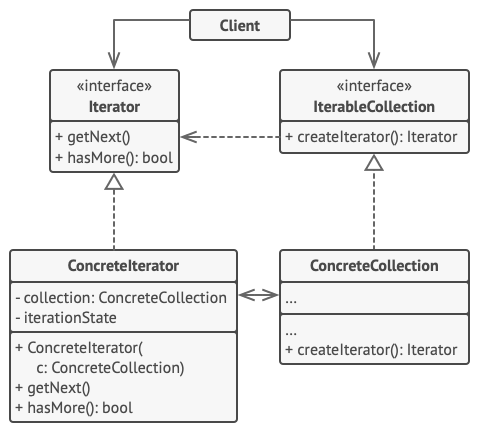
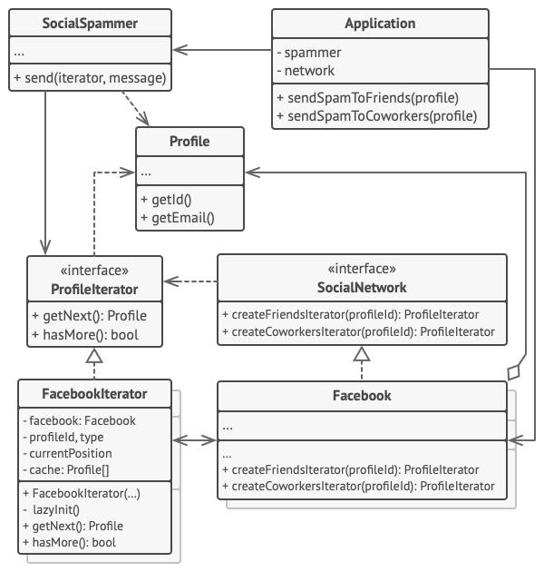

# Iterator

## 📜 Mục đích

**Iterator** là một design pattern thuộc nhóm behavioral giúp bạn duyệt phần tử của một tập hợp mà không để lộ dạng cơ bản của nó (danh sách, ngăn xếp, cây, ...)


## 😟 Vấn đề

Collection(tập hợp) là một trong những kiểu dữ liệu được sử dụng nhiều nhất trong lập trình. Hiểu đơn giản nó chỉ là nơi chứa cho một nhóm đối tượng.


Phần lớn tập hợp lưu trữ phần tử của nó bằng các danh sách đơn giản. Tuy nhiên một số lại sử dụng ngăn xếp, cây, đồ thị hoặc một cấu trúc dữ liệu phức tạp nào khác.

Nhưng việc tập hợp được tạo như thế nào không quan trọng, nó chỉ cần cung cấp một số cách để các đoạn code khác có thể truy cập và sử dụng phần tử của nó. Thế nên cần có một phương pháp để duyệt qua từng phần tử của tập hợp và đảm bảo truy cập không trùng lặp tại bất kỳ phần tử nào.

Điều này nghe có vẻ dễ dàng nếu tập hợp của bạn dựa trên dạng danh sách. Bạn chỉ việc lặp lại tất cả phần tử.

Nhưng nếu nó là một cấu trúc dữ liệu phức tạp khác như cây thì sao? Ví dụ, hôm nay bạn phải thực hiện duyệt cây theo chiều sâu(depth-first traversal), nhưng ngày hôm sau bạn lại nhận yêu cầu là cần thêm duyệt cây theo chiều rộng(breadth-first traversal), và các ngày kế tiếp bạn phải thực hiện các công việc khác như truy cập ngẫu nhiên ba phần tử,...


*Một tập hợp có thể duyệt theo nhiều cách*

Việc thêm nhiều thuật toán duyệt vào tập hợp có thể làm mờ đi nhiệm vụ chính của nó, là lưu trữ dữ liệu hiệu quả. Thêm vào đó, một vài thuật toán chỉ phù hợp với vài ứng dụng cơ bản, thế nên thêm nó vào lớp tập hợp chung có thể sẽ không phù hợp.

Mặt khác, code client làm việc với nhiều tập hợp khác nhau thường không quan tâm đến chúng lưu trữ phần tử như thế nào. Tuy nhiên, vì tập hợp cung cấp các cách khác nhau để truy cập phần tử, nên bạn không có lựa chọn nào khác ngoài kết hợp code của bạn với lớp tập hợp cụ thể.

## 😊 Giải pháp

Ý tượng ở đây là mở rộng hành vi duyệt của một tập hợp thành một đối tượng riêng biệt gọi là *iterator*.


Ngoài việc triển khai thuật toán chính, một đối tượng iterator còn đóng gói tất cả các chi tiết duyệt, chẳng hạn như vị trí hiện tại và số phần tử còn lại của tập hợp. Do đó, nhiều iterator có thể đi qua cùng một một tập hợp cùng lúc, độc lập với nhau.

Thông thường, các iterator cung cấp một phương thức chính để tìm nạp các phần tử của tập hợp. Client có thể tiếp tục chạy phương thức này cho đến khi nó không trả về bất kỳ thứ gì, có nghĩa là iterator đã duyệt qua tất cả các phần tử.

Tất cả các iterator phải triển khai cùng một interface. Điều này làm cho code client tương thích với bất kỳ loại tập hợp nào hoặc bất kỳ thuật toán duyệt nào miễn là có một iterator thích hợp. Nếu bạn cần một cách đặc biệt để duyệt qua một tập hợp, bạn chỉ cần tạo một lớp iterator mới mà không cần phải thay đổi tập hợp hoặc ứng dụng client.

## 🚗 Thế Giới Thực


Bạn có kế hoạch đi thăm Roma trong vài ngày và tham quan tất cả địa điểm chính nổi bật và thu hút. Nhưng khi đến đó, bạn có thể lãng phí nhiều thời gian để tìm đường, thậm chí bạn còn không thể tìm được đấu trường La Mã(nơi thông với mọi con đường).

Mặt khác bạn mua một ứng dụng hướng dẫn cho smartphone của bạn và dùng nó để tìm đường. Nó rất thông minh và tiện lợi, bạn có thể đến bất kỳ nơi thú vị nào mà bạn muốn.

Bên cạnh đó bạn cũng có thể bỏ ra một phần tiền cho chuyến đi để mướn một người địa phương, người nắm mọi con đường của thành phố trong lòng bàn tay. Hướng dẫn viên này có thể điều chỉnh hướng đi theo ý thích của bạn, chỉ cho bạn mọi điểm tham quan và kể rất nhiều điển tích thú vị. Điều đó sẽ tuyệt vời hơn ứng dụng điện thoại nhiều; nhưng, than ôi, cũng đắt hơn nhiều. 

Tất cả các tùy chọn này — đi đường ngẫu nhiên sinh ra trong đầu bạn, hướng dẫn trên điện thoại thông minh hoặc hướng dẫn của con người — hoạt động như các iterator trên tập hợp khổng lồ là các điểm tham quan và danh lam thắng cảnh ở Roma.

## 🏢 Cấu trúc



1. **Iterator** là interface khai báo các thao tác bắt buộc cho duyệt một tập hợp: lấy phần tử kế tiếp, trả về vị trí hiện tại, chạy lại vòng lặp,...
2. **Concrete Iterator** triển khai thuật toán cụ thể cho duyệt tập hợp. Đối tượng iterator nên theo dõi quá trình duyệt của nó. Điều này cho phép nhiều iterator duyệt cùng một tập hợp độc lập với nhau.
3. **Collection** là interface khai báo một hoặc nhiều phương thức để lấy các iterator tương thích với tập hợp. Lưu ý rằng kiểu trả về của phương thức phải được khai báo như interface iterator để cho concrete collection  có thể trả về kiểu iterator khác.
4. **Concrete Collections** trả về phiên bản mới của một lớp concrete iterator riêng biệt mỗi khi client yêu cầu nó. Bạn có thể hỏi rằng, phần code còn lại của tập hợp ở đâu ? Không cần lo lắng, nó sẽ ở cùng một lớp. Chỉ là những chi tiết này không thực sự quan trọng đối với pattern, vì vậy ta sẽ bỏ qua chúng.
5. **Client** làm việc với cả tập hợp và iterator thông qua interface của chúng. Cách này giúp client không phải ghép với lớp cụ thể, cho phép bạn sử dụng các tập hợp và iterator khác trên cùng một code.
Thông thường, client không tạo iterator của nó, thay vào đó nó lấy chúng từ tập hợp. Tuy nhiên, trong một số trường hợp nhất định, client có thể tạo trực tiếp một cái; ví dụ, khi client xác định iterator đặc biệt của riêng nó.

## 👨‍💻 Mã giả

Trong ví dụ này, Iterator được dùng để duyệt qua một tập hợp đặc biệt, một đồ thị mạng xã hội tương tự như Facebook. Tập hợp cung cấp nhiều iterator để duyệt hồ sơ người dùng theo nhiều cách khác nhau.



Iterator "friend" có thể sử dụng để duyệt qua các bạn bè của hồ sơ người dùng được cho. Iterator "colleagues" cũng tương tự, ngoại trừ việc nó bỏ qua những người bạn không làm chung công ty với người dùng. Cả hai iterator triển khai cùng interface nên cho phép client lấy thông tin hồ sơ mà không cần đi sâu vào chi tiết triển khai như là xác thực hay gửi yêu cầu REST. .

Code client không phải ghép với lớp cụ thể vì nó làm việc với tập hợp và iterator thông qua interface. Nếu bạn định kết nối ứng dụng của bạn với mạng xã hội mới, bạn chỉ cần làm đơn giản là cung cấp cho nó tập hợp mới và lớp iterator mà không cần thay đổi code hiện có.

```c
// Interface collection phải khai báo phương thức factory cho
// tạo các iterator. Bạn có thể khai báo nhiều phương thức nếu
// nó có các kiểu lặp khác nhau trong chương trình của bạn.
interface SocialNetwork is
    method createFriendsIterator(profileId):ProfileIterator
    method createCoworkersIterator(profileId):ProfileIterator


// Mỗi concrete collection được ghép với tập hợp lớp concrete iterator
// mà nó trả về. Nhưng client không cần làm vậy, vì signature của phương
// thức này trả về interface iterator.
class Facebook implements SocialNetwork is
    // ... Phần lớn code của tập hợp sẽ ở đây ...

    // Code tạo iterator.
    method createFriendsIterator(profileId) is
        return new FacebookIterator(this, profileId, "friends")
    method createCoworkersIterator(profileId) is
        return new FacebookIterator(this, profileId, "coworkers")


// Interface chung cho tất cả iterator.
interface ProfileIterator is
    method getNext():Profile
    method hasMore():bool


// Lớp concrete iterator.
class FacebookIterator implements ProfileIterator is
    // Iterator cần một tham chiếu đến tập hợp mà nó duyệt.
    private field facebook: Facebook
    private field profileId, type: string

    // Đối tượng iterator duyệt tập hợp độc lập với các iterator
    // khác. Do đó nó phải lưu trữ trạng thái iterator.
    private field currentPosition
    private field cache: array of Profile

    constructor FacebookIterator(facebook, profileId, type) is
        this.facebook = facebook
        this.profileId = profileId
        this.type = type

    private method lazyInit() is
        if (cache == null)
            cache = facebook.socialGraphRequest(profileId, type)

    // Mỗi lớp concrete iterator có triển khai riêng với interface
    // iterator chung.
    method getNext() is
        if (hasMore())
            currentPosition++
            return cache[currentPosition]

    method hasMore() is
        lazyInit()
        return currentPosition < cache.length


// Đây là một mẹo hữu ích khác: bạn có thể truyền một iterator 
// đến lớp client thay vì cấp cho nó quyền truy cập toàn bộ tập
// hợp. Với cách này bạn sẽ không để lộ tập hợp với client
//
// Và một lợi ích khác: bạn có thể thay đổi cách client làm việc
// với tập hợp khi đang chạy bằng cách truyền vào nó iterator khác.
// Nó hoàn toàn khả thi vì code client không ghép vói lớp iterator
// cụ thể.
class SocialSpammer is
    method send(iterator: ProfileIterator, message: string) is
        while (iterator.hasMore())
            profile = iterator.getNext()
            System.sendEmail(profile.getEmail(), message)


// Lớp ứng dụng cấu hình tập hợp và iterator, và truyền chúng
// vào code client.
class Application is
    field network: SocialNetwork
    field spammer: SocialSpammer

    method config() is
        if working with Facebook
            this.network = new Facebook()
        if working with LinkedIn
            this.network = new LinkedIn()
        this.spammer = new SocialSpammer()

    method sendSpamToFriends(profile) is
        iterator = network.createFriendsIterator(profile.getId())
        spammer.send(iterator, "Very important message")

    method sendSpamToCoworkers(profile) is
        iterator = network.createCoworkersIterator(profile.getId())
        spammer.send(iterator, "Very important message")
```

## 💡 Ứng dụng

**🐞 Sử dụng Iterator khi tập hợp của bạn có cấu trúc dữ liệu phức tạp và bạn muốn ẩn sự phức tập đó khỏi client(vì lý do thuận tiện hay bảo mật).**

⚡ Iterator đóng gói các chi tiết công việc với cấu trúc dữ liệu phức tạp, và cung cấp nó cho client bằng những phương thức truy cập đơn giản đến các phần tử. Nó không những đem lại sự thuận lợi cho client, mà còn bảo về tập hợp khỏi các nguy cơ tấn công mà client có thể thực hiện nếu kết nối trực tiếp.

**🐞 Sử dụng Iterator khi muốn giảm code duyệt trùng lặp trên ứng dụng của bạn**

⚡ Code của các thuật toán lặp đặc biệt thường có xu hướng rất cồng kềnh. Khi được đặt trong logic nghiệp vụ của một ứng dụng, nó có thể làm mờ trách nhiệm của code gốc và làm cho nó khó bảo trì hơn. Chuyển code duyệt đến các iterator cụ thể có thể giúp bạn làm cho code của ứng dụng gọn gàng và sạch sẽ hơn.

**🐞 Sử dụng Iterator khi bạn muốn code của bạn có thể duyệt các cấu trúc dữ liệu khác nhau mà kiểu của cấu trúc đấy là không biết trước**.

⚡ Pattern cung cấp một vài interface chung cho cả tập hợp và iterator. Giả sử code của bạn hiện sử dụng các interface này, code sẽ vẫn hoạt động nếu bạn chuyển cho code các loại tập hợp và iterator khác nhau triển khai các interface này.

## 📋 Triển khai

1. Khai báo interface iterator. Ít nhất, nó phải có một phương thức để duyệt phần tử tiếp theo từ một tập hợp. Nhưng để thuận tiện, bạn có thể thêm một số phương pháp khác, chẳng hạn như duyệt phần tử trước đó, theo dõi vị trí hiện tại và kiểm tra kết thúc của lần lặp.

2. Khai báo interface collection và mô tả một phương pháp để nạp các iterator. Kiểu trả về phải trùng với kiểu của interface interator. Bạn có thể khai báo các phương thức tương tự nếu bạn định có một số nhóm iterator khác nhau.

3. Triển khai các lớp concrete iterator cho các tập hợp mà bạn muốn có thể duyệt được bằng iterator. Một đối tượng iterator phải được liên kết với một tập hợp đơn nhất. Thông thường, liên kết này được thiết lập thông qua phương thức khởi tạo của iterator.

4. Triển khai interface collection trong các lớp tập hợp của bạn. Ý tưởng chính là cung cấp cho client một lối tắt để tạo các iterator, được điều chỉnh cho một lớp concrete collection. Đối tượng tập hợp phải chuyển chính nó đến phương thức khởi tạo của iterator để thiết lập liên kết giữa chúng.

5. Xem qua code client để thay thế tất cả code duyệt tập hợp bằng việc sử dụng iterator. Client tìm nạp một đối tượng iterator mới mỗi khi nó cần lặp qua các phần tử của tập hợp.

## ⚖️ Ưu nhược điểm

### Ưu điểm

✔️ *Single Responsibility Principle*. Bạn có thể làm sạch code client và các tập hợp bằng cách trích xuất các thuật toán duyệt cồng kềnh thành các lớp riêng biệt.

✔️ *Open/Closed Principle*. Bạn có thể triển khai các kiểu tập hợp và iterator mới, và truyền nó vào code hiện có mà không gây ra ảnh hưởng gì.

✔️ Bạn có thể lặp song song trên cùng một tập hợp vì mỗi đối tượng iterator chứa trạng thái lặp riêng của nó.

✔️ Vì lý do tương tự, bạn có thể trì hoãn một lần lặp lại và tiếp tục nó khi cần.

### Nhược điểm

❌ Áp dụng pattern có thể là một việc làm quá mức cần thiết nếu ứng dụng của bạn chỉ hoạt động với các tập hợp đơn giản.

❌ Sử dụng iterator thể kém hiệu quả hơn so với việc duyệt trực tiếp các phần tử của một số tập hợp chuyên biệt.

## 🔁 Quan hệ với các pattern khác

Bạn có thể sử dụng **Iterator** để duyệt qua các cây **Composite**.

Bạn có thể sử dụng **Factory Method** cùng với **Iterator** để cho phép các lớp con của collection trả về các kiểu vòng lặp khác nhau tương thích với các collection.

Bạn có thể sử dụng **Memento** cùng với **Iterator** để nắm bắt trạng thái lặp lại hiện tại và khôi phục nó nếu cần.

Bạn có thể sử dụng **Visitor** cùng với **Iterator** để xem qua một cấu trúc dữ liệu phức tạp và thực hiện một số thao tác trên các phần tử của nó, ngay cả khi tất cả chúng đều có các lớp khác nhau

# Nguồn

[**refactoring**](https://refactoring.guru/design-patterns/iterator)