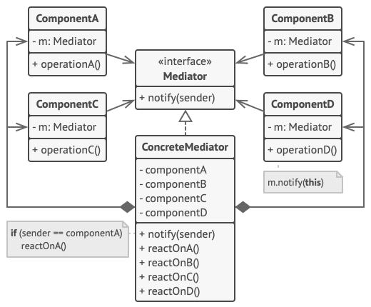
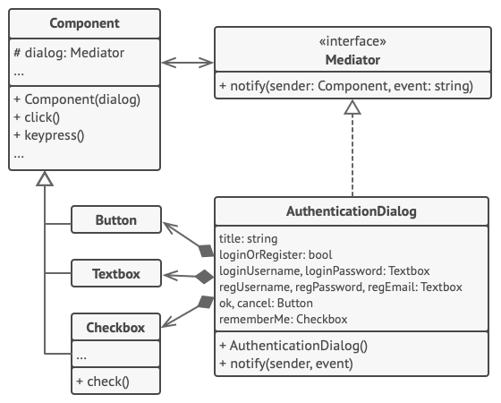

# Mediator

## 📜 Mục đích

Mediator là một desgin pattern thuộc nhóm behavioral giúp bạn giảm các phụ thuộc hỗn tạp giữa các đối tượng. Pattern hạn chế các giao tiếp trực tiếp giữa các đối tượng và buộc nó giao tiếp thông qua đối tượng mediator.


## 😟 Vấn đề

Giả sử bạn có một dialog cho tạo và chỉnh sửa thông tin khách hàng. Nó bao gồm các phần tử form khác nhau như text input, checkbox, button, ...


Một số phần tử trong form có thể tương tác với nhau. Ví dụ, khi chọn "I have a dog" ở một chechbox có thể sẽ dẫn đến hiện một input ẩn cho nhập tên chú chó đó. Hay  khi submit một button sẽ phải xác thực các giá trị hợp lệ ở tất cả trường trước khi lưu dữ liệu.


*Các phần tử có quan hệ với nhau, nên thay đổi một phần tử có thể ảnh hưởng đến những cái khác*

Bằng cách triển khai trực tiếp logic bên trong code của phần tử form bạn sẽ làm cho lớp phần tử khó tái sử dụng ở các form khác trong ứng dụng. Ví dụ bạn không thể dùng lớp checkbox này cho các form khác vì nó đã được kết nối với input "tên chó". Hoặc là bạn có thể sử dụng tất cả các lớp liên quan đến hiển thị form người dùng hoặc là không dùng được gì cả.

## 😊 Giải pháp

Mediator đề nghị giải pháp là bạn nên dừng việc kết nối trực tiếp giữa các thành phần mà bạn muốn nó trở nên độc lập. Thay vào đó, các thành phần này sẽ phải cộng tác gián tiếp qua việc gọi một đối tượng mediator đặc biệt, đối tượng này mới là thứ gọi trực tiếp đến các thành phần thích hợp. Kết quả là các thành phần chỉ phụ thuộc vào lớp mediator duy nhất thay vì được ghép nối với hàng chục  thành phần khác.

Trong ví dụ với form hồ sơ người dùng, lớp diago sẽ hành động như một mediator. Rất có thể, lớp dialog đã nhận thức được các phần tử con của nó, thế nên bạn không cần thêm phụ thuộc mới vào lớp.


Đây là một thay đổi có ý nghĩa to lớn với các phần tử trong form. Như với button submit. Trước đây mỗi lần người dùng click vào button, nó phải xác thực giá trị hợp lệ của tất cả phần tử riêng biệt trong form. Giờ đây nó chỉ có một công việc là thông báo cho dialog về thao tác click. Khi nhận được thông báo, dialog thực hiện xác thực bản thân nó hoặc truyền công việc cho các phần tử riêng biệt. Do đó thay vì bị ràng buộc với hàng tá phần tử trong form, button chỉ phụ thuộc vào dialog.

Bạn có thể làm nhiều hơn là nới lỏng các ràng buộc bằng việc trích xuất interface chung cho tất cả kiểu dialog. Interface sẽ khai báo phương thức thông báo cho tất cả phần tử của form để thông báo đến dialog mỗi khi có sự kiện gì diễn ra với bọn chúng. Do đó, button submit của ta bây giờ có thể làm việc với bất kỳ dialog nào triển khai interface này.

Bằng cách này, Mediator giúp bạn gói một trang web phức tạp với các đối tượng có quan hệ khác nhau vào trong một đối tượng mediator đơn giản. Ít ràng buộc và phụ thuộc hơn, giúp nó dễ thay đổi, mở rộng và tái sử dụng hơn.

## 🚗 Thế Giới Thực


Các phi công của máy bay đến hoặc rời đi khỏi khu vực kiểm soát của sân bay không phải liên lạc trực tiếp với nhau. Thay vào đó, họ trao đổi với một nhân viên kiểm soát không lưu, người ngồi trong một tòa tháp cao ở đâu đó gần đường băng. Nếu không có kiểm soát viên không lưu, các phi công sẽ cần phải biết về mọi máy bay trong khu vực lân cận sân bay, thảo luận về các ưu tiên hạ cánh với một nhóm gồm hàng chục phi công khác. Điều đó có thể sẽ làm tăng vọt số liệu thống kê về các vụ tai nạn máy bay.

Tháp không cần điều khiển toàn bộ chuyến bay. Nó chỉ tồn tại để thực thi các ràng buộc trong khu vực hạ cánh vì số lượng các máy bay ở đó có thể quá tải đối với một phi công.

## 🏢 Cấu trúc



1. **Component** là các lớp khác nhau bao gồm các logic nghiệp vụ. Mỗi component có một tham chiếu đến một mediator, khai báo kiểu của interface mediator. Component không cần biết về lớp thực sự của mediator, nên bạn có thể sử dụng lại component cho các chương trình khác bằng cách liên kết nó với một mediator khác.
2. **Mediator** là interface khai báo phương thức giao tiếp giữa các component, nó thường khai báo một phương thức thông báo duy nhất. Component có thể truyền bất kỳ ngữ cảnh nào như các tham số của phương thức này bao gồm cả đối tượng của chúng, nhưng chỉ trong trường hợp không diễn ra kết ghép giữa component nhận và lớp của người gửi.
3. **Concrete Mediator** đóng gói quan hệ giữa các component khác nhau. Concrete mediator thường giữ tham chiếu để tất cả component nó quản lý và thỉnh thoảng quản lý cả vòng đời của chúng.
4. Component không phải biết về các component khác. Nếu một điều gì quan trọng diễn ra với một component, nó chỉ việc thông báo đến mediator. Khi mediator nhận thông báo nó có thể xác định được người gửi dễ dàng, chỉ như vậy là đủ để nó quyết định component nào sẽ được kích hoạt khi trả về.

    Từ góc nhìn của một component, tất cả trông giống như một hộp đen. Người gửi không biết ai sẽ xử lý yêu cầu của mình và người nhận không biết ai đã gửi yêu cầu ngay từ đầu.


## 👨‍💻 Mã giả

Trong ví dụ này, Mediator  giúp bạn loại bỏ sự phụ thuộc lẫn nhau giữa các lớp UI khác nhau: button, checkbox và text labels.



Một phần tử được kích hoạt bởi người dùng, không cần giao tiếp trực tiếp với các phần tử khác. Thay vào đó, các phần tử chỉ cần cho mediator của chúng biết khi có sự kiện diễn ra, truyền thông tin ngữ cảnh cùng với thông báo.

Trong ví dụ này, các dialog hành động như một mediator. Nó biết làm thế nào để các phần tử cụ thể cộng tác với nhau và tạo điều kiện cho chúng kết nối gián tiếp với nhau. Mỗi khi nhận thông báo về một sự kiện, dialog quyết định phần tử nào sẽ giải quyết và chuyền hướng lệnh gọi phù hợp.

```c
// Interface mediator khai báo một phương thức được dùng bởi
// các component để thông báo cho mediator về các sự kiện khác
// nhau. Mediator sẽ phản ứng với sự kiện và truyền thực thi
// cho các component khác.
interface Mediator is
    method notify(sender: Component, event: string)


// Lớp concrete mediator. Các kết nối phức tạp giữa các
// component riêng biệt đã được gỡ rối và chuyền vào mediator.
class AuthenticationDialog implements Mediator is
    private field title: string
    private field loginOrRegisterChkBx: Checkbox
    private field loginUsername, loginPassword: Textbox
    private field registrationUsername, registrationPassword,
                  registrationEmail: Textbox
    private field okBtn, cancelBtn: Button

    constructor AuthenticationDialog() is
        // Tạo tất cả đối tượng component và truyền mediator
        // hiện tại vào hàm khởi tạo để thiết lập liên kết.


    // Khi điều gì đó diễn ra với một component, nó thông báo cho
    // mediator. Khi nhận được thông báo, mediator sẽ làm gì đó 
    // hoặc truyền yêu cầu đến component khác.
    method notify(sender, event) is
        if (sender == loginOrRegisterChkBx and event == "check")
            if (loginOrRegisterChkBx.checked)
                title = "Log in"
                // 1. Hiện form đăng nhập 
                // 2. Ẩn form đăng ký.
            else
                title = "Register"
                // 1. Hiện form đăng ký 
                // 2. Ẩn form đăng nhập.

        if (sender == okBtn && event == "click")
            if (loginOrRegister.checked)
                // Tìm kiếm người dùng bằng chứng chỉ đăng nhập.
                if (!found)
                    // Hiện thông báo lỗi trên trường đăng nhập.
            else
                // 1. Tạo tài khoản người dùng sử dụng dữ liệu
                // từ trường đăng ký.
                // 2. Đăng nhập người dùng.
                // ...
                

// Component giao tiếp với mediator thông qua interface mediator.
// Nhờ điều đó, bạn có thể dùng cùng một component trong các
// bối cảnh khác nhau bằng liên kết với các đối tượng mediator
// khác nhau.
class Component is
    field dialog: Mediator

    constructor Component(dialog) is
        this.dialog = dialog

    method click() is
        dialog.notify(this, "click")

    method keypress() is
        dialog.notify(this, "keypress")

// Mỗi concrete component không giao tiếp với nhau. Chúng chỉ
// có một kênh giao tiếp để gửi thông báo đến mediator.
class Button extends Component is
    // ...

class Textbox extends Component is
    // ...

class Checkbox extends Component is
    method check() is
        dialog.notify(this, "check")
    // ...
```

## 💡 Ứng dụng

**🐞 Sử dụng Mediator khi việc thay đổi một vài lớp trở nên khó khăn do chúng được kết ghép chặt chẽ với các lớp khác**

⚡ Pattern giúp bạn trích xuất các quan hệ giữa các lớp vào một lớp riêng biệt, cô lập bất kỳ thay đổi nào đến một thành phần cụ thể khỏi các thành phần còn lại.

**🐞 Sử dụng Mediator khi bạn không thể dùng lại một thành phần ở chương trình khác vì nó phụ thuộc vào các thành phần khác**.

⚡ Sau khi áp dụng Mediator, các thành phần cụ thể sẽ không biết đến các thành phần khác. Chúng chỉ giao tiếp với nhau một cách gián tiếp thông qua đối tượng mediator. Để dùng lại một thành phần ở ứng dụng khác, bạn cần cung cấp cho nó một lớp mediator mới.

**🐞 Sử dụng Mediator khi bạn phải tạo hàng tấn thành phần con chỉ để sử dụng lại vài hành vi cơ bản cho các bối cảnh khác nhau**.

⚡ Vì tất cả các mối quan hệ giữa các thành phần được chứa trong mediator, nên thật dễ dàng xác định các cách hoàn toàn mới cho các thành phần này cộng tác bằng cách thêm các lớp mediator mới mà không cần phải thay đổi chính các thành phần đó.

## 📋 Triển khai

1. Xác định xem một nhóm các lớp kết nối chặt chẽ có tốt hơn việc chúng độc lập với nhau không(có dễ bảo trì hay dùng lại các lớp này không).

2. Khai báo interface mediator và mô tả giao thức giao tiếp mong muốn giữa mediator và các thành phần khác. Trong hầu hết trường hợp, một phương thức duy nhất cho nhận các thông báo từ các thành phần là đủ.

    Interface này là cốt yếu khi bạn muốn sử dụng lại lớp thành phần ở ngữ cảnh khác. Miễn là thành phần làm việc với mediator thông qua interface chung, bạn có thể liên kết thành phần với triển khai khác của mediator.

3. Triển khai lớp mediator cụ thể. Lớp này dùng để lưu trữ tham chiếu đến tất cả thành phần mà nó quản lý.

4. Bạn có thể để mediator chịu trách nhiệm tạo và huỷ các đối tượng thành phần. Lúc này, mediator sẽ giống như một factory hay facade.

5. Các thành phần nên lưu một tham chiếu đến đối tượng mediator. Kết nối này thường được thiết lập ở hàm khởi tạo thành phần, nơi một đối tượng mediator được truyền như một tham số.

6. Thay đổi code của component này sẽ gọi đến phương thức thông báo của mediator thay vì đến phương thức của các thành phần khác. Trích xuất code để gọi đến thành phần khác vào lớp mediator. Thực thi code này bất cứ khi nào mediator nhận được thông báo.

## ⚖️ Ưu nhược điểm

### Ưu điểm

✔️ *Single Responsibility Principle*. Bạn có thể trích xuất giao tiếp giữa các thành phần khác vào một nơi duy nhất, giúp nó dễ hiểu và bảo trì hơn.

✔️ *Open/Closed Principle*. Bạn có thể thêm mediator mới mà không ảnh hưởng gì đến các thành phần thực sự.

✔️ Bạn có thể làm giảm liên kết giữa các thành phần khác nhau trong chương trình.

✔️ Bạn có thể sử dụng lại các thành phần cụ thể một cách dễ dàng.

### Nhược điểm

❌ Theo thời gian mediator có thể phát triển thành một [Đối tượng thượng đế](https://vi.wikipedia.org/wiki/Đối_tượng_thượng_đế_(Lập_trình_máy_tính))

## 🔁 Quan hệ với các pattern khác

**Chain of Responsibility**, **Command**, **Mediator** và **Observer** giải quyết các cách khác nhau để kết nối người gửi và người nhận yêu cầu:

- **CoR** chuyển một yêu cầu tuần tự dọc theo một chuỗi động gồm những người nhận tiềm năng cho đến khi một trong số họ xử lý nó.
- **Command** thiết lập các kết nối một chiều giữa người gửi và người nhận.
- **Mediator** loại bỏ các kết nối trực tiếp giữa người gửi và người nhận, buộc họ phải giao tiếp gián tiếp thông qua một đối tượng trung gian.
- **Observer** cho phép người nhận đăng ký động và hủy đăng ký nhận yêu cầu. 

**Facade** và **Mediator** có những công việc tương tự nhau: cố gắng tổ chức sự hợp tác giữa nhiều lớp được kết hợp chặt chẽ với nhau.

- **Facade** xác định một interface đơn giản cho một hệ thống con của các đối tượng, nhưng nó không giới thiệu bất kỳ chức năng mới nào. Bản thân hệ thống con không biết về facade. Các đối tượng trong hệ thống con có thể giao tiếp trực tiếp.
- **Mediator** tập trung giao tiếp giữa các thành phần của hệ thống. Các thành phần chỉ biết về đối tượng mediator và không giao tiếp trực tiếp.

Sự khác biệt giữa **Mediator** và **Observer** thường khó nắm bắt. Trong hầu hết các trường hợp, bạn có thể triển khai một trong các mẫu này; nhưng đôi khi bạn có thể áp dụng đồng thời cả hai. Hãy xem chúng ta có thể làm điều đó như thế nào.

- Mục tiêu chính của **Mediator** là loại bỏ sự phụ thuộc lẫn nhau giữa một tập hợp các thành phần hệ thống. Thay vào đó, các thành phần này trở nên phụ thuộc vào một đối tượng mediator duy nhất. Mục tiêu của **Observer** là thiết lập các kết nối động một chiều giữa các đối tượng, nơi một số đối tượng đóng vai trò là cấp dưới của những đối tượng khác.

- Có một cách triển khai phổ biến của **Mediator** vào **Observer**. Đối tượng mediator đóng vai trò là publisher và các thành phần đóng vai trò là subscribers, đăng ký và hủy đăng ký tham gia các sự kiện của mediator. Khi **Mediator** được triển khai theo cách này, nó có thể trông rất giống với **Observer**.

- Nếu thấy bối rối, hãy nhớ rằng bạn có thể triển khai **Mediator** theo những cách khác. Ví dụ: bạn có thể liên kết vĩnh viễn tất cả các thành phần với cùng một đối tượng mediator. Việc triển khai này sẽ không giống với **Observer** nhưng vẫn sẽ là một bản sao của **Mediator**.

- Bây giờ hãy tưởng tượng một chương trình mà tất cả các thành phần đã trở thành publisher, cho phép các kết nối động với nhau. Sẽ không có đối tượng mediator tập trung, chỉ có một nhóm observer phân tán.

# Nguồn

[**refactoring**](https://refactoring.guru/design-patterns/mediator)