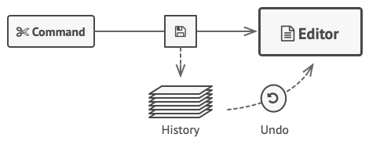
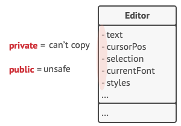
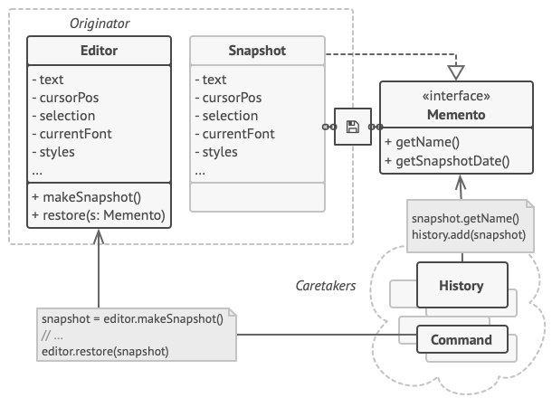
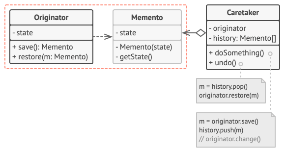
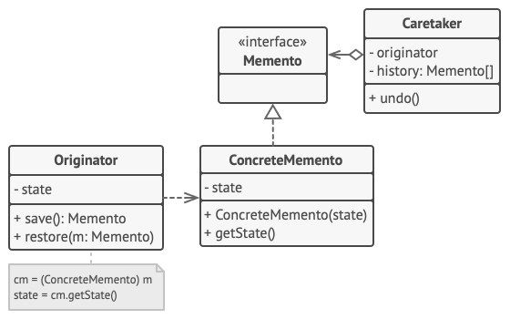
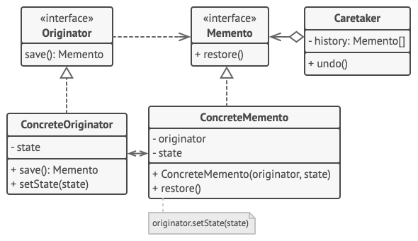
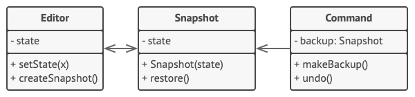

# Memento

## 📜 Mục đích

Memento là một desgin pattern thuộc nhóm behavioral giúp bạn lưu và phục hồi trạng thái trước đó của một đối tượng mà không để lộ chi tiết triển khai của nó


## 😟 Vấn đề

Tưởng tượng bạn đang tạo một ứng dụng soạn thảo văn bản. Bên cạnh việc chỉnh sửa đơn giản, bạn còn phải tạo chức năng định dạng văn bản, thêm ảnh, chỉnh phông,...

Vào một lúc nào đó, bạn quyết định thêm chức năng giúp người dùng hoàn tác bất kỳ thao tác nào được thực hiện trên văn bản. Chức năng này rất phổ biến trong thời gian gần đây và người dùng sẽ mong muốn là mọi ứng dụng đều có nó.
Để triển khai, bạn chọn cách tiếp cận trực tiếp. Là trước khi thực hiện bất kỳ thao tác nào, ứng dụng sẽ ghi lại trạng thái của tất cả đối tượng trong nó và lưu chúng vào một vài nơi lưu trữ. Sau đó, khi người dùng muốn hoàn tác hành động, ứng dụng  sẽ lấy snapshot (bản lưu nhanh) gần nhất trong lịch sử và dùng nó để phục hồi trạng thái của mọi đối tượng.



Bây giờ ta xem xét kỹ snapshot của các trạng thái này. Câu hỏi đặt ra là làm thế nào để bạn tạo chính xác chúng? Có lẽ bạn sẽ đi qua tất cả trường trong đối tượng và sao chép giá trị của chúng rồi lưu vào bộ nhớ. Tuy nhiên nó sẽ chỉ hoạt động nếu đối tượng của bạn không hạn chế truy cập đến nội dung của nó. Không may, phần lớn đối tượng thực sẽ không để những thứ bên ngoài truy cập vào bên trong của nó dễ dàng, nó sẽ ẩn tất cả dữ liệu có ích vào các trường riêng tư.

Tạm thời ta bỏ qua vấn đề này và mặc định rằng tất cả đối tượng của chúng ta đều như những con hà mã: thích các quan hệ mở và công khai trạng thái của chúng. Lúc này, ngay cả khi cách tiếp cận trên giải quyết được vấn đề và giúp bạn tạo snapshot của trạng thái đối tượng tuỳ ý, thì nó vẫn tồn đọng nhiều vấn đề nghiêm trọng khác. Trong tương lai, khi bạn quyết định tái cấu trúc  một vài lớp chỉnh sửa, tức là thêm hoặc xoá một vài trường. Điều này sẽ không dễ dàng vì bạn phải thay đổi tất cả các lớp chịu trách nhiệm cho sao chép trạng thái của đối tượng bị ảnh hưởng.



Hơn thế nữa. Hãy xem xét các snapshot trạng thái của trình soạn thảo. Dữ liệu trong nó bao gồm những gì? Ở mức tối thiểu, nó phải bao gồm các văn bản thực, toạ độ con trỏ, vị trí hiện tại đang scroll,... Để tạo snapshot, bạn cần phải tìm kiếm các giá trị này và đặt chúng vào trong một dạng container.

Có thể, bạn sẽ lưu một lượng đối tượng container này trong một vài danh sách để biểu diễn lịch sử thao tác. Do đó, container có lẽ là sẽ trở thành đối tượng của một lớp. Lớp này không có phương thức, những có nhiều trường để ánh xạ trạng thái của trình soạn thảo. Để cho phép các đối tượng khác viết và đọc dữ liệu từ snapshot, bạn phải công khai tất cả các trường của nó. Điều này vô tình làm lộ trạng thái của ứng dụng bất kể nó riêng tư hay không. Các lớp khác sẽ trở nên phụ thuộc vào mọi thay đổi dù rất nhỏ ở lớp snapshot, ngược lại nếu các trường và phương thức này riêng tư thì những gì diễn ra trong đây sẽ không ảnh hưởng gì đến bên ngoài lớp.

Có vẻ như chúng ta đã đi đến ngõ cụt: bạn để lộ tất cả các chi tiết bên trong của các lớp, khiến chúng quá mỏng manh(dễ bị thay đổi), còn nếu hạn chế quyền truy cập vào trạng thái của chúng, thì bạn không thể tạo snapshot. Có cách nào khác để thực hiện "hoàn tác" không?

## 😊 Giải pháp

Tất cả vấn đề trên mà ta gặp phải đều được gây ra bởi hành vi phá vỡ tính đóng gói. Một vài đối tượng cố làm nhiều hơn những gì chúng phải làm. Để thu thập dữ liệu cần thiết cho thực hiện một vài hành động, chúng xâm lấn sang các không gian riêng tư của các đối tượng khác thay vì để các đối tượng đó thực hiện hành động thực.

Memento đề xuất giải pháp uỷ thác việc tạo các snapshot trạng thái cho các chủ sở hữu thực của trạng thái đó, tức là đối tượng gốc. Do đó, thay vì để đối tượng khác cố sao chép trạng thái của trình soạn thảo từ bên ngoài, lớp trình soạn thảo sẽ tự tạo snapshot của chúng vì nó có đầy đủ quyền truy cập vào trạng thái của chúng.

Ý tưởng lưu trữ bản sao của trạng thái đối tượng vào một đối tượng đặc biệt gọi là memento. Nội dung của memento không thể bị truy cập bởi bất kỳ đối tượng nào khác ngoại trừ cái đã tạo ra nó. Các đối tượng khác phải giao tiếp với memento bằng một interface giới hạn, cho phép nạp metadata của snapshot(thời gian tạo, tên thao tác, ...) nhưng không được đụng đến trạng thái của đối tượng ban đầu có trong snapshot.



*Originator có đầy đủ quyền truy cập đến memento, trong khi caretaker chỉ có thể thể truy cập đến siêu dữ liệu.*

Một chính sách hạn chế như vậy giúp bạn lưu memento bên trong các đối tượng khác, thường được gọi là caretaker. Vì caretaker làm việc với memento thông qua interface giới hạn, nó không thể can thiệp vào trạng thái được lưu trong memento. Trong khi đó, originator có thể truy cập đến tất cả trường trong memento, cho phép nó khôi phục trạng thái trước đó theo ý muốn.  

Trong ví dụ trình soạn thảo của chúng ta, ta có thể tạo một lớp lịch sử riêng biệt như một caretaker. Ngăn xếp các memento được lưu bên trong caretaker sẽ phát triển mỗi khi trình soạn thảo thực thi một thao tác. Bạn có thể render ngăn xếp vào UI của ứng dụng, như hiển thị lịch sử các thao tác trước đó của người dùng.

Khi người dùng thực hiện hoàn tác, lịch sử sẽ lấy memento gần nhất khỏi ngăn xếp và truyền nó trở lại vào trình soạn thảo, yêu cầu phục hồi. Vì trình soạn thảo có đầy đủ truy cập đến memento, nó sẽ thay đổi trạng thái của nó với giá trị nhận được từ memento.

## 🏢 Cấu trúc

### Triển khai dạng lớp lồng nhau

Cách triển khai cổ điển dựa trên các lớp lồng nhau, khả dụng với các ngôn ngữ lập trình phổ biến như C++, C#, Java.



1. **Originator** lớp tạo các snapshot cho trạng thái của nó, cũng như phục hồi trạng thái của nó từ snapshot khi cần.
2. **Memento** là đối tượng giá trị hành động như một snapshot của trạng thái của originator. Thường thì memento sẽ bất biến và truyền dữ liệu cho nó chỉ một lần thông qua hàm khởi tạo.
3. **Caretaker** không chỉ biết "khi nào" và "tại sao" phải lưu trạng thái của originator, mà còn biết trạng thái sẽ được phục hồi khi nào.
    
    Một caretaker có thể theo dõi lịch sử của originator bằng cách lưu trữ một ngăn xếp memento. Khi originator đi ngược về lịch sử, caretaker tìm nạp memento trên cùng từ ngăn xếp và truyền nó vào phương thức phục hồi của originator.

4. Trong triển khai này, lớp memento được lồng trong originator. Cách này giúp originator truy cập đến tất cả trường và phương thức của memento, kể cả khi chúng là riêng tư. Mặt khác, caretaker bị giới hạn truy cập đến trường và phương thức của memento, nó chỉ lưu trữ memento trong một ngăn xếp chứ không thể can thiếp vào trạng thái của chúng.

### Triển khai dựa trên interface trung gian

Có một cách triển khai thay thế, phù hợp với các ngôn ngữ lập trình không hỗ trợ các lớp lồng nhau (vâng, tôi đang nói về PHP).



1. Nếu không dùng lớp lồng nhau, bạn có thể hạn chế truy cập đến trường của memento bằng cách thiết lập một quy ước rằng caretaker có thể làm việc với memento chỉ qua một interface trung gian khai báo rõ ràng, nó chỉ khai báo phương thức cho liên kết đến siêu dữ liệu của memento.
2. Mặt khác, originator có thể làm việc với một đối tượng memento trực tiếp, truy cập trường và phương thức được khai báo trong lớp memento. Nhược điểm của các tiếp cận này là bạn cần khai báo tất cả thành phần của memento công khai.

### Triển khai với tính đóng gói chặt chẽ hơn

Có một cách triển khai khác rất hữu ích khi bạn không muốn để lại mọt rủi ro nhỏ nhất nào cho các lớp khác truy cập vào trạng thái của trình khởi tạo thông qua memento.



1. Triển khai này cho phép nhiều kiểu của originator và memento. Mỗi originator làm việc với lớp memento phù hợp. Không có originator cũng như memento nào để lộ trạng thái của nó với bên ngoài.
2. Caretaker bây giờ bị giới hạn rõ ràng trong việc thay đổi trạng thái được lưu trong memento. Hơn thế nữa, lớp caretaker sẽ độc lập với originator vì phương thức phục hồi giờ được định nghĩa trong lớp memento.
3. Mỗi memento trở thành một liên kết với originator đã tạo nó. Originator truyền vào nó hàm khởi tạo của memento, cùng với giá trị trạng thái của nó. Vì quan hệ chặt chẽ giữa các lớp, nên một memento có thể phục hồi trạng thái của originator,  với điều kiện là phần sau đã xác định các bộ thiết lập thích hợp. 

## 👨‍💻 Mã giả

Ví dụ này sử dụng Memento cùng với Commend để lưu trữ snapshot về trạng thái của trình soạn thảo văn bản phức tạp và khôi phục trạng thái trước đó từ các snapshot này khi cần.



Đối tượng command hành động như một caretaker. Chúng tìm nạp memento của trình soạn thảo trước khi thực thi thao tác liên quan đến command. Khi người dùng thực hiện hoàn tác câu lệnh gần nhất, trình soạn thảo có thể sử dụng memento được lưu trong command để hoàn tác trạng thái trước đó của nó.

Lớp memento không khai báo bất kỳ trường công khai nào dù là getter hay setter. Do đó không có đối tượng nào có thể thay đổi nội dung của nó. Memento được liên kết với đối tượng soạn thảo đã tạo nó. Điều này giúp một memento phục hồi trạng thái của trình soạn thảo được liên kết bằng cách truyền dữ liệu thông qua setter trên đối tượng soạn thảo. Vì memento được liên kết với đối tượng soạn thảo cụ thể, bạn có thể làm cho ứng dụng hỗ trợ nhiều trình soạn thảo độc lập với ngăn xếp hoàn tác trung tâm.

```c
// Originator tổ chức một vài dữ liệu quan trọng có thể thay đổi 
// nhiều lần. Nó còn định nghĩa một phương thức cho lưu trữ và 
// phục hồi trạng thái của nó.
class Editor is
    private field text, curX, curY, selectionWidth

    method setText(text) is
        this.text = text

    method setCursor(x, y) is
        this.curX = x
        this.curY = y

    method setSelectionWidth(width) is
        this.selectionWidth = width

    // Lưu trạng thái hiện tại vào trong memento.
    method createSnapshot():Snapshot is
        // Memento là một đối tượng bất biến; điều này
        // giải thích tại sao originator truyền trạng
        // thái của nó như tham số vào hàm khởi tạo
        // của memento.
        return new Snapshot(this, text, curX, curY, selectionWidth)

// Lớp memento lưu trữ trạng thái trước đó của trình soạn thảo.
class Snapshot is
    private field editor: Editor
    private field text, curX, curY, selectionWidth

    constructor Snapshot(editor, text, curX, curY, selectionWidth) is
        this.editor = editor
        this.text = text
        this.curX = x
        this.curY = y
        this.selectionWidth = selectionWidth

    // Cùng thời điểm, trạng thái trước đó của trình soạn thảo
    // có thể phục hồi bằng cách sử dụng đối tượng memento.
    method restore() is
        editor.setText(text)
        editor.setCursor(curX, curY)
        editor.setSelectionWidth(selectionWidth)

// Đối tượng command hành động như một caretaker. Trong trường
// hợp này, command lấy memento trước khi trạng thái của originator
// thay đổi. Khi hoàn tác, nó phục hồi trạng thái của originator
// từ memento.
class Command is
    private field backup: Snapshot

    method makeBackup() is
        backup = editor.createSnapshot()

    method undo() is
        if (backup != null)
            backup.restore()
    // ...
```

## 💡 Ứng dụng

**🐞 Sử dụng Memento khi bạn muốn tạo snapshot của trạng thái đối tương để phục hồi trạng trước đó của đối tượng**

⚡ Memento giúp bạn tạo bản sao chép đầy đủ trạng thái của một đối tượng, kể cả trường riêng tư, và lưu chúng riêng biệt với đối tượng. Trong khi phần lớn mọi người sử dụng pattern này cho hoàn tác thì nó cũng được dùng cho xử lý giao dịch(nếu bạn cần khôi phục thao tác lỗi).

**🐞 Sử dụng Memento khi truy cập trực tiếp tới trường/getter/setter của đối tượng vi phạm tính đóng gói**

⚡ Memento giúp đối tượng tự chịu trách nhiệm tạo snapshot trạng thái của nó. Không đối tượng nào khác có thể đọc snapshot, giúp dữ liệu trạng thái của đối tượng ban đầu trở nên an toàn và bảo mật.

## 📋 Triển khai

1. Xác định lớp nào đóng vai trò originator. Điều này là cần thiết để biết chương trình sử dụng một đối tượng trung tâm hay nhiều đối tượng nhỏ hơn.
2. Tạo lớp memento. Từng cái một, khai báo tập hợp trường ánh xạ các trường được khai báo ở lớp originator.
3. Làm memento bất biến. Memento chỉ nhận dữ liệu một lần thông qua hàm khởi tạo. Lớp này không có setter.
4. Nếu ngôn ngữ lập trình hỗ trợ lồng lớp, lồng memento vào originator. Nếu không, trích xuất interface trống từ lớp memento và làm tất cả đối tượng khác sử dụng nó tham chiếu đến memento. Bạn có thể thêm thao tác metadata đến interface nhưng không để lộ thứ gì của trạng thái originator.

5. Thêm một phương thức cho tạo memento ở lớp originator. Originator chỉ truyền trạng thái của nó đến memento thông qua một hoặc nhiều tham số của hàm khởi tạo memento.
    
    Kiểu trả về của phương thức nên là interface bạn trích xuất ở bước trước đó (giả sử bạn trích xuất nó ở mọi nơi). Bên trong nó, phương thức tạo memento nên làm việc trực tiếp với lớp memento.

6. Thêm một phương thức cho phục hồi trạng thái của lớp originator. Nó chấp nhận một đối tượng memento như một tham số. Nếu bạn trích xuất một interface ở bước trước, làm nó có kiểu của tham số. Trong trường hợp này, bạn cần ép kiểu đối tượng vào lớp memento, vì originator cần đầy đủ truy cập đến đối tượng này.

7. Caretaker, cho dù nó biểu diễn một đối tượng command, một lịch sử hoặc một cái gì đó hoàn toàn khác, thì cũng cần biết khi nào yêu cầu memento mới từ originator, cách lưu trữ chúng và khi nào thì khôi phục originator bằng một memento cụ thể.

8. Mối liên hệ giữa caretaker và originator có thể được chuyển vào lớp memento. Trong trường hợp này, mỗi memento phải được kết nối với originator đã tạo ra nó. Phương thức khôi phục cũng sẽ chuyển sang lớp memento. Tuy nhiên, tất cả điều này sẽ chỉ có ý nghĩa nếu lớp memento được lồng vào originator hoặc lớp originator cung cấp đủ setter để ghi đè trạng thái của nó.

## ⚖️ Ưu nhược điểm

### Ưu điểm

✔️ Bạn có thể tạo snapshot cho trạng thái đối tượng mà không vi phạm tính đóng gói.

✔️ Bạn có thể đơn giản hoá của của originator bằng cách cho phép caretaker duy trì lịch sử trạng thái của originator.
### Nhược điểm

❌ Ứng dụng có thể tốn nhiều RAM nếu client thường xuyên tạo memento.

❌ Caretaker nên theo dõi vòng đời của originator để có thể huỷ memento hết hạn.

❌ Nhiều ngôn ngữ lập trình động như PHP, Python và JavaScript không bảo đảm trạng thái trong memento sẽ an toàn.

## 🔁 Quan hệ với các pattern khác

Bạn có thể sử dụng **Memento** cùng với **Iterator** để nắm bắt trạng thái lặp lại hiện tại và khôi phục nó nếu cần.

Bạn có thể sử dụng **Command** và **Memento** cùng nhau khi thực hiện "hoàn tác". Trong trường hợp này, các command chịu trách nhiệm thực hiện các hoạt động khác nhau trên một đối tượng đích, trong khi các mementos lưu trạng thái của đối tượng đó ngay trước khi command được thực thi.

Đôi khi **Prototype** có thể là một giải pháp thay thế đơn giản hơn cho **Memento**. Điều này hoạt động nếu đối tượng, trạng thái mà bạn muốn lưu trữ trong lịch sử, khá đơn giản và không có liên kết đến tài nguyên bên ngoài hoặc các liên kết dễ thiết lập lại.

# Nguồn

[**refactoring**](https://refactoring.guru/design-patterns/memento)