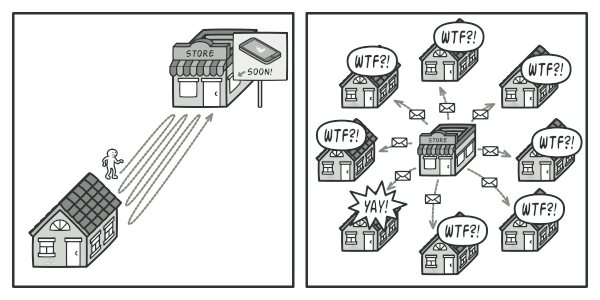
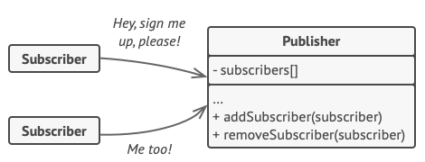
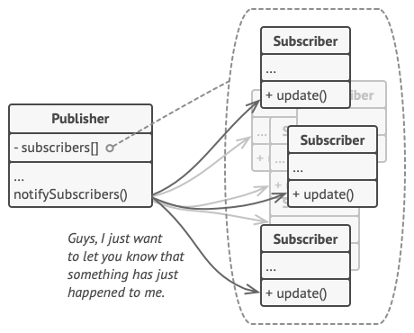
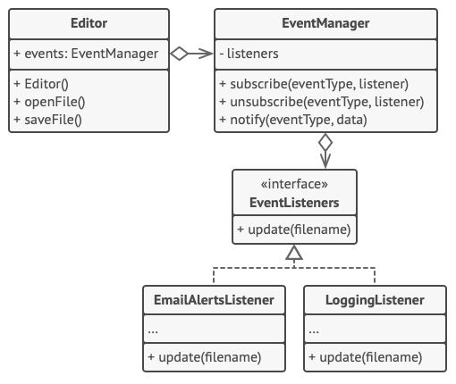

# Observer

## 📜 Mục đích

Observer là một design pattern thuộc nhóm behavioral giúp bạn định nghĩa một cơ chế đăng ký để thông báo cho nhiều đối tượng về bất kỳ sự kiện nào diễn ra với đối tượng mà chúng đang quan sát.


## 😟 Vấn đề

Tưởng tượng bạn có hai kiểu đối tượng: `Customer` và `Store`.

Khách hàng thường sẽ bị hấp dẫn với một vài thương hiệu sản phẩm nổi bật, ví dụ như mẫu iPhone mới sẽ sớm được bán ở của hàng. Thế nên họ sẽ đến cửa hàng mỗi ngày để kiểm tra sản phẩm đã có bán chưa. Nhưng nếu sản phẩm vẫn chưa nhập về, thì phần lớn công sức của họ cho mỗi chuyến đi sẽ vô nghĩa.



Thế nên, cửa hàng sẽ gửi hàng tấn mail (có thể là spam) cho tất cả khách hàng mỗi lần có sản phẩm mới. Điều này giúp khách hàng tránh những chuyến đi vô nghĩa đến cửa hàng. Nhưng bù lại, nó sẽ làm cho các khách hàng khác (những người không có hứng thú với sản phẩm mới) khó chịu.

Có vẻ như chúng ta đã xảy ra xung đột. Hoặc khách hàng lãng phí thời gian kiểm tra sản phẩm đã bán chưa hoặc cửa hàng lãng phí nguồn lực để thông báo thừa cho khách hàng.

## 😊 Giải pháp

Đối tượng có trạng thái hấp dẫn thường được gọi là subject(chủ thể), nhưng vì nó cũng sẽ thông báo cho các đối tượng khác về những thay đổi đối với trạng thái của nó, nên ta sẽ gọi nó là **publisher**. Tất cả đối tượng khác muốn theo dõi trạng thái của publisher được gọi là **subscriber**.

Pattern Observer đề nghị giải pháp là bạn thêm một cơ chế đăng ký đến lớp publisher để các đối tượng riêng biệt có thể đăng ký hoặc huỷ đăng ký một dòng các sự kiện xảy đến từ publisher. Thực tế, cơ chế này bao gồm một trường mảng cho lưu trữ danh sách tham chiếu đến đối tượng subscriber và nhiều phương thức công khai cho phép thêm hay xoá subscriber khỏi danh sách.



Bây giờ, bất cứ khi nào có sự kiện quan trọng diễn ra với publisher, nó đi qua tất cả subscriber và gọi phương thức thông báo cụ thể trên đối tượng của chúng.

Ứng dụng thực có thể có hàng tá lớp subscriber khác nhau quan tâm đến việc theo dõi các sự kiện của cùng một lớp publisher. Bạn sẽ không muốn ghép publiser với tất cả các lớp đó. Bên cạnh đó, bạn thậm chí có thể không biết về một số trong số chúng trước nếu lớp publisher của bạn được người khác sử dụng. 

Đó là lý do tại sao cho việc tất cả subscriber phải triển khai cùng một interface và publisher chỉ giao tiếp với chúng qua interface đó. Interface này phải khai báo phương thức thông báo cùng với một tập hợp các tham số mà publisher có thể sử dụng để chuyển một số dữ liệu ngữ cảnh cùng với thông báo.



Nếu ứng dụng của bạn có nhiều kiểu publisher khác nhau và bạn muốn làm cho subscriber của mình tương thích với tất cả chúng, bạn có thể tiến xa hơn nữa và khiến tất cả các publisher tuân theo cùng một interface. Interface này sẽ chỉ cần mô tả một số phương pháp đăng ký. Interface sẽ cho phép subscriber quan sát trạng thái của publisher mà không cần kết nối đến các lớp cụ thể của chúng.

## 🚗 Thế Giới Thực


Nếu bạn đăng ký một tờ báo hoặc tạp chí, bạn không cần phải đến cửa hàng để kiểm tra xem số tiếp theo có sẵn hay không. Thay vào đó, nhà xuất bản gửi các số báo mới trực tiếp đến hộp thư của bạn ngay sau khi xuất bản hoặc thậm chí trước.

Nhà xuất bản duy trì danh sách người đăng ký và biết họ quan tâm đến tạp chí nào. Người đăng ký có thể rời khỏi danh sách bất kỳ lúc nào khi họ muốn ngăn nhà xuất bản gửi các số tạp chí mới cho họ.

## 🏢 Cấu trúc


1. **Publisher** phát hành các sự kiện mà các đối tượng khác quan tâm. Các sự kiện này diễn ra khi publisher thay đổi trạng thái của nó hoặc thực thi một vài hành vi. Publisher bao gồm một kết cấu đăng ký cho phép subscriber mới tham gia hay subscriber hiện tại rời khỏi danh sách.
2. Khi một sự kiện mới diễn ra, publisher sẽ đi qua danh sách đăng ký và gọi phương thức thông báo được khai báo ở interface subscriber cho từng đối tượng subscriber.
3. **Subscriber** là interface khai báo interface thông báo. Trong hầu hết trường hợp, nó bao gồm một phương thức cập nhật duy nhất. Phương thức này có nhiều tham số giúp publisher truyền một vài chi tiết sự kiện cùng với cập nhật.
4. **Concrete Subscriber** thực hiện một vài hành động phản hồi lại thông báo được phát hành bởi publisher. Tất cả các lớp này phải triển khai cùng interface thế nên publisher không cần ghép với lớp cụ thể.
5. Thông thường, subscriber cần một vài thông tin ngữ cảnh để xử lý cập nhật chính xác. Vì lý do này, publisher truyền một vài dữ liệu ngữ cảnh như các tham số cho phương thức thông báo. Publisher có thể truyền chính bản thân nó như một tham số, để subscriber có thể nạp bất kỳ dữ liệu cần thiết nào trực tiếp.
6. **Client** tạo đối tượng publisher và subscriber riêng biệt, sau đó subscriber đăng ký các bản cập nhật publisher. 

## 👨‍💻 Mã giả

Trong ví dụ này, Observer giúp trình soạn thảo thông báo cho các đối tượng dịch vụ về các thay đổi trạng thái.



Danh sách các subscriber được biên dịch động: đối tượng có thể bắt đầu hoặc kết thúc lắng nghe thông báo khi đang chạy, dựa trên hành vi mong muốn của ứng dụng.

Trong triển khai này, lớp soạn thảo không duy trì danh sách đăng ký chính nó. Nó uỷ thác công việc cho đối tượng hỗ trợ đặc biệt làm điều đó. Bạn có thể nâng cấp đối tượng này để phục vụ như một trung tâm điều phối sự kiện, giúp bất kỳ đối tượng nào cũng hành động như một publisher.

Thêm các subscriber mới vào chương trình không yêu cầu thay đổi lớp publisher hiện có, miễn là chúng làm việc với subscriber thông qua cùng interface.

```c
// Lớp publisher cơ sở bao gồm code quản lý đăng ký
// và phương thức thông báo.
class EventManager is
    private field listeners: hash map of event types and listeners

    method subscribe(eventType, listener) is
        listeners.add(eventType, listener)

    method unsubscribe(eventType, listener) is
        listeners.remove(eventType, listener)

    method notify(eventType, data) is
        foreach (listener in listeners.of(eventType)) do
            listener.update(data)

// Publisher cụ thể bao gồm logic nghiệp vụ thực hấp dẫn một vài
// subscriber. Ta có thể có dẫn xuất lớp này từ một publisher cơ
// sở, nhưng điều này không luôn khả thi vì thực tế publisher cụ 
// thể sẽ có lớp con. Trong trường hợp này, ta có thể vá logic
// đăng ký với composition.
class Editor is
    public field events: EventManager
    private field file: File

    constructor Editor() is
        events = new EventManager()

    // Phương thức logic nghiệp vụ có thể thông báo subscriber
    // về các thay đổi.
    method openFile(path) is
        this.file = new File(path)
        events.notify("open", file.name)

    method saveFile() is
        file.write()
        events.notify("save", file.name)

    // ...


// Đây là interface subscriber. Nếu ngôn ngữ lập trình của bạn
// hỗ trợ kiểu function, bạn có thể thay thay toàn bộ hệ thống
// phân cấp subscriber với một tập hợp function.
interface EventListener is
    method update(filename)


// Subscriber cụ thể phản ứng với bản cập nhật được phát hành
// bởi publisher mà chúng được gắn.
class LoggingListener implements EventListener is
    private field log: File
    private field message: string

    constructor LoggingListener(log_filename, message) is
        this.log = new File(log_filename)
        this.message = message

    method update(filename) is
        log.write(replace('%s',filename,message))

class EmailAlertsListener implements EventListener is
    private field email: string
    private field message: string

    constructor EmailAlertsListener(email, message) is
        this.email = email
        this.message = message

    method update(filename) is
        system.email(email, replace('%s',filename,message))


// Ứng dụng có thể cấu hình publisher và subscriber khi đang chạy
class Application is
    method config() is
        editor = new Editor()

        logger = new LoggingListener(
            "/path/to/log.txt",
            "Someone has opened the file: %s")
        editor.events.subscribe("open", logger)

        emailAlerts = new EmailAlertsListener(
            "admin@example.com",
            "Someone has changed the file: %s")
        editor.events.subscribe("save", emailAlerts)
```

## 💡 Ứng dụng

**🐞 Sử dụng Observer khi thay đổi trạng thái của một đối tượng có thể yêu cầu thay đổi đối tượng khác, và tập hợp thực của đối tượng là không biết trước hoặc có thể thay đổi động**

⚡ Bạn có thể gặp vấn đề này khi làm việc với lớp giao diện người dùng. Ví dụ, bạn tạo nhiều lớp button tuỳ chỉnh, và bạn muốn client kết nối với một vài tuỳ chỉnh code button của bạn để nó kích hoạt bất cứ khi nào người dùng click.

Observer giúp bất kỳ đối tượng nào triển khai interface subscriber đăng ký nhận thông báo sự kiện ở đối tượng publisher. Bạn có thể thêm cơ chế subscription cho button của bạn, giúp client kết nối với code tuỳ chỉnh thông qua lớp subscriber tuỳ chỉnh.

**🐞 Sử dụng Observer khi một vài đối tượng trong ứng dụng phải quan sát đối tượng khác, nhưng chỉ giới hạn thời gian và trường hợp cụ thể**

⚡ Danh sách đăng ký là động, nên subscriber có thể tham gia hoặc rời danh sách khi chúng cần.

## 📋 Triển khai

1. Nhìn qua logic nghiệp vụ và chia nó làm hai phần: phần chức năng cốt lỗi độc lập với các phần khác, sẽ hành động như publisher. Phần còn lại sẽ là tập hợp lớp subscriber.

2. Khai báo interface subscriber. Ở mức tối thiếu, nó nên có một phương thức cập nhật duy nhất.
3. Khai báo interface publisher và mô tả một cặp phương thức cho thêm và xoá đối tượng subscriber khỏi danh sách. Hãy nhớ publisher phải làm việc với subscriber thông qua interface subscriber.
4. Quyết định nơi đặt danh sách đăng ký và triển khai phương thức đăng ký. Thông thường, code này như nhau với tất cả kiểu publisher, thế nên nơi rõ ràng để đặt nó là lớp trừu tượng được lấy trực tiếp từ interface publisher. Publisher cụ thể mở rộng từ lớp này, kế thừa các hành vi đăng ký.
    
    Tuy nhiên, nếu bạn áp dụng pattern với hệ phân cấp lớp hiện có, bao gồm cách tiếp cận dựa trên composition: đặt logic đăng ký vào đối tượng riêng biệt, và để cho tất cả publisher sử dụng nó. 
5. Tạo lớp publisher cụ thể. Mỗi lần điều gì diễn ra trong publisher, sẽ phải thông báo cho tất cả subscriber.

6. Triển khai phương thức thông báo cập nhật ở lớp subscriber cụ thể. Hầu hết subscriber sẽ cần dữ liệu ngữ cảnh về sự kiện. Nó có thể được truyền như một tham số cho phương thức thông báo.

    Nhưng ở đây ta có lựa chọn khác. Khi nhận thông báo, subscriber có thể tìm nạp dữ liệu trực tiếp từ thông báo. Trong trường hợp này, publisher phải truyền bản thân nó thông qua phương thức cập nhật. Các lựa chọn kém linh hoạt hơn là liên kết publisher với subscriber vĩnh viễn qua hàm khởi tạo.

7. Client phải tạo subscriber cần thiết và đăng ký nó với publisher phù hợp.

## ⚖️ Ưu nhược điểm

### Ưu điểm

✔️ *Open/Closed Principle*. Bạn có thể thêm lớp subscriber mới mà không ảnh hưởng đến code publisher (và ngược lại nếu có interface publisher).

✔️ Bạn có thể thiết lập quan hệ giữa các đối tượng khi đang chạy.

### Nhược điểm

❌ Subscriber được thông báo theo thứ tự ngẫu nhiên. 

## 🔁 Quan hệ với các pattern khác

**Chain of Responsibility**, **Command**, **Mediator** và **Observer** giải quyết các cách khác nhau để kết nối người gửi và người nhận yêu cầu:

- **CoR** chuyển một yêu cầu tuần tự dọc theo một chuỗi động gồm những người nhận tiềm năng cho đến khi một trong số họ xử lý nó.
- **Command** thiết lập các kết nối một chiều giữa người gửi và người nhận.
- **Mediator** loại bỏ các kết nối trực tiếp giữa người gửi và người nhận, buộc họ phải giao tiếp gián tiếp thông qua một đối tượng trung gian.
- **Observer** cho phép người nhận đăng ký động và hủy đăng ký nhận yêu cầu. 

Sự khác biệt giữa **Mediator** và **Observer** thường khó nắm bắt. Trong hầu hết các trường hợp, bạn có thể triển khai một trong các pattern này; nhưng đôi khi bạn có thể áp dụng đồng thời cả hai. Hãy xem chúng ta có thể làm điều đó như thế nào.

- Mục tiêu chính của **Mediator** là loại bỏ sự phụ thuộc lẫn nhau giữa một tập hợp các thành phần hệ thống. Thay vào đó, các thành phần này trở nên phụ thuộc vào một đối tượng mediator duy nhất. Mục tiêu của **Observer** là thiết lập các kết nối động một chiều giữa các đối tượng, nơi một số đối tượng đóng vai trò là cấp dưới của những đối tượng khác.

- Có một cách triển khai phổ biến của **Mediator** vào **Observer**. Đối tượng mediator đóng vai trò là publisher và các thành phần đóng vai trò là subscribers, đăng ký và hủy đăng ký tham gia các sự kiện của mediator. Khi **Mediator** được triển khai theo cách này, nó có thể trông rất giống với **Observer**.

- Nếu thấy bối rối, hãy nhớ rằng bạn có thể triển khai **Mediator** theo những cách khác. Ví dụ: bạn có thể liên kết vĩnh viễn tất cả các thành phần với cùng một đối tượng mediator. Việc triển khai này sẽ không giống với **Observer** nhưng vẫn sẽ là một bản sao của **Mediator**.

- Bây giờ hãy tưởng tượng một chương trình mà tất cả các thành phần đã trở thành publisher, cho phép các kết nối động với nhau. Sẽ không có đối tượng mediator tập trung, chỉ có một nhóm observer phân tán.

# Nguồn 

[refactoring](https://refactoring.guru/design-patterns/observer)
