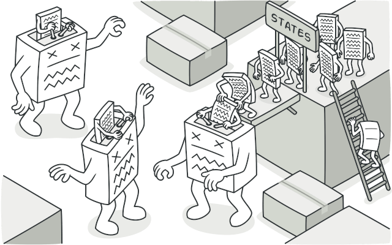
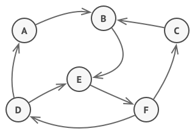
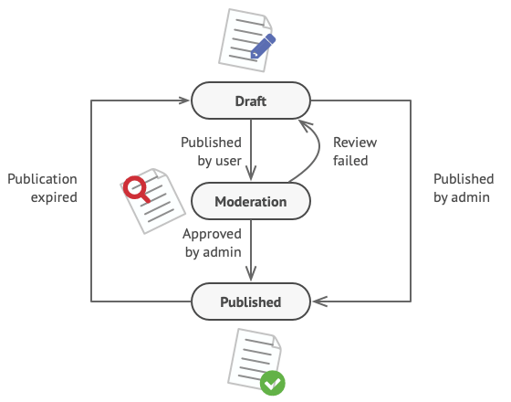
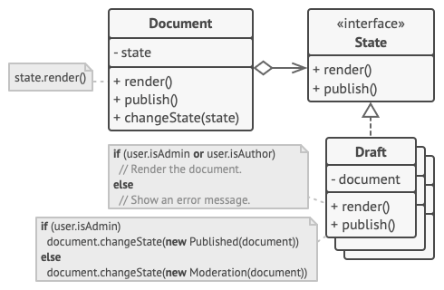
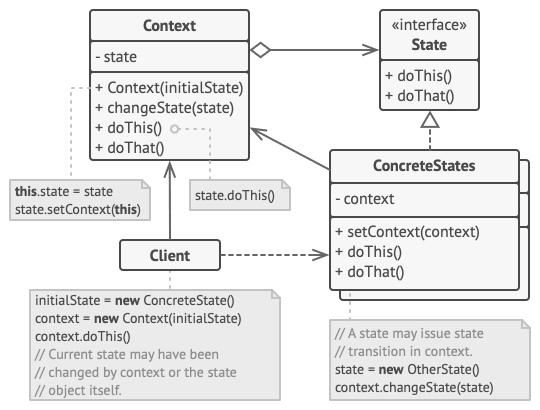
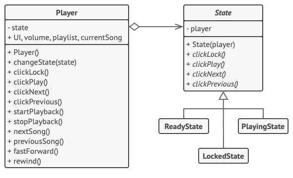

# State

## 📜 Mục đích

**State** là một design pattern thuộc nhóm behavoiral giúp chỉnh sửa hành vi của một đối tượng khi trạng thái bên trong nó thay đổi. Nó xảy ra nếu như một đối tượng thay đổi lớp của nó.



## 😟 Vấn đề

Pattern State có mối quan hệ gần gũi với khái niệm [Máy trạng thái hữu hạn](https://vi.wikipedia.org/wiki/Máy_trạng_thái_hữu_hạn) (gọi tắt là máy trạng thái)



Ý tưởng chính là như thế này, tại bất kỳ thời điểm nào cũng có một hữu hạn trạng thái mà chương trình có thể có. Với từng trạng thái đơn nhất, chương trình sẽ có hành vi khác nhau và chương trình còn có thể chuyển từ trạng thái này sang trạng thái khác ngay lập tức. Tuy nhiên, điều này phụ thuộc vào trạng thái hiện tại, mà chương trình có thể chuyển hoặc không thể chuyển sang trạng thái khác. Quy luật chuyển đổi này gọi là *transitions*, nó hữu hạn và có thể định trước.

Bạn có thể áp dụng cách tiếp cận này lên các đối tượng. Ví dụ bạn có lớp `Document`. Một tài liệu có thể có 3 trạng thái: `Draft`(nháp), `Moderation` (chờ duyệt) và `Published` (đã công khai). Phương thức `public` của tài liệu làm việc với từng trạng thái sẽ có vài khác biệt nhỏ:
- Ở `Draft`, nó chuyển tài liệu lên chờ duyệt.
- Ở `Moderation`, nó làm cho tài liệu công khai, nhưng chỉ khi người dùng hiện tại là admin.
- Ở `Publushed` nó không phải làm gì cả.



Máy trạng thái thường được triển khai với nhiều điều kiện hành động (`if` hoặc `switch`) để lựa chọn hành vi thích hợp dựa trên trạng thái hiện tại của đối tượng. Thông thường, "trạng thái" này chỉ là một tập hợp trường giá trị của đối tượng. Nếu bạn đã từng nghe về *Máy trạng thái hữu hạn* trước đây, thì bạn có lẽ đã triển khai nó ít nhất một lần. Ví dụ như nhìn đoạn code dưới đây bạn có thấy quen quen không?

```c
class Document is
    field state: string
    // ...
    method publish() is
        switch (state)
            "draft":
                state = "moderation"
                break
            "moderation":
                if (currentUser.role == 'admin')
                    state = "published"
                break
            "published":
                // Do nothing.
                break
    // ...
```

Điểm yếu lớn nhất của máy trạng thái nằm ở việc các điều kiện tự để lộ chúng khi ta thêm quá nhiều trạng thái và các hành vi phụ thuộc trạng thái vào lớp `Document`. Phần lớn phương thức sẽ chứa các điều kiện quái dị, để chọn hành vi phù hợp của phương thức theo trạng thái hiện tại. Điều này làm cho code trở nên khó bảo trì vì bất kỳ thay đổi nào đến logic transition sẽ đòi hỏi thay đổi điều kiện trạng thái ở toàn bộ phương thức.

Vấn đề có xu hướng trở nên lớn hơn khi dự án phát triển. Khá là khó khăn để có thể dự đoán tất cả trạng thái và transition xảy ra ở giai đoạn thiết kế. Do đó, một máy trạng thái tinh gọn được xây dựng với một tập hợp điều kiện giới hạn có thể phát triển thành một mớ hỗn độn theo thời gian. 

## 😊 Giải pháp

State đề xuất giải pháp là tạo một lớp mới cho tất cả trạng thái của một đối tượng và trích xuất tất cả hành vi dựa trên trạng thái cụ thể vào lớp đó.

Thay vì triển khai tất cả hành vi của nó, đối tượng gốc bây giờ gọi là *context* sẽ lưu tham chiếu đến một trong những đối tượng trạng thái, để biểu diễn trạng thái hiện tại của nó và uỷ thác mọi công việc liên quan đến trạng thái cho đối tượng này.



Để chuyển context sang trạng thái khác, ta sẽ thay thế đối tượng trạng thái đang hoạt động với một đối tượng khác để có trạng thái mới. Điều này chỉ khả thi khi tất cả lớp trạng thái theo cùng một interface và context làm việc với các đối tượng đó thông qua interface này.

Cấu trúc này trông giống Strategy, nhưng có một điểm khác biệt. Ở State, các trạng thái cụ thể có thể biết về nhau và bắt đầu chuyển đổi từ trạng thái này sang trạng thái khác, trong khi các Stategy hầu như không bao giờ biết về nhau

## 🚗 Thế Giới Thực

Các button và switch trong điện thoại thông minh của bạn hoạt động khác nhau tùy thuộc vào trạng thái hiện tại của thiết bị:

- Khi điện thoại được mở khóa, việc nhấn các button dẫn đến việc thực hiện các chức năng khác nhau.
- Khi điện thoại bị khóa, nhấn bất kỳ button nào sẽ dẫn đến màn hình mở khóa.
- Khi điện thoại gần hết pin, nhấn bất kỳ button nào sẽ hiển thị màn hình sạc.

## 🏢 Cấu trúc



1. **Context** lưu trữ một tham chiếu đến một trong các đối tượng concrete state và uỷ thác cho nó tất cả công việc cụ thể liên quan đến trạng thái. Context giao tiếp với đối tượng state thông qua interface state. Context để lộ một setter nhằm truyền vào nó một đối tượng state mới.
2. **State** là interface khai báo phương thức cụ thể liên quan đến trạng thái. Phương thức này nên có nghĩa với tất cả concrete state vì bạn không muốn các trạng thái của bạn có một phương thức vô dụng không bao giờ dùng đến.
3. **Concrete State** cung cấp triển khai của nó cho phương thức cụ thể liên quan đến trạng thái. Để tránh trùng lặp với code trên nhiều state, bạn nên cung cấp lớp trừu tượng trung gian cho đóng gói các hành vi dùng chung.

    Đối tượng state có thể lưu trữ một tham chiếu trở lại (backreference) đến đối tượng context. Thông qua tham chiếu này, state có thể tìm nạp thông tin cần thiết từ đối tượng context, cũng như bắt đầu chuyển trạng thái. 
4. Cả context và concrete state có thể thiết lập trạng thái tiếp theo cho context và thực hiện chuyển đổi trạng thái thực bằng cách thay thế đối tượng state được liên kết với context.

## 👨‍💻 Mã giả

Trong ví dụ này, State sẽ làm cho cùng một bộ điều chỉnh nhạc có các hành vi khác nhau phụ thuộc vào trạng thái phát hiện tại.



Đối tượng chính của bộ phát nhạc có liên kết đến một đối tượng state, thứ thực hiện phần lớn công việc thực. Các hành động thay thế đối tượng state hiện tại của bộ phát nhạc bằng đối tượng khác, để thay đổi cách mà bộ phát nhạc phản ứng với tương tác của người dùng.

```c
// Lớp AudioPlayer hành động như một context. Nó luôn 
// duy trì tham chiếu đến một trong số các lớp state
// để biểu diễn trạng thái hiện tại của bộ phát nhạc.
class AudioPlayer is
    field state: State
    field UI, volume, playlist, currentSong

    constructor AudioPlayer() is
        this.state = new ReadyState(this)

        // Context uỷ thác việc xử lý đầu vào của người dùng
        // cho đối tượng state. Kết quả dựa trên trạng thái
        // hiện tại đang hoạt động, vì ở mỗi trạng thái sẽ xử
        // lý đầu vào khác nhau.
        UI = new UserInterface()
        UI.lockButton.onClick(this.clickLock)
        UI.playButton.onClick(this.clickPlay)
        UI.nextButton.onClick(this.clickNext)
        UI.prevButton.onClick(this.clickPrevious)


    // Đối tượng khác có thể chuyển trạng thái hoạt động
    // của bộ phát nhạc.
    method changeState(state: State) is
        this.state = state

    // Các phương thức UI uỷ thác thực thi cho trạng thái
    // đang hoạt động.
    method clickLock() is
        state.clickLock()
    method clickPlay() is
        state.clickPlay()
    method clickNext() is
        state.clickNext()
    method clickPrevious() is
        state.clickPrevious()

    // State có thể gọi các phương thức dịch vụ có
    // trên context
    method startPlayback() is
        // ...
    method stopPlayback() is
        // ...
    method nextSong() is
        // ...
    method previousSong() is
        // ...
    method fastForward(time) is
        // ...
    method rewind(time) is
        // ...


// Lớp state cơ sở khai báo các phương thức cho tất cả concrete
// state triển khai và cung cấp một tham chiếu trở về đối tượng 
// context được liên kết với state. Các state có thể dùng tham chiếu
// đó để chuyển đổi trạng thái.
abstract class State is
    protected field player: AudioPlayer


    // Context truyền chính nó qua hàm khởi tạo của state. Điều
    // này giúp state lấy được dữ liệu hữu ích khi cần.
    constructor State(player) is
        this.player = player

    abstract method clickLock()
    abstract method clickPlay()
    abstract method clickNext()
    abstract method clickPrevious()


// Các concrete state triển khai các hành vi khác nhau được 
// liên kết với state của context.
class LockedState extends State is


    // Khi bạn mở khoá một bộ phát nhạc bị khoá,
    // nó có thể có một trong hai trạng thái.
    method clickLock() is
        if (player.playing)
            player.changeState(new PlayingState(player))
        else
            player.changeState(new ReadyState(player))

    method clickPlay() is
        // Bị khoá, nên không làm gì cả.

    method clickNext() is
        // Bị khoá, nên không làm gì cả.

    method clickPrevious() is
        // Bị khoá, nên không làm gì cả.


// Chúng cũng có thể kích hoạt chuyển đổi trạng thái context.
class ReadyState extends State is
    method clickLock() is
        player.changeState(new LockedState(player))

    method clickPlay() is
        player.startPlayback()
        player.changeState(new PlayingState(player))

    method clickNext() is
        player.nextSong()

    method clickPrevious() is
        player.previousSong()


class PlayingState extends State is
    method clickLock() is
        player.changeState(new LockedState(player))

    method clickPlay() is
        player.stopPlayback()
        player.changeState(new ReadyState(player))

    method clickNext() is
        if (event.doubleclick)
            player.nextSong()
        else
            player.fastForward(5)

    method clickPrevious() is
        if (event.doubleclick)
            player.previous()
        else
            player.rewind(5)
```

## 💡 Ứng dụng

**🐞 Sử dụng State khi bạn có một đối tượng có các hành vi khác nhau phụ thuộc vào trạng thái hiện tại, số lượng trạng thái là rất lớn và code của trạng thái cụ thể thường xuyên thay đổi**.
 
⚡ Pattern đề nghị việc trích xuất tất cả code trạng thái cụ thể vào một tập hợp lớp riêng biệt. Kết quả là bạn có thể thêm trạng thái mới hoặc thay đổi cái đã có độc lập với nhau, giảm thiểu chi phí bảo trì.

**🐞 Sử dụng State khi bạn có một lớp với số lượng điều kiện không lồ để thay đổi hành vi lớp đó theo giá trị hiện tại của các trường trong lớp đó.**

⚡ State giúp bạn trích xuất các nhánh của các điều kiện này thành các phương thức của các lớp trạng thái tương ứng. Đồng thời bạn còn có thể làm sạch các trường tạm thời và các phương thức trợ giúp liên quan đến code trạng thái cụ thể khỏi lớp chính của bạn.

**🐞 Sử dụng State khi bạn có một lượng lớn code trùng lặp các trạng thái và chuyển đổi tương tự của máy trạng thái dựa trên điều kiện.**

⚡ State giúp bạn soạn các hệ thống phân cấp của các lớp trạng thái và làm giảm sự trùng lặp bằng cách trích xuất code chung vào lớp cơ sở trừu tượng.

## 📋 Triển khai

1. Xác định lớp nào sẽ hành động như context. Nó có thể là một lớp đã có sẵn hoặc một lớp mới, nếu code trạng thái cụ thể được phân phối trên nhiều lớp.
2. Với tất cả trạng thái thực, tạo một lớp dẫn xuất từ interface state. Sau đó đi qua tất cả phương thức của context, trích xuất mọi code liên quan đến trạng thái vào lớp mới vừa tạo.
3. Trong khi chuyển code vào lớp trạng thái, bạn sẽ gặp trường hợp là nó phụ thuộc vào thành phần riêng tư của context. Có một vài cách giải quyết là:
    - Làm cho trường hay phương thức đó công khai.
    - Chuyển hành vi bạn đang trích xuất vào phương thức công khai trong context và gọi nó từ lớp state. Cách này khá tệ nhưng nhanh bạn có thể sửa lại sau.
    - Lồng lớp state vào lớp context, nhưng chỉ khi ngôn ngữ lập trình của bạn hỗ trợ lớp lồng nhau.
4. Trong lớp context, thêm trường tham chiếu của kiểu interface state và một setter công khai cho phép ghi đè giá trị lên trường.
5. Đi qua phương thức của context lần nữa và thay thế điều kiện trạng thái trống với lệnh gọi đến phương thức phù hợp của đối tượng state.
6. Để chuyển đổi trạng thái context, tạo một trong những lớp state và truyền nó vào context. Bạn có thể làm điều này bên trong context hoặc các state khác, hoặc ở client. Bất cứ khi nào thực hiện xong, lớp sẽ trở nên phụ thuộc vào lớp concrete state mà nó khởi tạo.

## ⚖️ Ưu nhược điểm

### Ưu điểm

✔️ *Single Responsibility Principle*. Tổ chức code liên kết với trạng thái cụ thể trong lớp riêng biệt.

✔️ *Open/Closed Principle*. Thêm trạng thái mới mà không ảnh hưởng đến lớp trạng thái hiện có hay ngữ cảnh.

✔️ Đơn giản hoá code context bằng loại bỏ các điều kiện máy trạng thái cồng kềnh.

### Nhược điểm

❌ Việc áp dụng pattern có thể quá mức cần thiết nếu máy trạng thái chỉ có một vài trạng thái hoặc hiếm khi thay đổi.

## 🔁 Quan hệ với các pattern khác

**Bridge**, **State**, **Strategy** (và ở một mức độ nào đó là **Adapter**) có cấu trúc rất giống nhau. Thật vậy, tất cả các pattern này đều dựa trên nguyên tắc là ủy thác công việc cho các đối tượng khác. Tuy nhiên, chúng giải quyết các vấn đề khác nhau. Một pattern không chỉ là một công thức để cấu trúc code của bạn theo một cách cụ thể. Nó còn có thể truyền đạt đến các dev khác về vấn đề mà pattern giải quyết.

**State** có thể được coi là một phần mở rộng của **Strategy**. Cả hai pattern đều dựa trên kết hợp: chúng thay đổi hành vi của ngữ cảnh bằng cách ủy quyền một số công việc cho các đối tượng trợ giúp. **Strategy** làm cho các đối tượng này hoàn toàn độc lập và không biết về nhau. Tuy nhiên, **State** không hạn chế sự phụ thuộc giữa các trạng thái cụ thể, cho phép chúng thay đổi trạng thái của ngữ cảnh theo ý muốn.

# Nguồn

[**refactoring**](https://refactoring.guru/design-patterns/state)