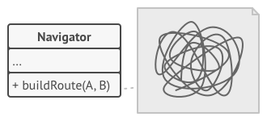
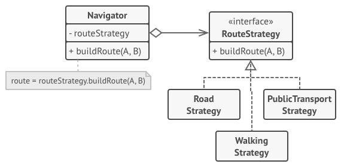
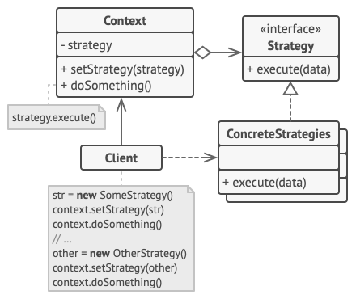

# Strategy

## 📜 Mục đích

**Strategy** là một design pattern thuộc nhóm behavioral giúp bạn xác định một nhóm thuật toán, đặt chúng vào một lớp riêng biệt và làm cho các đối tượng của chúng có thể hoán đổi lẫn nhau.


## 😟 Vấn đề

Vào một ngày đẹp trời, bạn định tạo một ứng dụng chỉ đường cho các khách du lịch. Ứng dụng xoay quanh các bản đồ đẹp mắt giúp người dùng dễ dàng đi đến bất cứ thành phố nào.

Phần lớn chức năng yêu cầu của ứng dụng là tự thiết lập lộ trình đường đi. Người dùng sẽ nhập vào địa chỉ hiện tại của họ và thấy con đường nhanh nhất để đến đích trên bản đồ.

Phiên bản đầu tiên của ứng dụng chỉ tập trung vào những đại lộ. Những người du lịch bằng xe sẽ cảm thấy vui sướng vì điều này. Nhưng mà rõ ràng là, không phải tất cả mọi người đều du lịch bằng xe. Thế nên ở bản cập nhật tiếp theo, bạn thêm tính năng chức năng cho người đi bộ. Ngay sau đó, bạn thêm các lựa chọn khác cho những phương tiện công cộng(bus, tàu điện ngầm,..) trên tuyến đường của họ.

Tuy nhiên, mọi thứ vẫn chưa dừng lại. Sau đó bạn định thêm lộ trình cho người đi xe đạp, hay là về sau này bạn sẽ thêm các lựa chọn khác cho xây dựng các lộ trình qua tất cả điểm tham quan trong thành phố.



Từ quan điểm kinh doanh, ứng dụng của bạn đã thành công, nhưng ở khía cạnh kỹ thuật bạn sẽ gặp nhiều vấn đề đau đầu. Mỗi lần bạn thêm một thuật toán chỉ đường mới, lớp chính của bộ chỉ đường sẽ gấp đôi kích thước. Và đến một thời điểm nào đó, nó sẽ như là một con quái vật, cực kỳ khó cho việc bảo trì.

Bất kỳ một thuật toán nào thay đổi, cho dù chỉ là fix lỗi đơn giản hay một chút điều chỉnh lên các con đường nó cũng ảnh hưởng đến toàn bộ lớp, làm tăng nguy cơ sinh lỗi ở các đoạn code đã hoạt động.

Bên cạnh đó, teamwork cũng bất tiện hơn. Các đồng nghiệp của bạn, những người gia nhập sau khi phiên bản đầu tiên phát hành sẽ than phiền rằng họ mất quá nhiều thời gian cho giải quyết các xung đột khi hợp nhất. Triển khai tính năng mới yêu cầu thay đổi cùng một lớp khổng lồ, xung đột với code được viết bởi những người khác.

## 😊 Giải pháp

Strategy đề xuất giải pháp là bạn nên chọn một lớp làm điều gì đó cụ thể theo nhiều cách khác nhau và trích xuất tất cả thuật toán vào các lớp riêng biệt đấy gọi là *strategy*.

Lớp gốc gọi là context, phải có một trường lưu trữ tham chiếu đến một trong các stategy. Context uỷ thác công việc cho đối tượng strategy được liên kết thay vì tự thực hiện nó.

Context không có trách nhiệm chọn thuật toán phù hợp cho công việc. Thay vào đó, client truyền strategy mong muốn đến context. Thực tế, context không biết gì về strategy. Nó làm việc với mọi strategy thông qua interface chung, nó chỉ để lộ một phương thức duy nhất cho kích hoạt thuật toán đã đóng gói trong stategy được chọn.

Với cách này, context trở nên độc lập với các strategy cụ thể, bạn có thể thêm hay chỉnh sửa thuật toán mà không ảnh hưởng gì đến code của context hay các strategy khác.



Trở lại với ứng dụng chỉ đường, mội thuật toán định tuyến có thể được trích xuất vào lớp của chúng với phương thức `buildRoute` duy nhất. Phương thức nhận vào điểm đầu và đích đến, và trả về một tập hợp các trạm dừng của lộ trình.

Mặc dùng cho cùng một tham số, mỗi lớp định tuyến sẽ có tạo một lộ trình khác nhau, lớp chính của ứng dụng không thực sự quan tâm thuật toán được chọn vì công việc chính của nó chỉ là hiển thị các trạm dừng trên bản đồ. Lớp có phương thức chuyển đổi các lịch trình đang hoạt động, thế nên người dùng với các button ở giao diện người dùng, có thể thay thế hành vi được chọn hiện tại với cái khác.

## 🚗 Thế Giới Thực


Tưởng tượng để đi đến sân bay. Bạn có thể bắt xe bus, gọi taxi hay đi xe đập. Các phương tiện của bạn là strategy. Bạn có thể chọn một trong các strategy dựa vào các nhân tố như ví tiền hay thời gian.

## 🏢 Cấu trúc



1. **Context** duy trì một tham chiếu đến một trong các strategy cụ thể và giao tiếp với các đối tượng này thông qua interface strategy.
2. **Strategy** là interface chung cho tất cả strategy cụ thể. Nó khai báo một phương thức duy nhất cho context sử dụng để thực thi.
3. **Concrete Strategies** triển khai khác nhau của thuật toán mà context sử dụng.
4. Context gọi phương thức thực thi đến đối tượng strategy được liên kết mỗi lần nó cần chạy thuật toán. Context không cần biết chính xác kiểu strategy nào đang làm việc và thuật toán được thực thi thế nào.
5. **Client** tạo đối tượng strategy cụ thể và truyền nó vào context. Context để lộ một setter cho client thay thế với strategy được liên kết với context khi đang chạy.

## 👨‍💻 Mã giả

Trong ví dụ này, context sử dụng nhiều strategy để thực hiện các phép toán khác nhau.

```c
// Interface strategy khai báo các phép toán chung cho tất cả 
// phiên bản hỗ trợ của một vài thuật toán. Context sử dụng 
// interface này để gọi thuật toán đã xác định bởi concrete
// strategies.
interface Strategy is
    method execute(a, b)

// Concrete strategies triển khai thuật toán khi đang theo
// interface strategy cơ sở. Interface hoán đổi chúng với
// nhau trong context.
class ConcreteStrategyAdd implements Strategy is
    method execute(a, b) is
        return a + b

class ConcreteStrategySubtract implements Strategy is
    method execute(a, b) is
        return a - b

class ConcreteStrategyMultiply implements Strategy is
    method execute(a, b) is
        return a * b

// Context xác định interface mà client mong muốn.
class Context is
    // Context duy trì một tham chiếu đến một trong các đối tượng
    // strategy. Context không biết rõ lớp cụ thể của strategy. 
    // Nó làm việc với mọi strategy thông qua interface strategy.
    private strategy: Strategy


    // Thông thường, context nhận strategy thông qua hàm khởi
    // tạo và cung cập một setter cho strategy có thể chuyển
    // đổi khi đang chạy.
    method setStrategy(Strategy strategy) is
        this.strategy = strategy


    // Context uỷ thác công việc cho đối tượng strategy thay
    // vì triển khai nhiều phiên bản thuật toán của chính nó.
    method executeStrategy(int a, int b) is
        return strategy.execute(a, b)


// Code client chọn một concrete strategy và truyền nó vào 
// context. Client nên nhận thức được sự khác nhau giữa 
// các strategy theo trật tự để chọn đúng.
class ExampleApplication is
    method main() is
        Create context object.

        Read first number.
        Read last number.
        Read the desired action from user input.

        if (action == addition) then
            context.setStrategy(new ConcreteStrategyAdd())

        if (action == subtraction) then
            context.setStrategy(new ConcreteStrategySubtract())

        if (action == multiplication) then
            context.setStrategy(new ConcreteStrategyMultiply())

        result = context.executeStrategy(First number, Second number)

        Print result.
```

## 💡 Ứng dụng

**🐞 Sử dụng Strategy khi bạn muốn dùng các biến thể thuật toán khác nhau trong một đối tượng cho phép chuyển đổi từ thuật toán này sang thuật toán khác khi đang chạy**.
 
⚡ Strategy giúp bạn gián tiếp chỉnh sửa hành vi của đối tượng khi đang chạy bằng liên kết với các đối tượng con khác để thực hiện hành vi cụ thể theo các cách khác nhau.

**🐞 Sử dụng Strategy khi bạn có nhiều lớp giống nhau chỉ khác nhau cách chúng thực hiện một vài hành vi**

⚡ Strategy giúp bạn trích xuất các hành vi khác nhau vào một hệ thống phân cấp lớp và kết hợp với lớp gốc thành một, bằng cách này sẽ làm giảm code trùng lặp.

**🐞 Sử dụng Strategy để cô lập logic nghiệp vụ của một lớp khỏi triển khai chi tiết của thuật toán, thứ không mấy quan trọng trong ngữ cảnh của logic đó**.

⚡ Strategy giúp bạn cô lập code, dữ liệu bên trong và các phụ thuộc vào thuật toán với phần code còn lại. Các client khác nhau nhận về một interface đơn giản để thực thi thuật toán và chuyển đổi chúng khi đang chạy.

**🐞 Sử dụng Strategy khi lớp của bạn có một lượng điều kiện khổng lồ để chuyển đổi các biến thể khác nhau với cùng thuật toán**.

⚡ Strategy giúp bạn bỏ đi các điều kiện bằng cách trích xuất tất cả thuật toán vào các lớp riêng biệt. Toàn bộ triển khai cùng interface. Đối tượng gốc uỷ thác thực thi cho một trong các đối tượng trên thay vì triển khai tất cả biến thể của thuật toán.

## 📋 Triển khai

1. Trong lớp context, xác định thuật toán dễ thay đổi. Nó còn có thể có một lượng lớn điều kiện để chọn và thực thi một biến thể của cùng một thuật toán khi đang chạy
2. Khai báo interface strategy chung cho tất cả biến thể của thuật toán.
3. Từng cái một, trích xuất tất cả thuật toán vào các lớp của nó. Chúng nên triển khai tất cả trên interface strategy.
4. Trong lớp context, thêm một trường cho lưu trữ tham chiếu đến đối tượng strategy. Cung cấp một setter cho thay thế giá trị của trường này. Context nên làm việc với đối tượng strategy thông qua interface strategy. Context có thể định nghĩa một interface để cho phép strategy truy cập dữ liệu của nó.
5. Client của context phải liên kết nó với strategy phù hợp để ứng với cách chúng mong đợi context thực hiện hành vi chính.

## ⚖️ Ưu nhược điểm

### Ưu điểm

✔️ Bạn có thể chuyển đổi thuật toán bên trong đối tượng khi đang chạy.

✔️ Bạn có thể cô lập triển khai chi tiết của thuật toán khỏi code sử dụng nó.

✔️ Bạn có thể thay thế kế thừa với hỗn hợp.

✔️ *Open/Closed Principle*. Bạn có thể thêm strategy mới mà không ảnh hưởng đến context.

### Nhược điểm

❌ Nếu bạn chỉ có một vài thuật toán và chúng hiếm khi thay đổi, thì không có lý do thực sự nào để làm phức tạp chương trình quá mức với các lớp và interface mới đi kèm với pattern.

❌ Client phải nhận thức được các strategy khác nhau để có thể chọn cái phù hợp.

❌ Rất nhiều ngôn ngữ lập trình hiện đại có hỗ trợ kiểu hàm cho phép bạn triển khai các phiên bản khác nhau của thuật toán bên trong một tập hợp các hàm ẩn danh. Sau đó, bạn có thể sử dụng các chức năng này chính xác như khi bạn đã sử dụng các đối tượng strategy, nhưng không làm tăng code của bạn với các lớp và giao diện bổ sung.

## 🔁 Quan hệ với các pattern khác

**Bridge**, **State**, **Strategy** (và ở một mức độ nào đó là **Adapter**) có cấu trúc rất giống nhau. Thật vậy, tất cả các pattern này đều dựa trên nguyên tắc là ủy thác công việc cho các đối tượng khác. Tuy nhiên, chúng giải quyết các vấn đề khác nhau. Một pattern không chỉ là một công thức để cấu trúc code của bạn theo một cách cụ thể. Nó còn có thể truyền đạt đến các dev khác về vấn đề mà pattern giải quyết.

**Command** và **Strategy** có thể trông giống nhau vì bạn có thể sử dụng cả hai để tham số hóa một đối tượng bằng một số hành động. Tuy nhiên, chúng có mục đích rất khác nhau.

- Bạn có thể sử dụng **Command** để chuyển đổi bất kỳ thao tác nào thành một đối tượng. Các tham số của thao tác trở thành các trường của đối tượng đó. Việc chuyển đổi cho phép bạn trì hoãn việc thực hiện thao tác, xếp hàng đợi, lưu trữ lịch sử lệnh, gửi lệnh đến các dịch vụ từ xa, v.v.

- Mặt khác, **Strategy** thường mô tả các cách khác nhau để thực hiện cùng một việc, cho phép bạn hoán đổi các thuật toán này trong một lớp ngữ cảnh duy nhất.

**Decorator** cho phép bạn thay đổi vẻ ngoài của một đối tượng, trong khi **Strategy** cho phép bạn thay đổi ruột.

**Template Method** dựa trên sự kế thừa: nó cho phép bạn thay đổi các phần của một thuật toán bằng cách mở rộng các phần đó trong các lớp con. **Strategy** dựa trên cấu tạo: bạn có thể thay đổi các phần trong hành vi của đối tượng bằng cách cung cấp cho đối tượng các strategy khác nhau tương ứng với hành vi đó. **Template Method** hoạt động ở cấp độ lớp, vì vậy nó là tĩnh. **Strategy** hoạt động ở cấp độ đối tượng, cho phép bạn chuyển đổi hành vi trong thời gian chạy.

**State** có thể được coi là một phần mở rộng của **Strategy**. Cả hai pattern đều dựa trên kết hợp: chúng thay đổi hành vi của ngữ cảnh bằng cách ủy quyền một số công việc cho các đối tượng trợ giúp. **Strategy** làm cho các đối tượng này hoàn toàn độc lập và không biết về nhau. Tuy nhiên, **State** không hạn chế sự phụ thuộc giữa các trạng thái cụ thể, cho phép chúng thay đổi trạng thái của ngữ cảnh theo ý muốn.

# Nguồn

[**refactoring**](https://refactoring.guru/design-patterns/strategy)