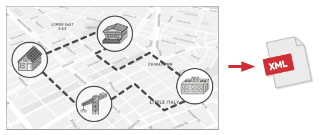
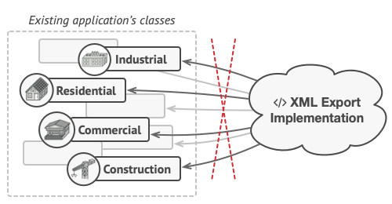
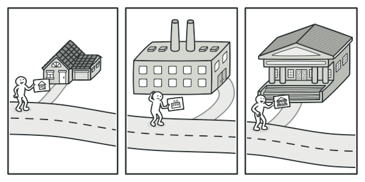
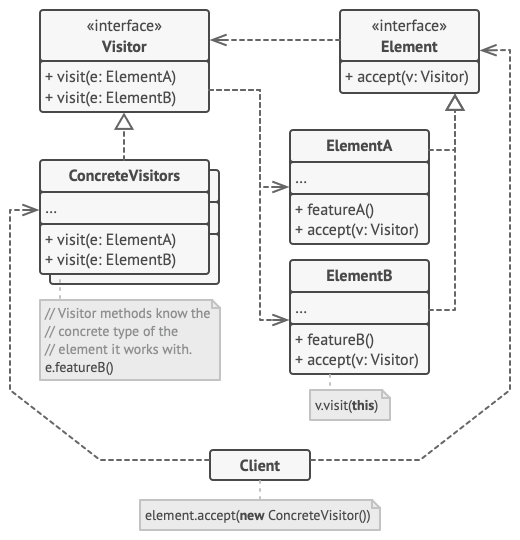
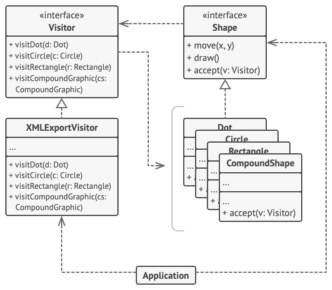

# Visitor

## 📜 Mục đích

**Visitor** là một design pattern thuộc nhóm behavioral giúp bạn tách các thuật toán khỏi đối tượng mà chúng đang hoạt động trên đó.


## 😟 Vấn đề

Tưởng tượng team bạn đang phát triển một ứng dụng làm việc với thông tin địa lý được cấu trúc dưới dạng một đồ thị khổng lồ. Mỗi nút trong đồ thị có thể biểu diễn một thực thể phức tạp như một thành phố, nhưng chi tiết hơn như các nhà máy, khu tham quan,... Các nút được kết nối với nhau nếu có một con đường giữa các đối tượng thực mà nó biểu diễn. Hiểu sâu hơn, mỗi loại nút được biểu diễn bởi lớp riêng của nó, trong khi mỗi nút cụ thể là một đối tượng.



Tại một thời điểm nào đó, bạn có nhiệm vụ xuất đồ thị sang định dạng XML. Lúc đầu, công việc có vẻ khá đơn giản. Bạn đã lên kế hoạch thêm một phương thức xuất vào từng lớp nút và sau đó tận dụng đệ quy để đi qua từng nút của đồ thị, thực hiện phương thức xuất. Giải pháp rất đơn giản và gọn gàng: nhờ tính đa hình, bạn không phải ghép đoạn code phương thức xuất với các lớp nút cụ thể.

Thật không may, kỹ sư hệ thống đã từ chối cho phép bạn thay đổi các lớp nút hiện có. Anh ấy nói rằng code đã được tạo và anh ấy không muốn mạo hiểm phá vỡ nó vì một lỗi tiềm ẩn trong các thay đổi của bạn.



Bên cạnh đó, anh ấy đặt câu hỏi liệu có hợp lý khi có code xuất XML trong các lớp nút hay không. Công việc chính của các lớp này là làm việc với dữ liệu địa lý. Hành vi xuất XML sẽ có vẻ không phù hợp ở đó.

Có một lý do khác cho việc từ chối. Rất có thể sau khi tính năng này được triển khai, một người nào đó từ bộ phận tiếp thị sẽ yêu cầu bạn cung cấp khả năng xuất sang một định dạng khác hoặc yêu cầu một số thứ kỳ lạ khác. Điều này sẽ buộc bạn phải thay đổi những lớp này một lần nữa.

## 😊 Giải pháp

Pattern Visitor gợi ý rằng bạn nên đặt hành vi mới vào một lớp riêng biệt được gọi là visitor, thay vì cố gắng tích hợp nó vào các lớp hiện có. Đối tượng gốc phải thực hiện hành vi bây giờ được chuyển cho một trong những phương thức của visitor dưới dạng tham số, cung cấp cho phương thức này quyền truy cập vào tất cả dữ liệu cần thiết có trong đối tượng.

Bây giờ, điều gì sẽ xảy ra nếu hành vi đó có thể được thực thi trên các đối tượng của các lớp khác nhau? Ví dụ, trong trường hợp này là xuất XML, việc triển khai thực tế có thể sẽ khác một chút trên các lớp nút khác nhau. Do đó, lớp visitor phải xác định không phải một, mà là một tập hợp các phương thức, mỗi phương thức có thể nhận các tham số thuộc các kiểu khác nhau, như thế này:

```c
class ExportVisitor implements Visitor is
    method doForCity(City c) { ... }
    method doForIndustry(Industry f) { ... }
    method doForSightSeeing(SightSeeing ss) { ... }
    // ...
```

Nhưng chính xác thì chúng ta sẽ gọi những phương pháp này như thế nào, đặc biệt là khi xử lý toàn bộ đồ thị? Các phương pháp này có các signature khác nhau, vì vậy ta không thể sử dụng tính đa hình. Để chọn một phương thức visitor thích hợp có thể xử lý một đối tượng nhất định, ta cần kiểm tra lớp của nó.

```c
foreach (Node node in graph)
    if (node instanceof City)
        exportVisitor.doForCity((City) node)
    if (node instanceof Industry)
        exportVisitor.doForIndustry((Industry) node)
    // ...
}
```

Bạn có thể hỏi, tại sao chúng ta không sử dụng phương thức overloading - nạp chồng? Overloading là khi bạn đặt cùng một tên cho tất cả các phương thức, ngay cả khi chúng có các tham số khác nhau. Thật không may, ngay cả trong trường hợp ngôn ngữ lập trình của ta hỗ trợ overloading (như Java và C #), thì nó cũng không giúp ích được gì cả. Vì lớp chính xác của đối tượng nút không được biết trước, cơ chế overloading sẽ không thể xác định phương thức chính xác để thực thi. Nó sẽ mặc định là phương thức nhận một đối tượng của lớp `Node` cơ sở.

Tuy nhiên, pattern visitor giải quyết vấn đề này. Nó sử dụng một kỹ thuật gọi là [**Double Dispatch**](https://refactoring.guru/design-patterns/visitor-double-dispatch), giúp thực thi phương thức thích hợp trên một đối tượng mà không cần các điều kiện rườm rà. 

Và thay vì cho phép client chọn một phiên bản thích hợp của phương thức để gọi, tại sao ta không ủy thác lựa chọn này cho các đối tượng mà chúng ta đang chuyển cho visitor làm tham số ? Vì các đối tượng biết các lớp riêng của chúng, chúng có thể chọn một phương pháp thích hợp cho visitor một cách ít lúng túng hơn. Chúng "accept" một visitor và cho visitor đó biết phương thức truy cập nào nên được thực thi.

```c
// Client code
foreach (Node node in graph)
    node.accept(exportVisitor)

// City
class City is
    method accept(Visitor v) is
        v.doForCity(this)
    // ...

// Industry
class Industry is
    method accept(Visitor v) is
        v.doForIndustry(this)
    // ...
```

Rốt cuộc thì ta cũng phải thay đổi các lớp nút. Nhưng ít nhất sự thay đổi là nhỏ và nó cho phép ta thêm các hành vi khác mà không phải thay đổi code một lần nữa.

Bây giờ, nếu ta trích xuất một interface chung cho tất cả visitor, thì tất cả các nút hiện có có thể hoạt động với bất kỳ visitor nào mà bạn thêm vào ứng dụng. Nếu bạn thấy mình đang thêm một hành vi mới liên quan đến các nút, tất cả những gì bạn phải làm là triển khai một lớp visitor mới.

## 🚗 Thế Giới Thực



Hãy tưởng tượng một đại lý bảo hiểm dày dạn kinh nghiệm đang mong muốn có được khách hàng mới. Anh ta có thể đến thăm mọi tòa nhà trong khu phố, cố gắng bán bảo hiểm cho mọi người anh ta gặp. Tùy thuộc vào loại hình tổ chức chiếm giữ tòa nhà, anh ta có thể đưa ra các chính sách bảo hiểm chuyên biệt:

- Nếu đó là một tòa nhà dân cư, anh ta bán bảo hiểm y tế.
- Nếu đó là một ngân hàng, anh ta bán bảo hiểm trộm cắp.
- Nếu đó là một quán cà phê, anh ấy bán bảo hiểm cháy nổ và thiên tai.

## 🏢 Cấu trúc



1. **Visitor** là interface khai báo một tập hợp các phương thức truy cập có thể lấy các concrete element của cấu trúc đối tượng làm tham số. Các phương thức này có thể trùng tên nếu chương trình được viết bằng ngôn ngữ hỗ trợ overloading, nhưng kiểu tham số của chúng phải khác nhau.
2. **Concrete Visitor** thực hiện một số phiên bản của các hành vi giống nhau, được điều chỉnh cho các lớp concrete element khác nhau.
3. **Element** là interface khai báo một phương thức để "accept" visitor. Phương thức này phải có một tham số được khai báo với kiểu interface visitor. 
4. **Concrete Element** thực hiện phương pháp nghiệm thu. Mục đích của phương thức này là chuyển hướng lệnh gọi đến phương thức của visitor thích hợp tương ứng với lớp element hiện tại. 

    Cần biết rằng ngay cả khi một lớp element cơ sở triển khai phương thức này, tất cả các lớp con vẫn phải ghi đè phương thức này trong các lớp của chính chúng và gọi phương thức thích hợp trên đối tượng visitor.
5. **Client** thường đại diện cho một tập hợp hoặc một số đối tượng phức tạp khác (ví dụ, một cây tổng hợp). Thông thường, client không biết tất cả các lớp concrete element vì chúng làm việc với các đối tượng từ tập hợp đó thông qua một số interface trừu tượng

## 👨‍💻 Mã giả

Trong ví dụ này, Visitor thêm hỗ trợ xuất XML vào hệ thống phân cấp lớp của các hình dạng hình học.



*Xuất nhiều loại đối tượng khác nhau sang định dạng XML thông qua đối tượng visitor.*

```c
// Interface element khai báo phương thức `accept` để
// nhận interface visitor cơ sở như là tham số.
interface Shape is
    method move(x, y)
    method draw()
    method accept(v: Visitor)


// Mỗi lớp concrete element phải triển khai phương
// thức `accept` theo một cách như gọi phương thức
// của visitor phù hợp với lớp của element.
class Dot implements Shape is
    // ...


    // Lưu ý ta gọi `visitDot`, tương ứng với tên lớp hiện 
    // tại. Cách này giúp visitor biết lớp của element
    // đang làm việc với nó.
    method accept(v: Visitor) is
        v.visitDot(this)

class Circle implements Shape is
    // ...
    method accept(v: Visitor) is
        v.visitCircle(this)

class Rectangle implements Shape is
    // ...
    method accept(v: Visitor) is
        v.visitRectangle(this)

class CompoundShape implements Shape is
    // ...
    method accept(v: Visitor) is
        v.visitCompoundShape(this)


// Interface visitor khai báo một tập hợp phương thức đi qua
// tương ứng với các lớp element. Ký hiệu của phương thức
// đi qua giúp visitior xác định chính xác lớp của element
// đang xử lý nó.
interface Visitor is
    method visitDot(d: Dot)
    method visitCircle(c: Circle)
    method visitRectangle(r: Rectangle)
    method visitCompoundShape(cs: CompoundShape)

// Concrete visitor triển khai nhiều phiên bản thuật toán
// giống nhau, thứ làm việc với tất cả lớp concrete element.
//
// Bạn có thể có nhiều lợi ích từ làm việc với pattern Visitor
// khi sử dụng nó với đối tượng có cấu trúc phức tạp như cây
// Composite. Trong trường hợp này, nó sẽ hữu ích để lưu trữ
// một vài trạng thái trung gian của thuật toán trong khi thực
// thi phương thức của visitor qua các đối tượng khác nhau của
// cấu trúc.
class XMLExportVisitor implements Visitor is
    method visitDot(d: Dot) is
        // Xuất ID của dấu chấm và hệ toạ độ trung tâm.

    method visitCircle(c: Circle) is
        // Xuất ID của vòng tròn, toạ độ trung tâm và bán kính.

    method visitRectangle(r: Rectangle) is
        // Xuất ID của hình chữ nhật, toạ độ trên-trái,
        // chiều dài và chiều rộng.

    method visitCompoundShape(cs: CompoundShape) is
        // Xuất ID của hình dạng cũng như danh sách con của ID.


// Code client chạy thao tác visitor qua bất kỳ tập hợp element
// mà không cần biết lớp cụ thể của nó. Thao tá accept trực tiếp
// gọi đến thao tác thích hợp ở đối tượng visitor.
class Application is
    field allShapes: array of Shapes

    method export() is
        exportVisitor = new XMLExportVisitor()

        foreach (shape in allShapes) do
            shape.accept(exportVisitor)
```

## 💡 Ứng dụng

**🐞 Sử dụng Visitor khi bạn cần thực hiện thao tác trên tất cả các phần tử của cấu trúc đối tượng phức tạp (ví dụ: cây đối tượng).**

⚡ Pattern Visitor cho phép bạn thực hiện một thao tác trên một tập hợp các đối tượng có các lớp khác nhau bằng cách để một đối tượng visitor triển khai một số biến thể của cùng một thao tác, tương ứng với tất cả các lớp mục tiêu.

**🐞 Sử dụng Visitor để làm sạch logic nghiệp vụ của các hành vi phụ trợ.**

⚡ Visitor cho phép bạn làm cho các lớp chính của ứng dụng tập trung hơn vào công việc chính của chúng bằng cách trích xuất tất cả các hành vi khác vào một tập hợp các lớp visitor.

**🐞 Sử dụng Visitor khi một hành vi chỉ có ý nghĩa trong một số lớp của hệ thống phân cấp lớp, nhưng không có ý nghĩa trong các lớp khác.**

⚡ Bạn có thể trích xuất hành vi này thành một lớp visitor riêng biệt và chỉ triển khai những phương thức truy cập chấp nhận các đối tượng của các lớp có liên quan, để trống phần còn lại.

## 📋 Triển khai

1. Khai báo interface visitor với một tập hợp các phương thức “ghé thăm”, một phương thức cho mỗi lớp phần tử cụ thể tồn tại trong chương trình.

2. Khai báo interface phần tử. Nếu bạn đang làm việc với hệ thống phân cấp lớp phần tử hiện có, hãy thêm phương thức trừu tượng "accept" vào lớp cơ sở của hệ thống phân cấp. Phương thức này phải chấp nhận một đối tượng visitor làm tham số.

3. Thực hiện các phương pháp chấp nhận trong tất cả các lớp phần tử cụ thể. Các phương thức này chỉ phải chuyển hướng cuộc gọi đến một phương thức thăm trên đối tượng visitor đến phù hợp với lớp của phần tử hiện tại.

4. Các lớp phần tử chỉ nên hoạt động với visitor thông qua interface visitor. Tuy nhiên, visitor phải biết tất cả các lớp phần tử cụ thể, được tham chiếu như các kiểu tham số của các phương thức truy cập.

5. Đối với mỗi hành vi không thể được triển khai bên trong phân cấp phần tử, hãy tạo một lớp visitor cụ thể mới và triển khai tất cả các phương pháp truy cập.

    Bạn có thể gặp phải tình huống trong đó visitor sẽ cần quyền truy cập vào một số thành viên riêng tư của lớp phần tử. Trong trường hợp này, bạn có thể đặt các trường hoặc phương thức này ở chế độ công khai, vi phạm tính đóng gói của phần tử hoặc lồng lớp visitor vào lớp phần tử. Điều sau chỉ có thể thực hiện được nếu bạn may mắn làm việc với ngôn ngữ lập trình hỗ trợ các lớp lồng nhau.

6. Client phải tạo các đối tượng visitor và chuyển chúng vào các phần tử thông qua các phương thức "accept".

## ⚖️ Ưu nhược điểm

### Ưu điểm

✔️ *Open/Closed Principle*. Bạn có thể thêm một hành vi mới có thể hoạt động với các đối tượng của các lớp khác nhau mà không cần thay đổi các lớp này.

✔️ *Single Responsibility Principle*. Bạn có thể chuyển nhiều phiên bản của cùng một hành vi vào cùng một lớp.

✔️ Một đối tượng visitor có thể tích lũy một số thông tin hữu ích khi làm việc với nhiều đối tượng khác nhau. Điều này có thể hữu ích khi bạn muốn duyệt qua một số cấu trúc đối tượng phức tạp, chẳng hạn như cây đối tượng và áp dụng visitor vào từng đối tượng của cấu trúc này.

### Nhược điểm

❌ Bạn cần cập nhật tất cả visitor mỗi khi một lớp được thêm vào hoặc xóa khỏi hệ thống phân cấp phần tử.

❌ Visitor có thể thiếu quyền truy cập cần thiết vào các trường riêng tư và phương pháp của các phần tử mà họ phải làm việc với.

## 🔁 Quan hệ với các pattern khác

Bạn có thể coi **Visitor** như một phiên bản mạnh mẽ của **Command**. Các đối tượng của nó có thể thực thi các hoạt động trên các đối tượng khác nhau của các lớp khác nhau.

Bạn có thể sử dụng **Visitor** cùng với **Iterator** để duyệt qua một cấu trúc dữ liệu phức tạp và thực hiện một số thao tác trên các phần tử của nó, ngay cả khi tất cả chúng đều có các lớp khác nhau

Bạn có thể sử dụng **Visitor** để thực hiện một thao tác trên toàn bộ cây **Composite**.

# Nguồn

[**refactoring**](https://refactoring.guru/design-patterns/template-method)