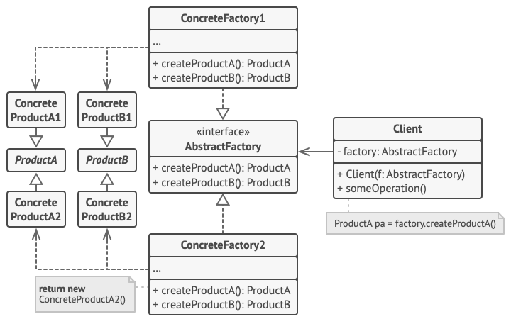

# Abstract Factory

## 📜 Mục đích

**Abstract Factory** là một design pattern thuộc nhóm creational, dùng để tạo ra các đối tượng có quan hệ gần gũi với nhau mà không cần chỉ định đến lớp cụ thể của chúng.


## 😟 Vấn đề

Giả sử bạn đang tạo một trang bán đồ nội thất. Code của bạn bao gồm các lớp sau:
1. Các sản phẩm có quan hệ với nhau như: `Sofa`, `Chair` và `CoffeTable`.
2. Các biến thể của nhóm sản phẩm đó. Ví dụ như nhóm `Sofa` + `Chair` + `CoffeTable` có các biến thể như `Modern`, `Victorian` và `ArtDeco`.


Bạn cần có cách để khi tạo một đồ nội thất đơn lẻ, nó phải phù hợp với các đồ vật khác trong nhóm của nó. Khách hàng sẽ khó chịu khi họ nhận về những đồ vật trong nhóm có biến thể khác nhau.


Bên cạnh đó, bạn không muốn thay đổi code mỗi khi thêm sản phẩm hoặc nhóm sản phẩm trong chương trình. Danh mục nội thất được cập nhật rất thường xuyên, và bạn không muốn thay đổi code mỗi khi nó diễn ra.

## 😊 Giải pháp

Việc đầu tiên cần làm theo Abstract Factory là khai báo inteface rõ ràng cho mỗi sản phẩm riêng biệt trong nhóm sản phẩm. Và tạo tất cả biến thể của sản phẩm theo sau inteface đó. Ví dụ tất cả biến thể của ghế được triển khai trong interface `Chair`, tất cả sofa được triển khai trong interface `Sofa` ,...


Bước tiếp theo là khai báo *Abstract Factory* - là interface chứa tất cả phương thức tạo cho tất cả sản phẩm trong nhóm sản phẩm (vd: `createChair`, `createSofa` và `createCoffeTable`). Các phương thức này trả về một kiểu sản phẩm **trừu tượng (abstract)** được biểu diễn bởi interface mà chúng ta trích xuất trước đó: `Chair`, `Sofa`, `CoffeTable`,...


Vậy còn các biến thể của sản phẩm? Với từng biến thể của nhóm sản phẩm, ta tạo ra một lớp factory riêng biệt dựa trên interface **Abstract Factory**. Factory là lớp trả về kiểu sản phẩm riêng biệt. Ví dụ, `ModernFurnitureFactory` có thể tạo ra các đối tượng `ModernChair`, `ModernSofa` hay `ModernCoffeTable`.

Code client làm việc với factory hay sản phẩm thông qua interface trừu tượng. Thế nên bạn có thể thay đổi kiểu factory hay biến thể của sản phẩm cho code client nhận mà không gây ra bất kỳ lỗi gì.


Giả sử client muốn một factory để tạo ghế (chair). Nó sẽ không cần quan tâm kiểu của lớp factory đó, cũng như kiểu ghế nhận về. Dù là Modern hay Victorian, nó cũng sẽ xử lý theo cùng một cách là thông qua interface trừu tượng `Chair`. Với cách tiếp cận này client chỉ cần quan tâm là ghế sẽ triển khai phương thức `sitOn` như thế nào. Bên cạnh đó, bất kỳ biến thể nào của `chair`, nó cũng sẽ phù hợp với `sofa` và `coffe-table` được tạo cùng đối tượng factory.

Nếu bạn thắc mắc: client chỉ làm việc với interface trừu tượng, vậy thì cái gì sẽ tạo ra factory ?. Thông thường ứng dụng sẽ tạo đối tượng factory cụ thể ở giai đoạn khởi tạo, nhưng trước đó ứng dụng sẽ tạo factory dựa trên kiểu cấu hình hoặc thiết lập môi trường.

## 🏢 Cấu trúc



1. **Abstract Product** là inteface cho các sản phẩm riêng biệt nhưng có quan hệ với nhau tạo nên một nhóm sản phẩm.
2. **Concrete Product** là các triển khai biến thể của abstract product, được gom nhóm theo biến thể. Mỗi abstract product (chair/sofa) sẽ được triển khai tất cả biến thể (modern, victorian).
3. **Abstract Factory** là interface có tập hợp phương thức khởi tạo cho từng abstract product.
4. **Concrete Factory** là triển khai phương thức khởi tạo của abstract factory. Mỗi concrete factory tương ứng với biến thể cụ thể của sản phẩm và chỉ tạo sản phẩm theo biến thể đó.
5. Mặc dù concrete factory tạo ra các concrete product, nhưng signature của phương thức khởi tạo trả về sẽ tương ứng với abstract product. Với cách này code client sử dụng factory sẽ không cần quan tâm tới biến thể cụ thể của sản phẩm từ factory. Nó có thể làm việc với bất kỳ biến thể nào miễn là giao tiếp với các đối tượng thông qua interface trừu tượng.

## 👨‍💻 Mã giả

Ví dụ này minh hoạ cách Abstract Factory có thể sử dụng để tạo các phần tử UI đa nền tảng mà không cần ghép code client với lớp UI cụ thể, đồng thời giữ cho tất cả các phần tử được tạo nhất quán với hệ điều hành đã chọn


Các phần tử UI trên các ứng dụng đa nền tảng sẽ được triển khai giống nhau, sẽ có một chút khác biệt trên các hệ điều hành khác nhau. Hơn nữa, nhiệm vụ của bạn là đảm bảo style của các phần tử UI phù hợp với hệ điều hành hiện tại. Bạn sẽ không muốn chương trình hiển thị MacOS control khi được thực thi trên Windows.

Abstract Factory sẽ khai báo tập hợp các phương thức khởi tạo mà code client có thể dùng để tạo các kiểu phần tử UI khác nhau. Concrete factory tương ứng với hệ điều hành cụ thể sẽ tạo ra các phần tử UI phù hợp với hệ điều hành đó.

Nó hoạt động như sau: khi ứng dụng bắt đầu chạy, nó sẽ kiểm tra loại hệ điều hành hiện tại. Ứng dụng sẽ dùng thông tin đó để tạo ra một đối tượng factory từ lớp tương ứng với hệ điều hành. Các phần còn lại sẽ dùng factory để tạo ra phần tử UI. Điều này ngăn việc tạo các phần tử UI sai lệch.

Với cách tiếp cận này, code client không phụ thuộc lớp cụ thể của factory hay phần tử UI, miễn là nó làm việc với các đối tượng thông qua abstract factory. Không những thế, code client còn hỗ trợ các factory khác và phần tử UI bạn thêm vào trong tương lai.

Như vậy bạn không cần chỉnh sửa code client mỗi lần thêm biến thể của phần tử UI trong ứng dụng. Bạn chỉ cần tạo một lớp factory mới tạo ra các phần tử này và sửa đổi một chút code khởi tạo để ứng dụng chọn lớp đó khi thích hợp.

```c
// Interface Abstract Factory khai bao tập hợp phương thức
// trả về kiểu abstract product khác nhau. Các sản phẩm chung
// nhóm có quan hệ với nhau về chủ đề hoặc một khái niệm cấp cao.
// Sản phẩm từ một nhóm thường có thể cộng tác với nhau. Nhóm 
// sản phẩm thường có một hay nhiều biến thể, nhưng sản phẩm của
// một biến thể này sẽ không tương thích với biến thể khác.
interface GUIFactory is
    method createButton():Button
    method createCheckbox():Checkbox


// Concrete factory tạo ra nhóm sản phẩm thuộc về một biến thể.
// Factory đảm bảo rằng sản phẩm tạo ra luôn tương thích.
// Signature của phương thức concrete factory trả về 
// abstract product, trong khi bên trong phương thức,
// concrete product được tạo ra.
class WinFactory implements GUIFactory is
    method createButton():Button is
        return new WinButton()
    method createCheckbox():Checkbox is
        return new WinCheckbox()

// Mỗi concrete factory có một biến thể sản phẩm tương ứng.
class MacFactory implements GUIFactory is
    method createButton():Button is
        return new MacButton()
    method createCheckbox():Checkbox is
        return new MacCheckbox()


// Mỗi sản phẩm riêng biệt của nhóm sản phẩm nên có một interface
// cơ sở. Tất cả biết thể của sản phẩm sẽ được triển khai từ 
// interface này
interface Button is
    method paint()


// Concrete product được tạo bởi concrete factory tương ứng.
class WinButton implements Button is
    method paint() is
        // Hiển thị button trong Windows

class MacButton implements Button is
    method paint() is
        // Hiển thị button trong MacOS

// Đây là interface cơ sở của một sản phẩm khác. Tất cả 
// sản phẩm có thể tương tác với nhau, nhưng tương tác
// chỉ khả dụng giữa hai sản phẩm cùng một biến thể.
interface Checkbox is
    method paint()

class WinCheckbox implements Checkbox is
    method paint() is
        // Hiển thị checkbox trong Windows

class MacCheckbox implements Checkbox is
    method paint() is
        // Hiển thị checkbox trong MacOS


// Code client làm việc với factory và sản phẩm chỉ thông qua
// kiểu trừu tượng: GUIFactory, Button và Checkbox. Nó giúp bạn
// chuyển bất kỳ lớp con nào của factory sang code client mà
// không làm hỏng nó.
class Application is
    private field factory: GUIFactory
    private field button: Button
    constructor Application(factory: GUIFactory) is
        this.factory = factory
    method createUI() is
        this.button = factory.createButton()
    method paint() is
        button.paint()


// Ứng dụng chọn kiểu factory tùy thuộc vào cấu hình hiện tại 
// hoặc thiết lập môi trường và tạo nó trong thời gian chạy
// (thường ở giai đoạn khởi tạo).
class ApplicationConfigurator is
    method main() is
        config = readApplicationConfigFile()

        if (config.OS == "Windows") then
            factory = new WinFactory()
        else if (config.OS == "Mac") then
            factory = new MacFactory()
        else
            throw new Exception("Error! Unknown operating system.")

        Application app = new Application(factory)
```

## 💡 Ứng dụng

**🐞 Sử dụng Abstract Factory khi bạn cần làm việc với nhiều biến thể của một nhóm sản phẩm, mà bạn không muốn phụ thuộc vào lớp cụ thể của sản phẩm đó - chúng có thể chưa biết trước hoặc đơn giản là bạn muốn mở rộng trong tương lai.**

⚡  Abstract Factory cung cấp cho bạn interface để tạo các đối tượng từ mỗi lớp trong nhóm sản phẩm miễn là code của bạn tạo đối tượng thông qua interface, bạn sẽ không phải lo lắng các vấn đề tạo sai biến thể của sản phẩm hay không phù hợp với sản phẩm đã tạo trong ứng dụng.

- Khi triển khai Abstract Factory cần lưu ý nến bạn có một lớp với một tập hợp phương thức Factory, nó có thể làm mờ nhiệm vụ chính của Abstract.
- Một thiết kế chương trình tốt là khi *mỗi lớp sẽ chỉ làm một nhiệm vụ*. Khi một lớp xử lý nhiều loại sản phẩm, bạn có thể trích xuất các phương thức factory của nó thành một lớp factory độc lập hoặc triển khai Abstract Factory toàn diện.

## 📋 Triển khai

1. Lập sơ đồ ma trận cho các loại sản phẩm riêng biệt so với các biến thể của chúng.

2. Khai báo interface, Abstract Product cho tất cả loại sản phẩm. Sau đó tạo ra lớp concrete product triển khai interface này.

3. Khai báo interface, Abstract Factory với tập hợp phương thức khởi tạo cho tất cả abstract product.

4. Triển khai các lớp concrete factory cho từng loại biến thể của sản phẩm

5. Tạo code khởi tạo factory đâu đó trong ứng dụng. Nó sẽ khởi tạo một trong các lớp concrete factory, dựa trên cấu hình ứng dụng hoặc thiết lập môi trường. Truyền đối tượng factory này cho tất cả lớp tạo sản phẩm.

6. Kiểm tra code và tìm tất cả các lệnh gọi trực tiếp đến constructor của sản phẩm. Thay thế chúng bằng các lệnh gọi đến phương thức tạo thích hợp trên đối tượng factory.

## ⚖️ Ưu nhược điểm

### Ưu điểm

✔️ Bạn có thể chắc chắn rằng các sản phẩm lấy từ một factory sẽ tương thích với nhau.

✔️ Tránh được kết hợp quá chặt chẽ giữa code client và concrete product.

✔️ *Single Responsibility Principle*. Bạn có thể di chuyển code tạo sản phẩm vào một nơi trong chương trình, giúp hỗ trợ code dễ dàng hơn.

✔️ *Open/Closed Principle*. Bạn có thể thêm các biến thể mới vào chương trình, mà không làm ảnh hưởng đến code client hiện tại.

### Nhược điểm

❌ Code có thể trở nên phức tạp khi bạn thêm vào quá nhiều interface và lớp để triển khai pattern.

## 🔁 Quan hệ với các pattern khác

Nhiều pattern bắt đầu bằng cách sử dụng **Factory Method** (ít phức tạp hơn và có thể tùy chỉnh nhiều hơn thông qua các lớp con) và phát triển theo hướng **Abstract Factory**, **Prototype** hoặc **Builder** (linh hoạt hơn nhưng phức tạp hơn).

Các lớp **Abstract Factory** thường dựa trên một tập hợp các **Factory Method**, nhưng bạn cũng có thể sử dụng **Prototype** để cấu trúc các phương thức trên các lớp này.

**Builder** tập trung vào việc xây dựng các đối tượng phức tạp theo từng bước. **Abstract Factory** chuyên tạo các nhóm đối tượng. **Abstract Factory** trả lại sản phẩm ngay lập tức, trong khi **Builder** cho phép bạn chạy một số bước xây dựng bổ sung trước khi tìm nạp sản phẩm.

**Abstract Factory** có thể dùng như một giải pháp thay thế cho **Facade** khi bạn chỉ muốn ẩn cách các đối tượng hệ thống con được tạo ra khỏi code client.

Bạn có thể sử dụng **Abstract Factory** cùng với **Bridge**. Việc ghép nối này rất hữu ích khi một số abstract được xác định bởi **Bridge** chỉ có thể hoạt động với các triển khai cụ thể. Trong trường hợp này, **Abstract Factory** có thể đóng gói các quan hệ này và ẩn sự phức tạp khỏi code client.

Tất cả các **Abstract Factory**, **Builder** và **Prototype** đều có thể được triển khai dưới dạng các **Singleton**.

# Nguồn

[**refactoring**](https://refactoring.guru/design-patterns/abstract-factory)