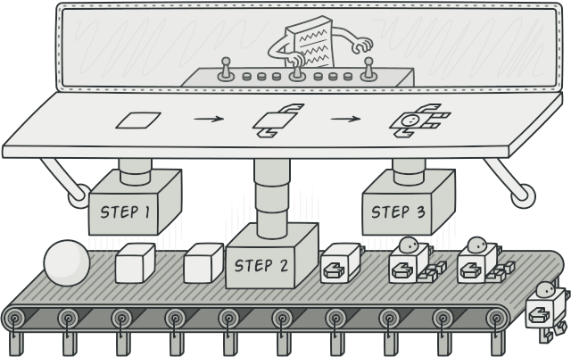
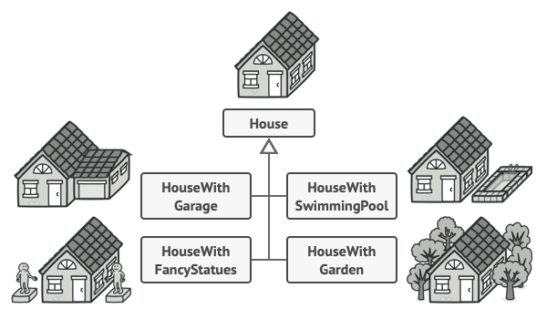
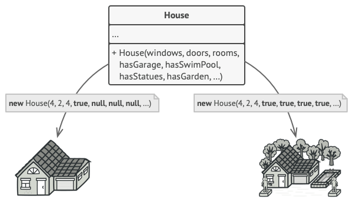
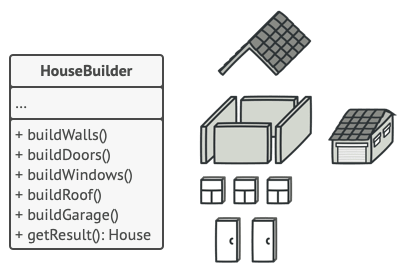
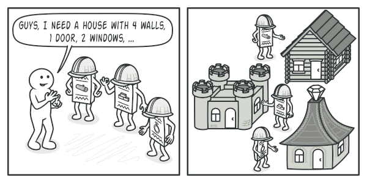
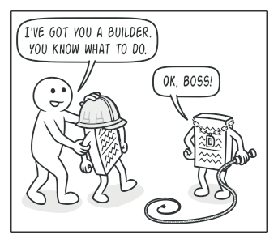
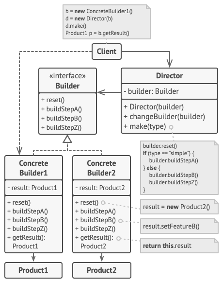
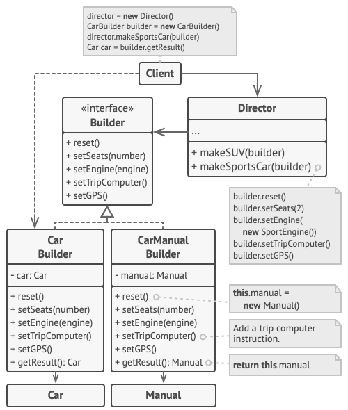

# Builder

## 📜 Mục đích

**Builder** là design pattern thuộc nhóm creational, giúp bạn khởi tạo những đối tượng phức tạp theo từng bước. Pattern này cho phép bạn tạo và biểu diễn các kiểu đối tượng khác nhau bằng code khởi tạo giống nhau.



## 😟 Vấn đề

Hãy tưởng tượng một đối tượng phức tạp đòi hỏi nhiều công sức, phải tạo từng bước một với rất nhiều trường và các đối tượng lồng nhau. Các đoạn code khởi tạo như vậy sẽ nằm rất sâu trong hàm khởi tạo (constructor) khổng lồ với rất nhiều tham số. Hoặc tệ hơn là nó nằm rải rác trên các đoạn code client.



Ví dụ như làm thế nào để tạo một đối tượng `House`. Để xây dựng một ngôi nhà đơn giản, bạn cần tạo bốn bức tường, nền móng, cửa lớn, các cửa sổ phù hợp và mái nhà. Nhưng nếu sau này, bạn cần mở rộng nhà to hơn, sáng sủa hơn, với sân sau và những hệ thống tiên tiến như (hệ thống ống nước, hệ thống sưởi ấm, hệ thống dây điện)?

Giải pháp đơn giản nhất là mở rộng lớp cơ sở `House`, và tạo ra tập hợp lớp con để kết hợp tất cả các tham số. Nhưng điều này sẽ khiến bạn tạo ra một số lượng đáng kể lớp con, đồng thời với bất kỳ tham số mới nào, ví dụ như kiểu hiên nhà sẽ yêu cầu phát triển hệ phân cấp lớp nhiều hơn nữa.

Lúc này cách tiếp cận khác tránh việc tạo nhiều lớp con. Là bạn có thể tạo một hàm khởi tạo (constructor) lớn trong lớp cơ sở `House` với tất cả tham số cần thiết để điều khiển đối tượng `House`. Cách này tuy có thể giải quyết vấn đề lớp con nhưng lại rơi vào vấn đề khác.



*Nhược điểm của constructor nhiều tham số là không phải lúc nào cũng cần đến các tham số*

Trong phần lớn trường hợp, các tham số của bạn sẽ không được dùng đến, điều này làm cho *hàm khởi tạo của bạn rất tệ*. Ví dụ chỉ một phần trong nhà bạn có hồ bơi, thì những tham số liên quan đến hồ bơi sẽ vô dụng khoảng 90%.

## 😊 Giải pháp

Ý tưởng của Builder pattern là bạn sẽ trích xuất các đoạn code khởi tạo đối tượng ra khỏi lớp của nó và chuyển đến một đối tượng riêng biệt gọi là *builder*.



*Builder pattern giúp bạn khởi tạo đối tượng phức tạp theo từng bước.*

Pattern khởi tạo đối tượng theo trật tự từng bước một (vd như `buildWalls`, `buildDoor`,...).
Để tạo đối tượng, bạn thực thi một loạt các bước này trên đối tượng builder. Nhưng bạn không cần phải gọi đến tất các bước, mà chỉ cần gọi đến bước cần thiết để tạo cấu hình cụ thể của đối tượng.

Một vài bước khởi tạo yêu cầu triển khai khác nhau, khi bạn cần biểu diễn các biến thể của sản phẩm. Ví dụ: tường của một cabin sẽ được xây bằng gỗ, còn tường của một lâu đài sẽ được xây bằng đá.

Trong trường hợp đấy, ta cần tạo ra nhiều lớp builder khác nhau, để triển khai các bước xây dựng giống nhau nhưng khác về cách thức. Sau đó bạn sử dụng builder trong quá trình khởi tạo để tạo ta các kiểu đối tượng khác nhau.



Ví dụ, cần xây dựng 3 ngôi nhà, cái thứ nhất được xây từ gỗ và kính, cái thứ hai được xây từ đá và sắt còn cái thứ ba được xây từ vàng và kim cương. Như vậy với lệnh gọi các bước thực hiện như nhau, ta sẽ có một ngôi nhà thông thường, một lâu đài và một cung điện. Tuy các nhiệm vụ giống nhau nhưng các xây dựng khác nhau với từng biến thể.

Song điều này chỉ hoạt động khi code client gọi các lệnh khởi tạo tương tác với builder thông qua inteface chung.

### Director

Bạn có thể trích xuất một loạt lệnh gọi đến các bước của hàm khởi tạo, mà bạn sử dụng để xây dựng sản phẩm thành một lớp riêng biệt có tên là *director*.

Lớp director xác định thứ tự thực thi của các bước xây dựng, trong khi builder cung cấp việc triển khai cho các bước đó.



Các lớp director là không bắt buộc. Bạn có thể gọi các bước xây dựng theo thứ tự cụ thể trực tiếp từ code client. Tuy nhiên, lớp director là nơi lý tưởng để đặt các quy trình khởi tạo khác nhau mà bạn có thể sử dụng lại trong chương trình của mình.

Ngoài ra, lớp director sẽ ẩn hoàn toàn chi tiết khởi tạo của sản phẩm với code client. Code client chỉ cần liên kết với director, rồi nhận hàm khởi tạo từ director và kết quả từ builder.

## 🏢 Cấu trúc



1. **Builder** là interface khai báo các bước tạo sản phẩm chung cho tất cả loại builder.
2. **Concrete Builder** cung cấp các triển khai khác nhau cho các bước khởi tạo. Concrete Builder có thể tạo sản phẩm mà không cần theo interface chung.
3. **Product** là đối tượng kết quả. Product được tạo bởi nhiều builder khác nhau không nhất thiết phải thuộc cùng một lớp phân cấp hay interface chung.
4. **Director** lớp định nghĩa thứ tự gọi các bước khởi tạo. Vì vậy bạn có thể tạo và sử dụng cho cấu hình cụ thể của sản phẩm.
5. **Client** phải liên kết đến một trong các đối tượng builder và director. Thường chỉ được thực hiện một lần, thông qua tham số của hàm khởi tạo director. Sau đó director sẽ sử dụng đối tượng builder cho tất cả khởi tạo tiếp theo. Tuy nhiên có một giải pháp thay thế là khi client truyền đối tượng builder sang phương thức production trong director. Trong trường hợp này, bạn có thể sử dụng builder khác nhau mỗi khi cần tạo thứ gì đó với director.

## 👨‍💻 Mã giả

Đây là ví dụ minh hoạ cách pattern **Builder** sử dụng lại code tạo đối tượng khi xây dựng các kiểu sản phẩm khác nhau, ví dụ như xe hơi và tạo các hướng dẫn sử dụng tương ứng.



Xe hơi là một đối tượng phức tạp có thể được tạo bằng hàng trăm cách khác nhau. Thay vì một lớp `Car` với hàm khởi tạo (constructor) khổng lồ, ta sẽ trích xuất code lắp ráp xe vào một lớp `CarBuilder` riêng biệt. Lớp này sẽ có tập hợp các phương pháp cấu hình cho từng bộ phận trong xe.

Nếu code client cần lắp ráp xe theo một mô hình đặc biệt, được tinh chỉnh thì nó có thể làm việc trực tiếp với builder. Trong trường hợp khác, nó có thể uỷ thác việc lắp ráp cho lớp director, nơi biết cách sử dụng builder để tạo ra những mẫu xe thời thượng nhất.

Bạn có thể bị sốc nếu biết mọi chiếc xe đều có hướng dẫn sử dụng (hầu hết mọi người không đọc chúng :v). Hướng dẫn sử dụng là thứ mô tả mọi tính năng của chiếc xe đấy, vì vậy với các mẫu xe khác nhau sẽ có hướng dẫn sử dụng khác nhau. Đó là lý do bạn nên sử dụng cùng quy trình tạo cho chiếc xe và hướng dẫn sử dụng của nó. Dĩ nhiên, tạo hướng dẫn sử dụng không giống tạo một chiếc xe, đó là lý do ta cung cấp cho nó một lớp builder khác chuyên biệt cho việc tạo hướng dẫn sử dụng. Lớp này thực hiện các phương thức xây dựng tương tự như `CarBuilder`, nhưng thay vì chế tạo các bộ phận, nó chỉ mô tả chúng. Bằng cách truyền các builder vào cùng một đối tượng director, ta có thể tạo ra chiếc xe hay hướng dẫn sử dụng của nó.

Cuối cùng là tìm nạp đối tượng kết quả. Một chiếc xe bằng kim loại và hướng dẫn sử dụng bằng giấy dù có quan hệ những vẫn rất khác nhau. Nên ta không thể đặt phương thức nạp kết quả trong director, vì nó không kết hợp với lớp product cụ thể. Do đó ta sẽ nhận về kết quả tạo từ builder.

```c
// Sử dụng pattern Builder có ý nghĩa khi sản phẩm
// quá phức tạp và yêu cầu nhiều cấu hình mở rộng. 
// Hai sản phẩm có quan hệ với nhau, dù không có
// interface chung.

class Car is
    // Xe hơi có thể có GPS, hộp đen và một số ghế ngồi.
    // Cái mẫu xe khác nhau(xe thể thao, SUV, xe mui trần)
    // sẽ có tính năng được thiết lập khác nhau.

class Manual is
    // Mỗi xe sẽ có một hướng dẫn sử dụng cho người dùng
    // tương ứng với cấu hình xe đó để mô tả mọi tính năng.


// Interface builder chỉ định phương thức cụ thể để tạo
// các phần khác nhau trong đối tượng sản phẩm.
interface Builder is
    method reset()
    method setSeats(...)
    method setEngine(...)
    method setTripComputer(...)
    method setGPS(...)


// Lớp concrete builder theo sau interface builder và cung cấp
// các triển khai cụ thể cho bước xây dựng. Chương trình của bạn 
// sẽ có nhiều biến thể builder cho các triển khai khác nhau.
class CarBuilder implements Builder is
    private field car:Car

    // Một fresh builder nên bao gồm đối tượng sản phẩm trống
    // để sử dụng cho các lắp ráp trong tương lai.
    constructor CarBuilder() is
        this.reset()

    // Phương thức reset xoá đối tượng được xây dựng.
    method reset() is
        this.car = new Car()

    // Tất cả các bước tạo làm việc với cùng một đối tượng sản phẩm.
    method setSeats(...) is
        // Thiết lập số ghế ngồi trong xe.

    method setEngine(...) is
        // Cài đặt bộ động cơ.

    method setTripComputer(...) is
        // Cài đặt máy tính hành trình.

    method setGPS(...) is
        // Cài đặt GPS.
    
    // Concrete builder phải cung cấp phương thức của nó để
    // truy xuất kết quả. Các kiểu builder khác nhau sẽ tạo 
    // ra sản phẩm hoàn chỉnh khác nhau mà không cần theo một
    // interface chung. Do đó, phương thức này không thể khai 
    // báo ở interface builder (chí ít là với các ngôn ngữ lập
    // trình tĩnh.)
    //
    // Thông thường, sau khi nhận kết quả cuối cùng từ client,
    // builder sẽ sẵn sàng cho việc tạo ra một sản phẩm khác.
    // Đó là lý do ta đặt lệnh gọi phương thức reset ngay phía
    // sau phương thức `getProduct`. Tuy nhiên, điều này là không
    // bắt buộc, bạn có thể để cho builder đợi đến lệnh gọi reset
    // từ code client trước khi loại bỏ kết quả trước đó.
    method getProduct():Car is
        product = this.car
        this.reset()
        return product

// Không giống creational pattern khác, builder giúp bạn
// tạo sản phẩm không cần theo interface chung.
class CarManualBuilder implements Builder is
    private field manual:Manual

    constructor CarManualBuilder() is
        this.reset()

    method reset() is
        this.manual = new Manual()

    method setSeats(...) is
        // Tài liệu số ghế của xe.

    method setEngine(...) is
        // Thêm hướng dẫn động cơ.

    method setTripComputer(...) is
        // Thêm hướng dẫn máy tính hành trình.

    method setGPS(...) is
        // Thêm hướng dẫn GPS.

    method getProduct():Manual is
        // Trả về hướng dẫn sử dụng và reset builder


// Director chỉ chịu trách nhiệm cho thực thi các bước xây dựng
// theo một thứ tự cụ thể. Nó hữu ích khi tạo sản phẩm theo một
// trật tự xác định hoặc một cấu hình rõ ràng.
// Nói đúng hơn, lớp director là tuỳ chọn, để client có thể gián
// tiếp điều khiển builder.
class Director is
    private field builder:Builder

    // Director làm việc với bất kỳ builder nào mà code client
    // truyền vào nó. Với cách này, code client có thể thay đổi
    // kiểu cuối cùng của sản phẩm vừa được lắp ráp.
    method setBuilder(builder:Builder)
        this.builder = builder

    // Director có thể tạo nhiều biến thể sản phẩm
    // với cùng các bước xây dựng.
    method constructSportsCar(builder: Builder) is
        builder.reset()
        builder.setSeats(2)
        builder.setEngine(new SportEngine())
        builder.setTripComputer(true)
        builder.setGPS(true)

    method constructSUV(builder: Builder) is
        // ...


// Code client tạo đối tượng builder, truyền nó vào director 
// sau đó bắt đầu quá trình khởi tạo. Kết quả cuối cùng được
// truy xuất từ đối tượng builder.
class Application is

    method makeCar() is
        director = new Director()

        CarBuilder builder = new CarBuilder()
        director.constructSportsCar(builder)
        Car car = builder.getProduct()

        CarManualBuilder builder = new CarManualBuilder()
        director.constructSportsCar(builder)


        // Sản phẩm cuối cùng thường được truy xuất từ đối
        // tượng builder vì director không nhận biết được
        // concreate builder và sản phẩm.
        Manual manual = builder.getProduct()
```

## 💡 Ứng dụng

**🐞 Sử dụng Builder để loại bỏ các "hàm khởi tạo khổng lồ"** 

⚡  Giả sử bạn có một phương thức khởi tạo với 10 tham số. Gọi một con "quái vật" như vậy là rất bất tiện, nên bạn đã overload constructor để tạo ra nhiều phiên bản ít tham số hơn. Các constructor này vẫn tham chiếu đến cái chính, và truyền một số giá trị mặc định vào bất kỳ tham số nào bị bỏ qua.

```
class Pizza {
    Pizza(int size) { ... }
    Pizza(int size, boolean cheese) { ... }
    Pizza(int size, boolean cheese, boolean pepperoni) { ... }
    // ...
```

Builder cho phép bạn xây dựng đối tượng từng bước, chỉ dùng những bước bạn thực sự cần. Sau khi triển khai pattern bạn không cần nhồi nhét hàng tá tham số vào constructor.

**🐞 Sử dụng Builder khi bạn muốn code của bạn tạo ra các sản phẩm có biểu diễn khác nhau (như nhà tường và nhà gỗ)**

⚡  Builder pattern có thể áp dụng khi tạo các biểu diễn khác nhau của sản phẩm gồm các bước tương tự nhau chỉ khác về chi tiết.

**🐞 Sử dụng Builder để tạo ra những cây Composite và các đối tượng phức tạp khác**

⚡  Builder tạo sản phẩm theo từng bước một. Bạn có thể trì hoãn việc thực thi một số bước mà không làm ảnh hưởng đến sản phẩm cuối cùng. Bạn cũng có thể gọi đệ quy, điều này rất hữu ích khi bạn xây dựng đối tượng cây. Builder không để lộ sản phẩm khi đang thực hiện các bước tạo. Điều này tránh việc code client tìm nạp sản phẩm chưa hoàn chỉnh.

## 📋 Triển khai

1. Đảm bảo bạn đã xác định rõ ràng các bước khởi tạo để xây dựng tất cả sản phẩm khả dụng. Nếu không bạn không thể triển khai pattern này.

2. Khai báo các bước trong interface cơ sở Builder.

3. Tạo lớp concrete builder cho từng biểu diễn sản phẩm và triển khai các bước khởi tạo của chúng. Đừng quên rằng việc triển khai phương thức để tìm nạp kết quả cho khởi tạo. Đó là lý do phương thức này không thể đặt trong interface Builder, vì các builder khác nhau có thể tạo ra các sản phẩm không cùng interface. Do đó bạn không biết kiểu trả về của phương thức. Tuy nhiên, nếu bạn đang xử lý các sản phẩm từ một hệ thống phân cấp, thì phương pháp tìm nạp có thể được thêm vào interface cơ sở một cách an toàn.

4. Tạo lớp director. Nó bao gồm nhiều cách khác nhau để tạo sản phẩm trên cùng một đối tượng builder.

5. Code client tạo ra cả đối tượng builder và director. Trước khi bắt đầu khởi tạo, client truyền đối tượng builder vào director, thông thường client chỉ làm một lần thông qua tham số của hàm khởi tạo director. Director sử dụng builder cho tất cả khởi tạo trong tương lai. Có một cách tiếp cận khác là builder chuyển trực tiếp đến phương thức constructor của director.

6. Chỉ có thể nhận kết quả trực tiếp từ director nếu tất cả sản phẩm cùng theo một interface chung. Ngược lại thì phải nhận từ builder.

## ⚖️ Ưu nhược điểm

### Ưu điểm

✔️ Bạn có thể tạo đối tượng từng bước, bỏ qua vài bước hay chạy đệ quy.

✔️ Bạn có thể sử dụng lại code khởi tạo cho xây dựng sản phẩm có biểu diễn khác nhau.

✔️ *Single Responsibility Principle*. Bạn có thể tách code khởi tạo phức tạp khỏi logic nghiệp vụ của sản phẩm

### Nhược điểm

❌ Độ phức tạp tổng thể của code tăng lên vì pattern yêu cầu tạo nhiều lớp mới.

## 🔁 Quan hệ với các pattern khác

Nhiều pattern bắt đầu bằng cách sử dụng **Factory Method** (ít phức tạp hơn và có thể tùy chỉnh nhiều hơn thông qua các lớp con) và phát triển theo hướng **Abstract Factory**, **Prototype** hoặc **Builder** (linh hoạt hơn nhưng phức tạp hơn).

**Builder** tập trung vào việc xây dựng các đối tượng phức tạp theo từng bước. **Abstract Factory** chuyên tạo các nhóm đối tượng. **Abstract Factory** trả lại sản phẩm ngay lập tức, trong khi **Builder** cho phép bạn chạy một số bước xây dựng bổ sung trước khi tìm nạp sản phẩm.

Bạn có thể sử dụng **Builder** khi tạo các cây **Composite** phức tạp vì bạn có thể lập trình các bước xây dựng của nó để hoạt động một cách đệ quy.

Bạn có thể kết hợp **Builder** với **Bridge**: lớp director đóng vai trò abstract, trong khi các builder khác đóng vai trò implementation.

Tất cả các **Abstract Factory**, **Builder** và **Prototype** đều có thể được triển khai dưới dạng các **Singleton**.


# Nguồn

[**refactoring**](https://refactoring.guru/design-patterns/builder)