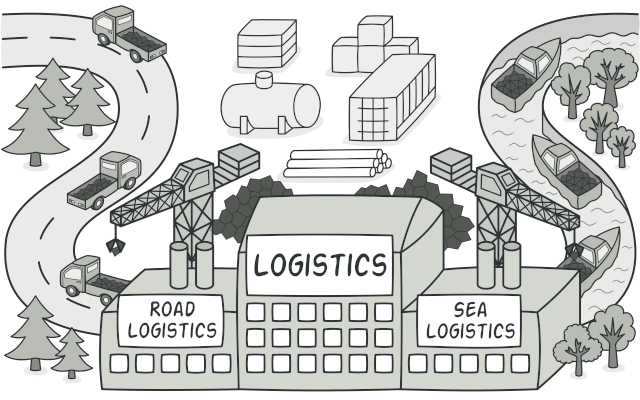
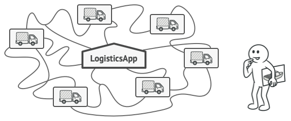
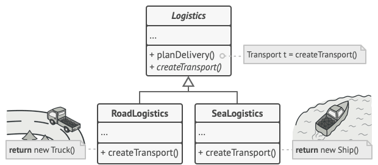
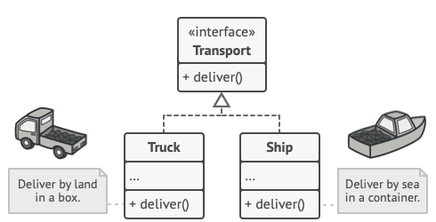
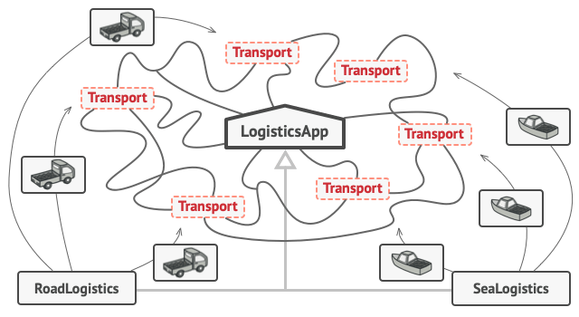
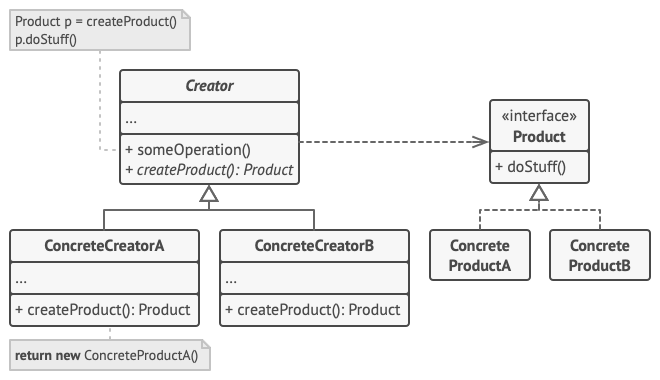
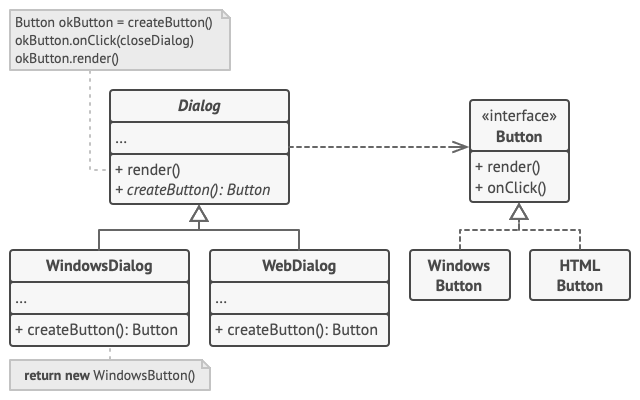

# Factory Method

## 📜 Mục đích

**Factory method** là một design pattern thuộc nhóm Creational, nó cung cấp một interface để tạo đối tượng cho lớp cha (superclass), nhưng cũng cho phép các lớp con (subclass) thay đổi đối tượng sẽ được tạo.



## 😟 Vấn đề

Tưởng tượng bạn đang tạo một ứng dụng quản lý chuỗi cung ứng. Phiên bản đầu tiên của ứng dụng chỉ quản lý vận chuyển cho các xe tải, thế nên phần lớn code của bạn sẽ nằm trong lớp `Truck`. 

Sau đó ứng dụng của bạn ngày càng phổ biến và bạn nhận được yêu cầu từ các công ty hàng hải để hợp nhất chuỗi cung ứng qua đường biển vào ứng dụng. Đấy là một thông tin tuyệt vời! Nhưng còn code thì sao?



*Việc thêm một lớp mới vào ứng dụng không hề đơn giản nếu phần lớn code đã được kết nối với các lớp hiện có.*

Hiện tại hầu hết code của bạn đã được ghép với lớp `Truck`. Việc thêm `Ship` vào ứng dụng sẽ yêu cầu các thay đổi với toàn bộ codebase. Và nếu bạn thêm một phương tiện vận tải nào nữa vào ứng dụng, thì bạn sẽ thay đổi code lần nữa.

Kết quả là bạn có một đống code tạp nham với rất nhiều điều kiện thay đổi của ứng dụng tùy thuộc vào loại đối tượng vận chuyển.

## 😊 Giải pháp

Factory Method gợi ý giải pháp là thay vì tạo đối tượng qua các lệnh khởi tạo trực tiếp (sử dụng toán tử `new`) thì hãy tạo bằng cách gọi phương thức *factory*. Lưu ý là đối tượng vẫn được tạo thông qua toán tử `new`, nhưng nó sẽ được gọi từ trong phương thức *factory*. Các đối tượng được trả về theo phương thức factory thường được gọi là **products**.



*Các lớp con có thể chỉnh sửa đối tượng trả về từ phương thức factory*

Thoạt nhìn, thay đổi này có vẻ vô nghĩa: chúng ta chỉ chuyển lệnh gọi *constructor* từ phần này sang phần khác của chương trình. Tuy nhiên, hãy xem xét thật kỹ lưỡng : bây giờ bạn có thể ghi đè(override) phương thức factory trong một lớp con và thay đổi `product` đang được tạo bởi phương thức này.

Song, nó vẫn có một hạn chế nhỏ: các lớp con có thể trả về các kiểu `product` khác nhau chỉ khi các `product` này có lớp cơ sở hoặc interface chung. Ngoài ra, phương thức factory trong lớp cơ sở nên có kiểu trả về được khai báo là interface này. 



Ví dụ, cả hai lớp `Truck` và `Ship` đều được triển khai từ interface `Transport`, interface này khai báo một phương thức là `deliver`. Mỗi lớp sẽ triển khai phương thức này theo cách khác nhau, xe tải (truck) sẽ phân phối (deliver) hàng hoá theo đường bộ, còn tàu(ship) sẽ phân phối theo đường biển. Phương thức factory `RoadLogistics` sẽ trả về đối tượng `Truck`, còn `SeaLogistics` sẽ trả về đối tượng `Ship`.



Đoạn code sử dụng phương thức factory (thường được gọi là *code client*), không nhìn thấy sự khác biệt giữa những `product` trả về bởi các lớp con khác nhau. Client coi tất cả `product` là lớp trừu tượng **Transport**, đồng thời nó cũng biết các đối tượng transport phải có phương thức `deliver`. Nhưng chi tiết cách hoạt động thì nó không cần quan tâm.

## 🏢 Cấu trúc



1. **Product** là interface chung cho tất cả đối tượng có thể được tạo ra bởi creator hay các lớp con của nó.
2. **Concrete Product** là các triển khai khác nhau từ interface **Product**. Tạm hiểu là product con.
3. **Creator** lớp này khai báo một phương thức factory trả về đối tượng product mới. Kiểu trả về của phương thức này phải tương ứng với interface **Product**. Bạn có thể định nghĩa phương thức factory là trừu tượng để tất cả lớp con triển khai phiên bản riêng của chúng. Và phương thức factory cơ sở sẽ trả về các kiểu product mặc định.

4. **Concreta Creator** sẽ ghi đè (override) phương thức factory cơ sở để trả về một kiểu product mới. Không phải lúc nào phương thức factory cũng tạo ra một đối tượng mới, nó có thể trả về đối tượng đã tồn tại từ cache, object pool hay từ một nguồn nào đó.

## 👨‍💻 Mã giả

Ví dụ này minh hoạ cách phương thức Factory có thể sử dụng để tạo các phần tử UI đa nền tảng mà không cần ghép code client với lớp UI cụ thể.



Lớp dialog cơ sở dùng hiển thị các phần tử UI khác nhau cho hiển thị cửa sổ. Dưới các hệ điều hành khác nhau, các phần tử này có thể có vài khác biệt nhỏ, song nó vẫn phải đồng nhất. Button trên Window vẫn là button trên Linux.

Khi sử dụng phương thức factory, bạn không cần viết lại các logic cho dialog vớI từng hệ điều hành. Nếu ta khai báo phương thức factory để tạo button trong lớp dialog, sau này ta có thể tạo các lớp con trả về button kiểu Windows từ phương thức factory. Lớp con sau đó sẽ kế thừa phần lớn code của dialog từ lớp cơ sở, nhờ vào phương thức factory ta có thể hiển thị các button kiểu window trên màn hình.

Với pattern này khi làm việc, các lớp dialog cơ sở phải làm việc với button trừu tượng: lớp cơ sở hoặc interface cho tất cả concrete button. Theo cách này, đoạn code còn lại của dialog vẫn hoạt động, dù phải làm việc với bất kỳ kiểu button nào.

Tất nhiên, bạn có thể dùng cách này cho các phần tử UI khác. Tuy nhiên, với mỗi phương thức factory mà bạn thêm vào diago, ta sẽ dần tiến đến Abstract Factory pattern. Ta sẽ nói về pattern này ở các bài viết sau.

```c
// Lớp creator khai báo phương thức factory phải trả về
// đối tượng của lớp product. Lớp con của creator tạo
// các triển khai khác của phương thức.

// Creator có thể tạo các triển khai mặc định cho
// phương thức factory.
class Dialog is

    abstract method createButton():Button

    // Lưu ý, dù tên là creator, song không phải nhiệm vụ chính
    // của nó là tạo product. Nó được dùng để chứa nhưng logic 
    // nghiệp vụ cốt lõi dựa trên đối tượng product trả về từ phương
    // thức factory. Các lớp con có thể gián tiếp thay đổi logic
    // bằng cách ghi đè lên phương thức factory và trả về kiểu 
    // product khác từ nó.
    method render() is
        // Gọi phương thức factory để tạo đối tượng product.
        Button okButton = createButton()
        // Sử dụng product.
        okButton.onClick(closeDialog)
        okButton.render()


// Concrete creator ghi đè lên phương thức factory để 
// thay đổi kiểu product trả về.
class WindowsDialog extends Dialog is
    method createButton():Button is
        return new WindowsButton()

class WebDialog extends Dialog is
    method createButton():Button is
        return new HTMLButton()

// Interface product khai báo phương thức cho tất cả 
// concrete product cần triển khai.
interface Button is
    method render()
    method onClick(f)

// Concrete product tạo ra các triển khai với interface product.
class WindowsButton implements Button is
    method render(a, b) is
        // Hiển thị button kiểu Windows
    method onClick(f) is
        // Đánh đấu sự kiện click trên hệ điều hành.

class HTMLButton implements Button is
    method render(a, b) is
        // Hiển thị button dưới dạng HTML
    method onClick(f) is
        // Đánh dấu sự kiện click trên trình duyệt.


class Application is
    field dialog: Dialog

    // Ứng dụng chon kiểu creator dựa trên cấu hình 
    // hiện tại hoặc môi trường thiết lập.
    method initialize() is
        config = readApplicationConfigFile()

        if (config.OS == "Windows") then
            dialog = new WindowsDialog()
        else if (config.OS == "Web") then
            dialog = new WebDialog()
        else
            throw new Exception("Error! Unknown operating system.")

    // Code client làm việc với thực thể của concrete creator,
    // thông qua interface cơ sở. Miễn là client vẫn làm việc với
    // creator thông qua interface, bạn có thể chuyển nó vào bất
    // kỳ lớp con nào của creator.
    method main() is
        this.initialize()
        dialog.render()
```

## 💡 Ứng dụng

🐞 **Sử dụng phương thức Factory khi bạn không biết chính xác kiểu và phụ thuộc của đối tượng mà code bạn sẽ làm việc**

⚡ Phương pháp Factory phân tách code khởi tạo product với code sử dụng lại product. Do đó việc mở rộng code khởi tạo product với phần code còn lại sẽ dễ dàng hơn.

🐞 **Sử dụng phương thức Factory khi bạn cung cấp cho người dùng thư viện hay framework với cách mở rộng các thành phần trong nó**

⚡ Kế thừa có lẽ là cách dễ nhất để mở  rộng các hành vi mặc định của một thư viện hay framework. Nhưng làm thế nào để framework nhận diện được đâu là lớp con của bạn, đâu là thành phần tiêu chuẩn. Giải pháp ở đây là làm giảm code khởi tạo component của framework thành một phương thức factory duy nhất và cho phép bất kỳ ai ghi đè (override) lên phương thức để thêm các phần mở rộng cho component đó.

Ví dụ, bạn đang tạo một ứng dụng dựa trên một framework UI mã nguồn mở. Bây giờ bạn muốn có một button dạng tròn cho ứng dụng, nhưng framework chỉ hỗ trợ button vuông. Thế nên bạn cần mở rộng lớp tiêu chuẩn `Button` thành lớp con `RoundButton`. Bây giờ bạn cần nói cho lớp chính `UIFramework` rằng sử dụng lớp con button mới thay vì mặc định. Để làm được điều đó, bạn tạo lớp con `UIWithRoundButtons` từ lớp cơ sở của framework và ghi đè lên phương thức `createButton`. Trong khi phương thức ở lớp cơ sở trả về đối tượng `Button` thì lớp con của bạn sẽ trả về đối tượng `RoundButton`. Bây giờ bạn sẽ sử dụng `UIWithRoundButtons` thay vì `UIFramework`.

🐞 **Sử dụng phương thức Factory khi bạn muốn tiết kiệm tài nguyên hệ thống bằng cách sử dụng lại đối tượng hiện có thay vì tạo mới chúng mỗi lần**

⚡  Bạn thường gặp phải yêu cầu này khi làm việc với các đối tượng lớn, sử dụng nhiều tài nguyên như kết nối cơ sở dữ liệu, hệ thống file, tài nguyên mạng,..

Bây giờ hãy nghĩ về những việc phải làm với đối tượng hiện có:

1. Bạn cần nơi để lưu trữ tất cả các đối tượng đã tạo.
2. Khi ai đó yêu cầu một đối tượng, chương trình sẽ thực hiện tìm kiếm đối tượng đó trong pool.
3. ...và trả về cho code client.
4. Nếu không có đối tượng, chương trình sẽ tạo ra một đối tượng mới (và thêm nó vào pool).

Có khá nhiều code, và ta phải đặt chúng vào một nơi duy nhất để không rối chương trình do các đoạn code có thể bị trùng. Có lẽ nơi rõ ràng và thuận tiện nhất mà code này có thể được đặt là tại hàm khởi tạo của lớp có các đối tượng mà ta đang cố gắng sử dụng lại. Tuy nhiên, một hàm khởi tạo luôn phải trả về các đối tượng mới theo định nghĩa. Nó không thể trả lại các phiên bản hiện có.

Do đó, bạn cần phải có một phương thức có khả năng tạo các đối tượng mới cũng như sử dụng lại các đối tượng hiện có. Và đó chính là phương thức Factory.

## 📋 Triển khai

1. Tạo tất cả product theo cùng một interface. Interface này nên khai báo phương thức có ý nghĩa với tất cả product.

2. Thêm phương thức factory trống vào lớp creator. Kiểu trả về của phương thức nên tương ứng với interface product chung.

3. Trong code creator tìm tất cả tham chiếu đến hàm khởi tạo product. Từng cái một, thay thế nó với lệnh gọi phương thức factory, trong khi trích xuất code tạo product vào phương thức factory. Bạn cần thêm tham số mẫu vào phương thức factory để điều khiển kiểu trả về của product.

4. Bây giờ, tạo tập hợp lớp con của creator cho từng kiểu product trong phương thức factory. Ghi đè lên phương thức factory ở lớp con và trích xuất các bit phù hợp từ hàm khởi tạo với phương thức cơ sở.

5. Nếu có quá nhiều kiểu product và nó không phù hợp tạo lớp con cho chúng, ta có thể tái sử dụng tham số điều khiển từ lớp cở sở ở lớp con. Ví dụ, bạn có một hệ thống phân cấp các lớp như sau: lớp cơ sở `Mail` với hai lớp con: `AirMail` và `GroundMail`; lớp `Transport` có `Plane`, `Truck` và `Train`. Trong khi lớp `AirMail` chỉ dùng đối tượng `Plane`, thì `GroundMail` làm việc với cả hai đối tượng `Truck` và `Train`. Bạn có thể tạo lớp con (tạm gọi `TrainMail`) để xử lý cả hai trường hợp, nhưng cũng có lựa chọn khác. Code client có thể gửi tham số vào phương thức factory của `GroundMail` để điều khiển kiểu product mà nó muốn nhận.

6. Sau cùng, nếu phương thức factory ở lớp cơ sở trống, bạn có thể chuyển nó thành trừu tượng(abstract). Nếu còn sót lại gì đó thì ta sẽ thiết lập đó là hành vi mặc định của phương thức.

## ⚖️ Ưu nhược điểm

**Ưu điểm**

 ✔️ Tránh được kết hợp quá chặt chẽ giữa creator và concrete product.

 ✔️ *Single Responsibility Principle*. Bạn có thể di chuyển code tạo product vào một nơi trong chương trình, giúp code hỗ trợ dễ dàng hơn.

 ✔️  *Open/Closed Principle*. Bạn có thể thêm các kiểu product mới vào chương trình, mà không làm ảnh hưởng đến code client hiện tại.

**Nhược điểm**

❌ Code có thể trở nên phức tạp khi bạn thêm vào quá nhiều lớp con để triển khai pattern. Trường hợp tốt nhất là khi bạn triển khai pattern bằng cách sử dụng hệ thống phân cấp của lớp creator.
 
## 🔁 Quan hệ với các pattern khác

Nhiều pattern bắt đầu bằng cách sử dụng **Factory Method** (ít phức tạp hơn và có thể tùy chỉnh nhiều hơn thông qua các lớp con) và phát triển theo hướng **Abstract Factory**, **Prototype** hoặc **Builder** (linh hoạt hơn nhưng phức tạp hơn).

Các lớp **Abstract Factory** thường dựa trên một tập hợp các **Factory Method**, nhưng bạn cũng có thể sử dụng **Prototype** để cấu trúc các phương thức trên các lớp này.

Bạn có thể sử dụng **Factory Method** cùng với **Iterator** để cho phép các lớp con của collection trả về các kiểu vòng lặp khác nhau tương thích với các collection.

**Prototype** không dựa trên sự kế thừa, vì vậy nó không có nhược điểm. Mặt khác, **Prototype** yêu cầu khởi tạo nhân bản đối tượng phức tạp. **Factory Method** dựa trên kế thừa nhưng không yêu cầu bước khởi tạo.

**Factory Method** là một chuyên môn hóa của **Template Method**. Đồng thời, **Factory Method** có thể đóng vai trò là một bước trong một **Template Method** lớn.

# Nguồn

[**refactoring**](https://refactoring.guru/design-patterns/factory-method)
