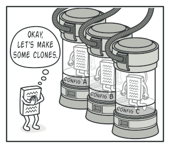
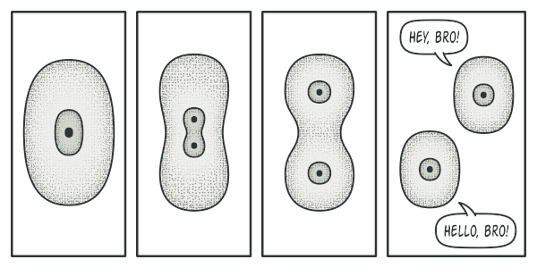
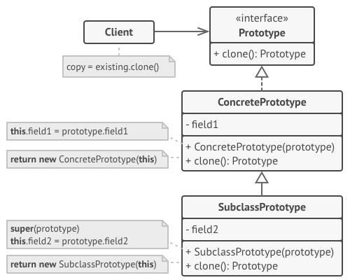
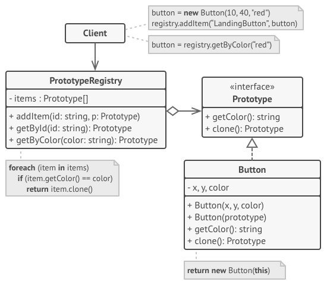
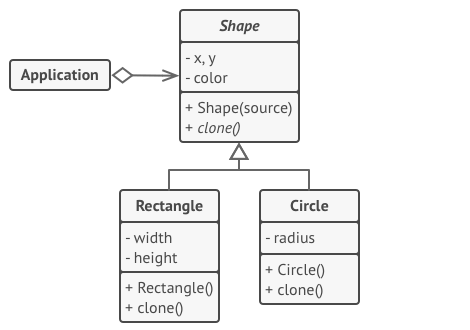

# Prototype

## 📜 Mục đích

**Prototype** là một design pattern thuộc nhóm creational, giúp bạn sao chép một đối tượng mà code của bạn sẽ không phụ thuộc vào lớp của đối tượng đó.


## 😟 Vấn đề

Giả sử bạn đang có một đối tượng và bạn muốn tạo ra bản sao của nó. Vậy làm thế nào ? Đầu tiên bạn sẽ tạo ra một đối tượng mới có cùng lớp, sau đó bạn sẽ lấy giá trị từ tất cả các trường của đối tượng gốc và gán nó sang cho đối tượng mới.

Hay lắm ! Nhưng nó có vấn đề. Không phải tất cả đối tượng đều có thể sao chép theo cách này vì có thể một vài trường của nó là riêng tư (private) và không thể truy cập từ bên ngoài đối tượng.


*Copy đối tượng từ bên ngoài không phải lúc nào cũng tốt*

Có nhiều hơn một vấn đề với cách tiếp cận này, là khi bạn biết lớp của đối tượng mà bạn tạo bản sao, code của bạn sẽ trở nên phụ thuộc vào lớp đó. Nếu điều này chưa làm bạn lo lắng thì còn một vấn đề nữa. Là thỉnh thoảng bạn chỉ biết interface của đối tượng, chứ không biết đến lớp cụ thể, khi đó tham số trong các phương thức của bạn sẽ chấp nhận bất kỳ đối tượng nào theo interface đấy.

## 😊 Giải pháp

Pattern Prototype uỷ thác quá trình sao chép cho các đối tượng thực đang được sao chép. Pattern này khai báo một interface chung hỗ trợ sao chép cho tất cả đối tượng. Interface này giúp bạn sao chép đối tượng mà không cần ghép code của bạn với lớp của đối tượng. Thông thường, interface như vậy chỉ bao gồm một phương thức `clone`.

Triển khai phương thức `clone` là như nhau với mọi lớp. Phương thức tạo một đối tượng của lớp hiện tại và chuyển tất cả trường giá trị của đối tượng cũ sang đối tượng mới. Thậm chí có thể sao chép cả trường riêng tư vì phần lớn ngôn ngữ lập trình cho phép đối tượng truy cập trường riêng tư của đối tượng khác nếu chúng cùng thuộc một lớp.

Đối tượng hỗ trợ sao chép gọi là *prototype*. Khi đối tượng của bạn có hàng chục trường và hàng trăm cấu hình khả khi, nhân bản chúng có thể xem như một giải pháp thay thế cho tạo lớp con.



*Các prototype tạo sẵn có thể thay thế cho phân lớp.*

Cách mà nó hoạt động: bạn tạo một tập hợp các đối tượng, được cấu hình theo nhiều cách khác nhau. Khi bạn cần một đối tượng giống như đối tượng bạn đã cấu hình, bạn chỉ cần sao chép một prototype thay vì xây dựng một đối tượng mới từ đầu.

## 🚗 Thế Giới Thực

Trong cuộc sống thực, các prototype được sử dụng để thực hiện các thử nghiệm khác nhau trước khi bắt đầu sản xuất hàng loạt một sản phẩm. Tuy nhiên, trong trường hợp này các prototype không tham gia vào bất kỳ quá trình sản xuất thực nào, nó chỉ đóng vai trò thụ động. Vì các prototype trong công nghiệp không thực sự tự sao chép.



Một ví dụ thực nữa của pattern này quá trình nguyên phân trong sinh học. Sau khi nguyên phân, một cặp tế bào giống hệt nhau được hình thành. Tế bào gốc lúc này hoạt động như một prototype và đóng vai trò chủ động.

## 🏢 Cấu trúc

### Triển khai cơ bản



1. **Prototype** là interface khai báo phương thức sao chép. Trong đa số trường hợp, nó chỉ có một phương thức `clone`.
2. **Concrete Prototype** lớp triển khai phương thức sao chép. Ngoài việc sao chép dữ liệu của đối tượng ban đầu sang bản sao, phương pháp này cũng có thể xử lý một số trường hợp của quá trình sao chép liên quan đến việc sao chép các đối tượng được liên kết, gỡ rối các phụ thuộc đệ quy, ...
3. **Client**  có thể tạo một bản sao của bất kỳ đối tượng nào theo interface prototype.

### Triển khai prototype registry



1. **Prototype Registry** cung cấp cách để truy cập dễ dàng các prototype được sử dụng thường xuyên. Nó lưu trữ một tập hợp đối tượng đã tạo sẵn cho việc sao chép. Prototype registry đơn giản nhất là là một hashmap `name → prototype`. Tuy nhiên, nếu bạn cần các tiêu chí tìm kiếm tốt hơn, bạn có thể tự xây dựng một phiên bản registry mạnh mẽ hơn.

## 👨‍💻 Mã giả

Trong ví dụ này, Prototype Pattern cho phép bạn tạo các bản sao chính xác của các đối tượng hình học mà không cần ghép code với các lớp của chúng.



Tất cả các lớp hình dạng theo sau một interface, cung cấp phương thức sao chép. Lớp con có thể gọi phương thức sao chép của lớp cha trước khi sao chép các trường giá trị của chính nó vào đối tượng kết quả. 

```c
// Prototype cơ sở.
abstract class Shape is
    field X: int
    field Y: int
    field color: string

    // Hàm khởi tạo thông thường.
    constructor Shape() is
        // ...

    // Hàm khởi tạo prototype. Đối tượng rỗng được tạo
    // với giá trị từ đối tượng đã tồn tại.
    constructor Shape(source: Shape) is
        this()
        this.X = source.X
        this.Y = source.Y
        this.color = source.color

    // Phương thức clone trả về một trong những lớp con Shape.
    abstract method clone():Shape


// Concrete prototype. Phương thức sao chép tạo đối tượng mới
// và truyền vào hàm khởi tạo. Cho đến khi hàm khởi tạo kết thúc
// nó sẽ tham chiếu đến bản sao. Do đó không có ai có thể truy cập 
// đến bản sao chưa hoàn chỉnh. Nó giữ cho bản sao nhất quán.
class Rectangle extends Shape is
    field width: int
    field height: int

    constructor Rectangle(source: Rectangle) is
        // Lệnh gọi hàm khởi tạo cha là cần thiết
        // để sao chép trường riêng tư được định
        // nghĩa trong lớp cha
        super(source)
        this.width = source.width
        this.height = source.height

    method clone():Shape is
        return new Rectangle(this)


class Circle extends Shape is
    field radius: int

    constructor Circle(source: Circle) is
        super(source)
        this.radius = source.radius

    method clone():Shape is
        return new Circle(this)


// Đâu đó trong code client.
class Application is
    field shapes: array of Shape

    constructor Application() is
        Circle circle = new Circle()
        circle.X = 10
        circle.Y = 10
        circle.radius = 20
        shapes.add(circle)

        Circle anotherCircle = circle.clone()
        shapes.add(anotherCircle)
        // Biến `anotherCircle` bao gồm bản sao 
        // chính xác của đối tượng `circle`.

        Rectangle rectangle = new Rectangle()
        rectangle.width = 10
        rectangle.height = 20
        shapes.add(rectangle)

    method businessLogic() is
        // Prototype chắc chắn vì nó giúp bạn tạo ra bản sao của đối
        // tượng mà không cần biết bất cứ điều gì về kiểu của nó.
        Array shapesCopy = new Array of Shapes.

        // Ví dụ, bạn không biết chính xác phần tử trong mảng shape.
        // Tất cả những gì ta biết chỉ là đấy là hình dạng.
        // Nhưng nhờ tính đa hình, khi ta gọi phương thức `clone`
        // trên một hình dạng, chương trình kiểm tra lớp có thực và
        // chạy phương thức clone phù hợp đã định nghĩa trong lớp.
        // Đó là lý do vì sao ta nhận được bản sao phù hợp thay vì 
        // một mảng đối tượng Shape thông thường.
        foreach (s in shapes) do
            shapesCopy.add(s.clone())

        // Mảng `shapeCopy` bao gồm các bản sao chính xác
        // của mảng `shape`.
```

## 💡 Ứng dụng

**🐞 Sử dụng Prototype khi code bạn không muốn phụ thuộc vào một lớp cụ thể của đối tượng cần sao chép**

⚡ Chuyện này xảy ra khi bạn làm việc với đối tượng được truyền đến từ code bên thứ ba thông qua một vài interface. Các lớp cụ thể của đối tượng này là không xác định nên bạn không thể phụ thuộc nó, ngay cả khi muốn. 

Pattern Prototype cung cấp cho code client một interface chung để làm việc với tất cả đối tượng hỗ trợ sao chép. Interface này giúp code client độc lập với lớp cụ thể từ đối tượng mà nó sao chép.

**🐞 Sử dụng Prototype khi bạn muốn giảm số lượng lớp con, chỉ khác nhau về cách chúng khởi tạo các đối tượng tương ứng**

⚡ Pattern Prototype cho phép bạn sử dụng một tập hợp các đối tượng được tạo sẵn, được cấu hình theo nhiều cách khác nhau, là prototype.

Thay vì khởi tạo một lớp con phù hợp với một số cấu hình, client chỉ cần tìm kiếm một prototype thích hợp và sao chép nó.

## 📋 Triển khai

1. Tạo interface prototype và khai báo phương thức sao chép trong đó. Hoặc thêm phương thức vào tất cả các lớp của hệ phân cấp lớp, nếu bạn có.

2. Lớp prototype phải định nghĩa hàm khởi tạo thay thế để chấp nhận đối tượng của lớp đó như một tham số. Hàm khởi tạo phải sao chép giá trị từ tất cả trường đã định nghĩa trong lớp từ đối tượng được truyền vào đối tượng mới được tạo. Nếu bạn đang thay đổi một lớp con, bạn phải gọi hàm khởi tạo cha để cho phép lớp cha xử lý việc sao chép các trường riêng tư của nó.

    Nếu ngôn ngữ lập trình của bạn không hỗ trợ phương thức overloading, bạn phải định nghĩa phương thức đặc biệt cho sao chép đối tượng dữ liệu. Hàm khởi tạo là một nơi tiện lợi để làm điều này vì nó cung cấp kết quả đối tượng ngay sau khi bạn gọi toán tử `new`.

3. Phương thức sao chép thường chỉ bao gồm một dòng: chạy một toán tử `new` với phiên bản prototype của hàm khởi tạo. Lưu ý rằng mọi lớp phải ghi đè(override) rõ ràng phương thức sao chép và sử dụng tên lớp của chính nó cùng với toán tử `new`. Nếu không, phương thức sao chép có thể tạo ra một đối tượng của lớp cha.

4. Tuỳ chọn, tạo một prototype registry để lưu trữ một danh mục các prototype thường được sử dụng. 

    Bạn có thể triển khai registry như một lớp factory hoặc đặt nó vào một lớp prototype cơ sở với phương thức tĩnh cho tìm nạp prototype. Phương thức này tìm kiếm prototype dựa trên các tiêu chí tìm kiếm mà code client truyền đến phương thức. Tiêu chí có thể là một chuỗi đơn giản hoặc cũng có thể là một tập hợp các tham số tìm kiếm phức tạp. Sau khi tìm thấy prototype thích hợp, registry sẽ sao chép nó và trả lại bản sao cho client.
    
5. Cuối cùng, thay thế các lệnh gọi trực tiếp đến các hàm khởi tạo của lớp con bằng các lệnh gọi đến phương thức factory của prototype registry.

## ⚖️ Ưu nhược điểm

### Ưu điểm

✔️ Bạn có thể sao chép đối tượng mà không cần quan tâm đến lớp cụ thể.

✔️ Bạn có thể tránh code khởi tạo lặp đi lặp lại bằng việc sao chép các prototype có sẵn.

✔️ Bạn có thể tạo các đối tượng phức tạp thuận tiện.

✔️ Bạn nhận được một giải pháp thay thế cho kế thừa khi phải xử lý các cấu hình cho các đối tượng phức tạp.

### Nhược điểm

❌ Sao chép các đối tượng phức tạp có tham chiếu vòng tròn có thể rất khó.

## 🔁 Quan hệ với các pattern khác

Nhiều pattern bắt đầu bằng cách sử dụng **Factory Method** (ít phức tạp hơn và có thể tùy chỉnh nhiều hơn thông qua các lớp con) và phát triển theo hướng **Abstract Factory**, **Prototype** hoặc **Builder** (linh hoạt hơn nhưng phức tạp hơn).

Các thiết kế sử dụng nhiều **Composite** và **Decorator** thường có thể được hưởng lợi từ việc sử dụng **Prototype**. Áp dụng pattern cho phép bạn sao chép các cấu trúc phức tạp thay vì xây dựng lại chúng từ đầu.

Các lớp **Abstract Factory** thường dựa trên một tập hợp các **Factory Method**, nhưng bạn cũng có thể sử dụng **Prototype** để cấu trúc các phương thức trên các lớp này.

**Prototype** không dựa trên sự kế thừa, vì vậy nó không có nhược điểm. Mặt khác, **Prototype** yêu cầu khởi tạo nhân bản đối tượng phức tạp. **Factory Method** dựa trên kế thừa nhưng không yêu cầu bước khởi tạo.

**Prototype** có thể hữu ích khi bạn cần lưu các bản sao của **Commands** vào lịch sử.

Đôi khi **Prototype** có thể là một giải pháp thay thế đơn giản hơn cho **Memento**. Điều này hoạt động nếu đối tượng, trạng thái mà bạn muốn lưu trữ trong lịch sử, khá đơn giản và không có liên kết đến tài nguyên bên ngoài hoặc các liên kết dễ thiết lập lại.

Tất cả các **Abstract Factory**, **Builder** và **Prototype** đều có thể được triển khai dưới dạng các **Singleton**.

# Nguồn

[**refactoring**](https://refactoring.guru/design-patterns/prototype)