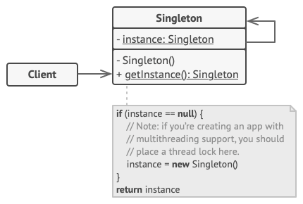

# Singleton

## 📜 Mục đích

**Singleton** là một design pattern thuộc nhóm creational giúp bạn tạo ra một lớp chỉ với một thực thế duy nhất, trong khi cung cấp điểm truy cập toàn cục cho thực thế đấy.


## 😟 Vấn đề

Singleton cùng lúc giải quyết hai vấn đề vi phạm đến *Nguyên tắc Trách nhiệm đơn lẻ ( Single Responsibility Principle)*:

1. **Đảm bảo mỗi lớp chỉ có một thực thể**: Tại sao bất kỳ ai cũng muốn kiểm soát số lượng thực thể(instance) mà một lớp có ? Lý do phổ biến nhất là để quản lý truy cập đến các tài nguyên chung, vd như cơ sở dữ liệu hay file. 

Tưởng tượng, bạn đã tạo một đối tượng nhưng sau một thời gian bạn quyết định tạo một đối tượng mới. Thay vì nhận một đối tượng mới hoàn toàn bạn sẽ nhận về đối tượng đã được tạo.

Lưu ý: Điều này không thể thực thi với các hàm khởi tạo (constructor) thông thường vì chúng sẽ luôn trả về đối tượng mới.


2. **Cung cấp một điểm truy cập toàn cục cho thực thể**: Hãy nhớ lại các biến toàn cục mà bạn đã dùng để lưu trữ một số đối tượng thiết yếu. Mặc dù khá tiện dụng nhưng chúng lại không an toàn vì bất kỳ đoạn code nào cũng có khả năng ghi đè lên nội dung của biến đó và làm hỏng chương trình.

Giống như biến toàn cục, Singleton giúp bạn truy cập đến các đối tượng ở bất cứ đâu trong chương trình. Tuy nhiên, không như biến, nó bảo vệ các thực thể khỏi bị ghi đè bởi code khác.

Mặt khác của vấn đề: bạn không muốn code giải quyết vấn đề #1 bị phân tán khắp chương trình. Sẽ tốn hơn nếu có nó trong một lớp, đặc biệt nếu phần còn lại của code bạn đã phụ thuộc vào nó. 

## 😊 Giải pháp

Tất cả triển khai của Singelton đều có hai bước chung là:
- Mặc định các hàm khởi tạo là riêng tư, để tránh các đối tượng khác sử dụng toán từ `new` với lớp Singleton.
- Tạo mội phương thức tĩnh hoạt động như một hàm khởi tạo. Bên dưới phương thức này, sẽ gọi đến hàm khởi tạo riêng tư để tạo một đối tượng và lưu nó vào một trường tĩnh. Tất cả lệnh gọi theo sao phương thức này trả về một đối tượng cache.

Nếu code của bạn có quyền truy cập vào lớp Singleton thì nó có thể gọi phương thức tĩnh của Singleton. Vì vậy, bất cứ khi nào phương thức đó được gọi, sẽ có cùng một đối tượng được trả về.

## 🚗 Thế Giới Thực

Chính phủ là một ví dụ điển hình của pattern Singleton. Mỗi quốc gia chỉ có thể có một chính phủ chính thức. Bất kể danh tính cá nhân của các cá nhân đại diện chính phủ, danh hiệu, “Chính phủ X”, đều là điểm truy cập toàn cục để xác định danh tính nhóm người phụ trách.

## 🏢 Cấu trúc



1. **Lớp Singleton** khai báo phương thức tĩnh `getInstance` để trả về cùng một thực thể của lớp đó.

Hàm khởi tạo Singleton sẽ bị ẩn ở client code, gọi phương thức `getInstance` là cách duy nhất để lấy đối tượng Singleton.

## 👨‍💻 Mã giả

Trong ví dụ này, cơ sở dữ liệu sẽ kết nối với một lớp hoạt động như một Singleton. Nó không có hàm khởi tạo công khai, cách duy nhất để lấy đối tượng là gọi phương thức `getInstane`. Phương thức này lưu đối tượng tạo trong lần đầu vào cache và sử dụng nó cho các lần gọi tiếp theo.

```c
// Lớp Database định nghĩa phương thức `getInstance` để giúp
// client truy cập vào cùng đối tượng mà cơ sở dữ liệu kết
// nối trong suốt chương trình.
class Database is
    // Trường này để lưu trữ thực thể singleton nên khai
    // báo là tĩnh (static)
    private static field instance: Database

    // Hàm khởi tạo singleton luôn luôn là riêng tư
    // để trách khởi tạo trực tiếp với toán từ `new`.
    private constructor Database() is
        // Một vài code khởi tạo ở đây, như là
        // kết nối đến server cơ sở dữ liệu.

    // Phương thức tĩnh điều khiển truy cập đến thực thể
    // singleton.
    public static method getInstance() is
        if (Database.instance == null) then
            acquireThreadLock() and then
                // Đảm bảo rằng thực thể chưa được tạo bởi 
                // luồng(thread) khác trong khi luồng này đang
                // đợi giải phóng lock.
                if (Database.instance == null) then
                    Database.instance = new Database()
        return Database.instance

    // Cuối cùng, bất kỳ singleton nào cũng có một vài logic business
    // để có thể thực thi các thực thể của nó.
    public method query(sql) is
        // Ví dụ, tất cả truy vấn cơ sở dữ liệu của ứng dụng
        // trong phương thức này. Do đó bạn có thể đặt logic
        // điều tiết hoặc cache vào đây.

class Application is
    method main() is
        Database foo = Database.getInstance()
        foo.query("SELECT ...")
        // ...
        Database bar = Database.getInstance()
        bar.query("SELECT ...")
        // Biến `bar` sẽ bao gồm cùng đồi tượng với
        // biến `foo`.
```

## 💡 Ứng dụng

**Sử dụng mẫu Singleton khi một lớp trong chương trình của bạn chỉ nên có một thực thể duy nhất cho tất cả client**

Thường thấy khi dùng một đối tượng cơ sở dữ liệu duy nhất kết nối đến các phần khác nhau trong ứng dụng. Singleton vô hiệu hoá tất cả cách tạo đối tượng của lớp trừ phương thức tạo đặc biệt.

**Sử dụng Singleton khi bạn cần kiểm soát chặt chẽ hơn đối với các biến toàn cục**

Không giống như các biến toàn cục, Singleton đảm bảo rằng chỉ có một thực thể của một lớp. Không có gì khác, ngoại trừ chính lớp Singleton, có thể thay thế thực thể được lưu trong bộ nhớ cache.

*Lưu ý rằng bạn luôn có thể điều chỉnh giới hạn này và cho phép tạo bất kỳ số lượng thực thể Singleton nào. Đoạn code duy nhất cần thay đổi là phần thân của phương thức `getInstance`.*