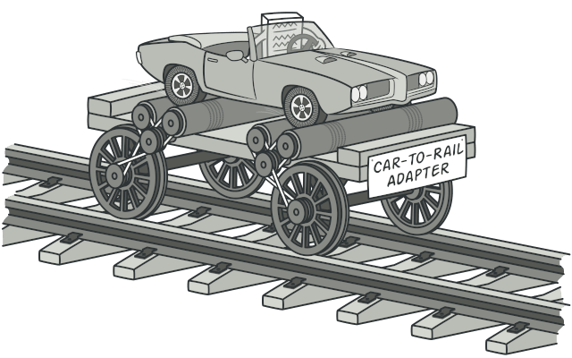
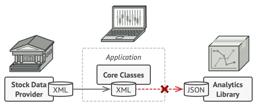
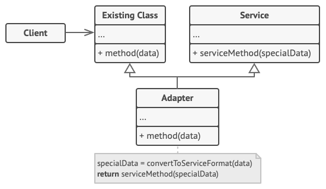
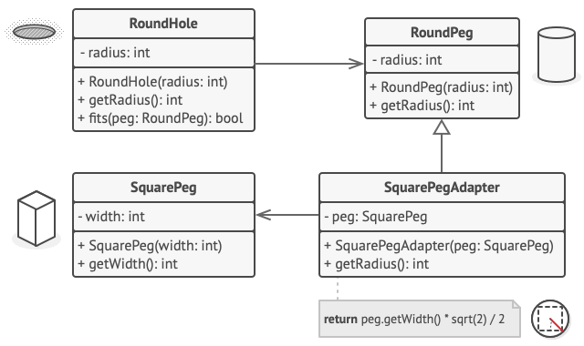

# Adapter

## 📜 Mục đích

**Adapter** là một design pattern thuộc nhóm structural cho phép các đối tượng có interface không tương thích cộng tác với nhau.



## 😟 Vấn đề

Tượng tượng bạn đang tạo một ứng dụng giám sát thị trường chứng khoán. Ứng dụng sẽ tải dữ liệu chứng khoán từ nhiều nguồn dưới dạng XML, và hiển thị nó dưới dạng biểu đồ và sơ đồ cho người dùng.

Vào một thời điểm nào đó, bạn quyết định cải tiến ứng dụng bằng việc tích hợp một thư viện bên thứ ba cho phân tích dữ liệu. Nhưng có một vấn đề là thư viện này chỉ làm việc với dữ liệu dạng JSON. 



*Bạn không thể sử dụng thư viện phân tích vì nó yêu cầu dữ liệu không tương thích với ứng dụng của bạn*

Nếu bạn thay đổi thư viện để nó làm việc với XML nó có thể ảnh hưởng đến những đoạn code hiện có trong thư viện. Hoặc tệ hơn là ngay từ đầu bạn không được phép truy cập đến mã nguồn của thư viện. Nên cách tiếp cận này là bất khả thi.

## 😊 Giải pháp

Bạn có thể tạo ra một *adapter*, là một đối tượng đặc biệt có thể chuyển đổi interface của một đối tượng cho các đối tượng khác hiểu được nó.

Adapter sẽ bọc một đối tượng để giấu đi sự phức tạp đằng sau chuyển đổi đấy. Đối tượng được bọc thậm chí còn không biết gì về adapter. Ví dụ như bạn có thể bọc một đối tượng có đơn vị đo lường là kilomet và met, với bộ adapter sẽ chuyển đổi tất cả dữ liệu sang các đơn vị là feet và miles.

Adapter không chỉ có thể chuyển đổi dữ liệu thành nhiều định dạng khác nhau mà còn có thể giúp các đối tượng có interface khác nhau cộng tác. Đây là cách nó hoạt động:
1. Adapter lấy interface và tương thích của nó với một đối tượng đã tồn tại.
2. Sử dụng interface, đối tượng đã tồn tại có thể gọi đến phương thức adapter.
3. Khi nhận được lệnh gọi, adapter sẽ chuyển yêu cầu đến đối tượng thứ hai, nhưng theo một định dạng và trật tự mà đối tượng thứ hai có thể hiểu được.

Đôi khi, ta có thể tạo adapter hai chiều để chuyển đổi cuộc gọi theo cả hai hướng.


Trở về với ứng dụng thị trường chứng khoán, để giải quyết tình trạng định dạng không tương thích, ta sẽ tạo một adapter XML-to-JSON cho tất cả các lớp trong thư viện phân tích để code bạn làm việc trực tiếp. Sau đó bạn điều chỉnh code của bạn làm việc với thư viện thông qua adapter.

Khi adapter nhận được một lệnh gọi, nó sẽ dịch dữ liệu XML sang cấu trúc JSON và chuyển hướng cuộc gọi đến các phương thức thích hợp của đối tượng phân tích đã được bọc.

## 🚗 Thế Giới Thực


Khi bạn đi du lịch từ Mỹ đến châu Âu lần đầu tiên, bạn có thể sẽ sốc khi sạc laptop của mình. Vì chuẩn ổ cắm và nguồn điện của các quốc gia khác nhau sẽ khác nhau. Đó là lý do tại sao phích cắm Hoa Kỳ sẽ không phù hợp với ổ cắm ở Đức. Vấn đề có thể được giải quyết bằng cách sử dụng bộ chuyển đổi có ổ cắm kiểu Hoa Kỳ và phích cắm kiểu châu Âu.

## 🏢 Cấu trúc

### Đối tượng adapter

Việc triển khai này sử dụng nguyên tắc cấu thành đối tượng: adapter triển khai interface của một đối tượng và bọc một đối tượng khác. Nó có thể triển khai trên mọi ngôn ngữ lập trình.


1. **Client** là lớp bao gồm các code logic hiện có của chương trình.
2. **Client Interface** mô tả giao thức mà các lớp khác phải theo để có thể cộng tác với code client.
3. **Service** là một vài lớp hữu ích (thường là bên thứ 3 hoặc kế thừa). Client không thể sử dụng trực tiếp vì không tương thích interface.
4. **Adapter** là lớp có thể làm việc với cả client và service. Nó triển khai client interface trong khi bọc đối tượng service. Adapter nhận lệnh gọi từ client thông qua adapter interface và dịch nó, sau đó nó gọi lại đối tượng service được bọc dưới định dạnh service có thể hiểu được.
5. Code client không cần phải ghép với lớp adapter cụ thể miễn là nó làm việc với adapter thông qua client interface. Nhờ điều đó, bạn có thể thêm kiểu adapter mới vào chương trình mà không ảnh hưởng đến code client. Điều này có thể hữu ích khi interface của lớp service có thay đổi: bạn có thể tạo lớp adapter mới mà không cần thay đổi code client.

### Lớp adapter

Triển khai này sử dụng kế thừa: adapter kế thừa interface từ cả hai đối tượng vào cùng thời điểm. Lưu ý là cách tiếp cận này chỉ triển khai trên các ngôn ngữ lập trình hỗ trợ đa kế thừa, như C++.



**Lớp Adapter** không cần bọc bất kỳ đối tượng nào vì nó sẽ kế thừa hành vi từ cả client và service. Sự chuyển đối diễn ra bên trong phương thức override. Adapter kết quả có thể sử dụng 
thay thể cho một lớp client hiện có.

## 👨‍💻 Mã giả

Ví dụ cho pattern Adapter sẽ dựa trên câu thành ngữ: "chốt gỗ vuông trong lỗ tròn"(Square pegs in round holes).



Adapter giả vờ là một chốt tròn(round peg), có bán kính bằng một nửa đường chéo của hình vuông (nói cách khác, là bán kính của hình tròn nhỏ nhất có thể chứa vừa hình vuông).

```c
// Giả sử bạn có hai lớp với interface tương thích:
// RoundHole và RoundPeg.
class RoundHole is
    constructor RoundHole(radius) { ... }

    method getRadius() is
        // Trả về bán kính của lỗ.

    method fits(peg: RoundPeg) is
        return this.getRadius() >= peg.getRadius()

class RoundPeg is
    constructor RoundPeg(radius) { ... }

    method getRadius() is
        // Trả về bán kính của chốt.


// Nhưng có một lớp không tương thích là: SquarePeg.
class SquarePeg is
    constructor SquarePeg(width) { ... }

    method getWidth() is
        // Trả về độ dài của chốt.


// Lớp adapter giúp bạn cho chốt vuông vào vừa lỗ tròn.
// Nó mở rộng lớp RoundPeg để giúp đối tượng adapter hành
// động như một chốt tròn.
class SquarePegAdapter extends RoundPeg is
    // Thực tế, adapter bao gồm một thực thể của
    // lớp SquarePeg
    private field peg: SquarePeg

    constructor SquarePegAdapter(peg: SquarePeg) is
        this.peg = peg

    method getRadius() is
        // Apdater giả vờ là một chốt tròn với bán kính
        // vừa với chốt vuông mà adapter thực sự bọc.
        return peg.getWidth() * Math.sqrt(2) / 2


// Đâu đó trong code client.
hole = new RoundHole(5)
rpeg = new RoundPeg(5)
hole.fits(rpeg) // true

small_sqpeg = new SquarePeg(5)
large_sqpeg = new SquarePeg(10)
hole.fits(small_sqpeg) // điều này sẽ không biên dịch (các loại không tương thích)

small_sqpeg_adapter = new SquarePegAdapter(small_sqpeg)
large_sqpeg_adapter = new SquarePegAdapter(large_sqpeg)
hole.fits(small_sqpeg_adapter) // true
hole.fits(large_sqpeg_adapter) // false
```

## 💡 Ứng dụng

**🐞 Sử dụng lớp Adapter khi bạn muốn dùng một số lớp hiện có, nhưng interface của nó không tương thích với code của bạn**

⚡ Adapter cho phép bạn tạo một lớp trung gian đóng vai trò như một trình dịch giữa code của bạn và lớp kế thừa, lớp của bên thứ 3 hoặc bất kỳ lớp nào khác có interface không tương thích.

**🐞 Sử dụng Adapter khi bạn muốn sử dụng lại các lớp con hiện có nhưng thiếu một số hàm chung không thể thêm vào lớp cha**

⚡ Bạn có thể mở rộng từng lớp con và đưa hàm còn thiếu vào các lớp con mới. Tuy nhiên, bạn sẽ cần phải sao chép code trên tất cả các lớp mới này, điều này khá tệ.

Giải pháp tốt hơn là đưa các hàm bị thiếu vào lớp adapter. Sau khi bạn bọc đối tượng với chức năng thiếu trong adapter, thu được các tính năng cần thiết một cách linh động. Để hoạt động, các lớp đích phải có interface chung và trường của adapter phải theo interface. Các tiếp cận này có phần tương đồng pattern Decorator.

## 📋 Triển khai

1. Chắc chắn rằng bạn có ít nhất hai lớp với interface không tương thích:
    - Lớp service, bạn không thể thay đổi (như bên thứ 3 hay kế thừa)
    - Một hoặc nhiều lớp client sẽ có ích khi sử dụng lớp service.

2. Khai báo client interface và mô tả cách client giao tiếp với service.

3. Tạo lớp adapter theo client interface. Tạm thời để trống tất cả phương thức.

4. Thêm trường vào lớp adapter để lưu trữ tham chiếu đến đối tượng service. Cách phổ biến là tạo trường này thông qua hàm khởi tạo, nhưng đôi khi truyền nó cho adapter khi gọi các phương thức của nó sẽ thuận tiện hơn.

5. Triển khai tất cả phương thức của client interface trong lớp adapter. Adapter nên uỷ thác phần lớp phần lớn công việc thực cho đối tượng service, và chỉ xử lý interface hoặc chuyển đổi định dạng dữ liệu.

6. Client nên sử dụng adapter thông qua client interface. Điều này giúp bạn thay đổi hoặc mở rộng adapter mà không ảnh hưởng đến code client.

## ⚖️ Ưu nhược điểm

### Ưu điểm

✔️ *Single Responsibility Principle* Bạn có thể tách interface hoặc code chuyển đổi dữ liệu khỏi logic nghiệp vụ chính của chương trình.

✔️ *Open/Closed Principle* Bạn có thể giới thiệu các loại adapter mới vào chương trình mà không ảnh hưởng code client hiện có, miễn là chúng hoạt động với adapter thông qua client interface.

### Nhược điểm

❌ Độ phức tạp tổng thể của code tăng lên vì bạn cần giới thiệu một tập hợp các interface và lớp mới. Đôi khi, việc thay đổi lớp service sao cho phù hợp với phần còn lại của code của bạn sẽ đơn giản hơn.

## 🔁 Quan hệ với các pattern khác

**Bridge** thường được thiết kế từ trước, cho phép bạn phát triển các phần của ứng dụng một cách độc lập với nhau. Mặt khác, **Adapter** thường được sử dụng với một ứng dụng hiện có để  một số lớp không tương thích hoạt động với nhau.

**Adapter** thay đổi interface của một đối tượng hiện có, trong khi **Decorator** nâng cao một đối tượng mà không thay đổi interface của nó. Ngoài ra, **Decorator** hỗ trợ thành phần đệ quy, điều này không thể thực hiện được khi bạn sử dụng **Adapter**.

**Adapter** cung cấp một interface khác cho đối tượng được bọc, **Proxy** cung cấp cho nó một interface tương tự và **Decorator** cung cấp cho nó một interface nâng cao.

**Facade** định nghĩa một interface mới cho các đối tượng hiện có, trong khi **Adapter** cố gắng làm cho interface hiện có có thể sử dụng được. **Adapter** thường chỉ bọc một đối tượng, trong khi **Facade** hoạt động với toàn bộ hệ thống con của các đối tượng.

**Bridge**, **State**, **Strategy** (và ở một mức độ nào đó là **Adapter**) có cấu trúc rất giống nhau. Thật vậy, tất cả các pattern này đều dựa trên nguyên tắc là ủy thác công việc cho các đối tượng khác. Tuy nhiên, chúng giải quyết các vấn đề khác nhau. Một pattern không chỉ là một công thức để cấu trúc code của bạn theo một cách cụ thể. Nó còn có thể giao tiếp với các nhà phát triển khác về vấn đề mà pattern giải quyết.

# Nguồn

[**refactoring**](https://refactoring.guru/design-patterns/adapter)