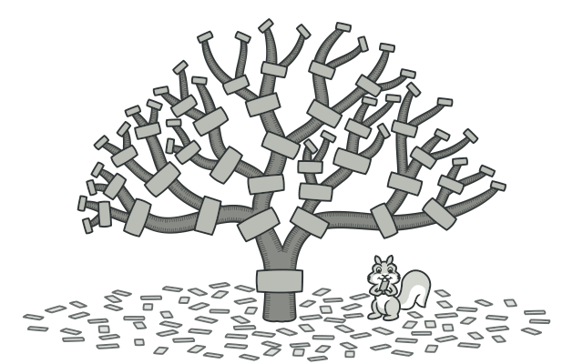
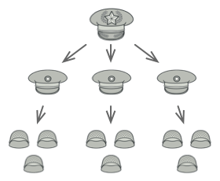
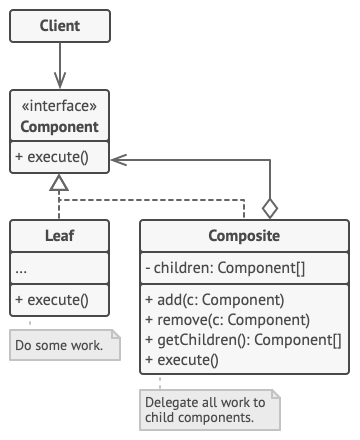
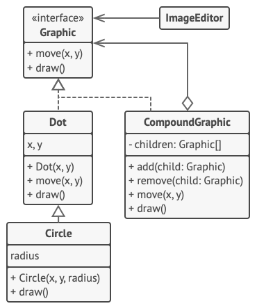

# Composite

## 📜 Mục đích

**Composite** là một design pattern thuộc nhóm structural cho phép bạn sắp xếp các đối tượng thành cấu trúc cây và sau đó làm việc với các cấu trúc này như thể chúng là các đối tượng riêng lẻ.



## 😟 Vấn đề

Sử dụng pattern Composite chỉ hợp lý khi mô hình cốt lõi của ứng dụng bạn có thể biểu diễn dạng cây.

Ví dụ, tưởng tượng bạn có hai loại đối tượng: `Product` và `Box`. `Box` có thể bao gồm nhiều `Product` và một số lượng `Box` nhỏ hơn.Các box nhỏ hơn đó có thể bao gồm `Product` hoặc `Box` nhỏ hơn khác nữa.

Khi bạn định tạo một hệ thống đặt hàng sử dụng các lớp đấy. Đơn hàng (`Order`) có thể bao gồm một sản phẩm đơn giản không bị bọc, cũng có thể là một cái hộp đựng sản phẩm và các hộp khác.
Vậy làm thế nào để bạn tính tổng giá trị của đơn hàng?


Bạn có thể giải quyết trực tiếp: mở tất cả các hộp và cộng tất cả các sản phẩm lại với nhau. Đây là cách giải quyết trong đời sống thực, nhưng trong các chương trình máy tính nó không đơn giản như vậy. Bạn phải biết lớp của `Product` và `Box` mà bạn cần, cấp độ lồng nhau của hộp và các chi tiết khó hiểu khác. Tất cả điều này khiến cách tiếp cận trực tiếp trở nên khó khăn thậm chí là không thể.

## 😊 Giải pháp

Pattern Composite cho bạn ý tưởng là làm việc với `Product` và `Box` qua một interface chung, interface này đã khai báo phương thức tính tổng giá tiền.

Vậy phương thức này vận hành thế nào ? Với sản phẩm, rất đơn giản để trả về giá tiền của sản phẩm đó. Với hộp, nó sẽ đi qua tất cả thành phần trong hộp, lấy giá tiền và trả về tổng giá cho hộp. Nếu một thành phần là hộp nhỏ hơn, hộp đấy sẽ bất đầu đi qua các thành phần trong đó, cho đến tính xong giá của tất cả thành phần bên trong nó. Một hộp thậm chí có thể thêm một số chi phí bổ sung vào giá cuối cùng, chẳng hạn như chi phí đóng gói. 


*Composite cho phép bạn chạy đệ quy trên tất cả các thành phần của cây đối tượng*

Lợi ích tuyệt vời của giải pháp này là bạn không cần quan tâm lớp cụ thể của đối tượng cấu thành cây. Bạn không cần biết đối tượng đó là một sản phẩm đơn giản hay một hộp phức tạp. Bạn có thể xử lý như nhau thông qua interface chung. Khi bạn gọi phương thức, đối tượng sẽ tự động chuyển yêu cầu xuống phía dưới cây.

## 🚗 Thế Giới Thực



Quân đội của hầu hết quốc gia đều có cấu trúc như cây phân cấp. Quân đội sẽ bao gồm các sư đoàn: các sư đoàn bao gồm các trung đoàn, các trung đoàn bao gồm các tiểu đoàn, các tiểu đoàn lại bao gồm các đại đội, trung đội, tiểu đội. Các mệnh lệnh được đưa ra ở trên cùng của hệ thống phân cấp sẽ được truyền xuống từng cấp độ cho đến khi mọi người lính biết những gì cần phải làm.

## 🏢 Cấu trúc



1. **Component** là interface khai báo hoạt động chung cho cả phần tử phức tạp và đơn giản của cây.
2. **Leaf** là phần tử cơ bản của cây, không bao gồm bất kỳ phần tử con nào. Thông thường, các thành phần leaf thực hiện hầu hết các công việc thực, vì chúng không có bất kỳ ai để ủy thác.
3. **Container** (hoặc composite-phức hợp) là một phần tử có các phần tử con là leaf hoặc các container khác. Một container không biết các lớp cụ thể của các lớp con của nó. Nó chỉ hoạt động với tất cả các phần tử con thông qua interface component.
4. **Client** làm việc với tất cả các phần tử thông qua interface component. Do đó, client có thể làm việc theo cùng một cách với cả các phần tử đơn giản hoặc phức tạp của cây.

## 👨‍💻 Mã giả

Ở ví dụ này, Composite giúp bạn triển khai ngăn xếp của các dạng hình học ở trình thiết kế đồ hoạ.



Lớp `CompoundGraphic` là một container có thể bao gồm bất kỳ số lượng hình dạng con nào, bao gồm cả các container khác. Một hình dạng container có cùng phương thức với hình dạng đơn giản. Tuy nhiên, thay vì thực hiện điều gì đó trên chính nó, thì nó chuyển yêu cầu xuống tất cả con của nó và tính tổng bằng đệ quy.

Code client làm việc với tất cả hình dạng qua interface chung duy nhất cho tất cả lớp hình dạng. Do đó, client không biết nó đang làm việc với dạng đơn giản hay phức hợp. Nó có thể làm việc với các đối tượng có cấu trúc phức tạp mà không cần ghép với lớp cụ thể tạo nên cấu trúc đấy.

```c
// Interface component khai báo các hoạt động chung cho
// cả đối tượng đơn giản và phức tạp của cây.
interface Graphic is
    method move(x, y)
    method draw()

// Lớp leaf biểu diễn đối tượng cuối cùng của cây. Đối tượng
// leaf không thể có bất kỳ đối tượng con nào. Thông thường
// leaf của một đối tượng là nơi làm việc thực, trong khi các
// đối tượng container uỷ thác cho con của nó.
class Dot implements Graphic is
    field x, y

    constructor Dot(x, y) { ... }

    method move(x, y) is
        this.x += x, this.y += y

    method draw() is
        // Vẽ chấm X và Y.

// Tất cả lớp component có thể mở rộng các component khác.
class Circle extends Dot is
    field radius

    constructor Circle(x, y, radius) { ... }

    method draw() is
        // Vẽ hình tròn tại X và Y với bán kính R.

// Lớp container biểu diễn component phức tạp có thể có con.
// Đối tượng container thường uỷ thác công việc thực cho
// con của nó và tính kết quả tổng.
class CompoundGraphic implements Graphic is
    field children: array of Graphic

    // Đối tượng container có thể thêm hoặc xoá component khác
    // (cả đơn giản và phức tạp) vào hoặc khỏi danh sách con 
    // của nó.
    method add(child: Graphic) is
        // Thêm con vào mảng danh sách con.

    method remove(child: Graphic) is
        // Xoá con khỏi mảng danh sách con.

    method move(x, y) is
        foreach (child in children) do
            child.move(x, y)

    // Một container thực hiện logic chính của nó theo một cách cụ thể.
    // Nó duyệt đệ quy qua tất cả các con của nó, thu thập và tổng hợp
    // kết quả của chúng. Vì các con của container chuyển các lệnh gọi
    // này cho các con của chính chúng và tiếp tục như thế, nên kết quả
    // cuối cùng là toàn bộ cây đối tượng được duyệt qua.
    method draw() is
        // 1. Với mỗi component con:
        //      - Vẽ component
        //      - Cập nhật giới hạn hình chữ nhật.
        // 2. Vẽ một hình chữ nhật đứt nét bằng cách 
        // sử dụng các tọa độ giới hạn.


// Code client làm việc với tất cả component thông qua
// interface cơ sở. Với cách này code client có thể 
// hỗ trợ leaf đơn giản cũng như các container phức tạp.
class ImageEditor is
    field all: CompoundGraphic

    method load() is
        all = new CompoundGraphic()
        all.add(new Dot(1, 2))
        all.add(new Circle(5, 3, 10))
        // ...

    // Kết hợp các component đã chọn thành một 
    // container phức tạp.
    method groupSelected(components: array of Graphic) is
        group = new CompoundGraphic()
        foreach (component in components) do
            group.add(component)
            all.remove(component)
        all.add(group)
        // Tất cả component đều được vẽ.
        all.draw()
```

## 💡 Ứng dụng

**🐞 Sử dụng Composite khi bạn muốn triển khai đối tượng có cấu trúc giống cây**

⚡ Pattern Composite cung cấp cho bạn hai kiểu phần tử đơn giản có interface chung: leaf đơn giản và container(composite) phức tạp. Container có thể bao gồm leaf và container khác. Nó giúp bạn khởi tạo các đối tượng có cấu trúc đệ quy lồng nhau giống cây.

**🐞 Sử dụng Composite khi bạn muốn code client xử lý đồng nhất cả phần tử đơn giản và phức tạp**

⚡ Tất cả phần tử được xác định với pattern Composite chia sẻ chung interface. Sử dụng interface này, code client không cần quan tâm đến lớp cụ thể mà đối tượng làm việc.

## 📋 Triển khai

1. Đảm bảo rằng mô hình cốt lõi của ứng dụng có thể biểu diễn cấu trúc cây. Cố gắng chia nhỏ thành các phần tử đơn giản và container. Nhớ là container có thể bao gồm cả phần tử đơn giản và container khác.

2. Khai báo interface component với danh sách phương thức hợp lý cho cả component đơn giản và phức tạp.

3. Tạo lớp leaf để biểu diễn phần tử đơn giản. Chương trình có thể có nhiều lớp leaf khác nhau.

4. Tại lớp container biểu diễn phần tử phức tạp. Trong lớp này, cung cấp mảng để lưu trữ tham chiếu đến phần tử. Mảng có thể lưu cả leaf và container khác, chắc chắn rằng nó được khai báo với kiểu interface component.
Trong khi triển khai phương thức của interface component, hãy nhớ container thường uỷ thác phần lớn công việc cho phần tử con.

5. Cuối cùng định nghĩa phương thức thêm và xoá phần tử con ở container. Hãy ghi nhớ rằng các hoạt động có thể khai báo ở interface component. Điều này sẽ vi phạm *Nguyên tắc Phân tách Interface* vì phương thức sẽ trống trong lớp leaf. Tuy nhiên, client sẽ xử lý tất cả phần tử như nhau, khi cấu thành cây.

## ⚖️ Ưu nhược điểm

### Ưu điểm

✔️ Bạn có thể làm việc với cấu trúc cây phức tạp thuật tiện hơn: sử dụng kiểu đa hình và đệ quy.

✔️ *Open/Closed Principle* Bạn có thể thêm một kiểu phần tử mới vào ứng dụng mà không ảnh hưởng đến code hiện có, chỉ hiệu quả với đối tượng cây.

### Nhược điểm

❌ Có thể khó cung cấp một interface chung cho các lớp có chức năng khác nhau quá nhiều. Trong một số trường hợp nhất định, bạn cần phải tổng quát hóa quá mức interface component, khiến nó khó hiểu hơn.

## 🔁 Quan hệ với các pattern khác

Bạn có thể sử dụng **Builder** khi tạo các cây **Composite** phức tạp vì bạn có thể lập trình các bước xây dựng của nó để hoạt động bằng đệ quy.

**Chain of Responsibility** thường được sử dụng cùng với **Composite**. Trong trường hợp này, khi một thành phần leaf nhận được một yêu cầu, nó có thể chuyển nó qua chuỗi của tất cả các thành phần mẹ xuống gốc của cây đối tượng.

Bạn có thể sử dụng **Iterator** để duyệt qua các cây **Composite**.

Bạn có thể sử dụng **Visitor** để thực hiện một hoạt động trên toàn bộ cây **Composite**.

Bạn có thể triển khai các nút leaf chia sẻ của cây **Composite** dưới dạng **Flyweights** để tiết kiệm dung lượng RAM.

**Composite** và **Decorator** có các sơ đồ cấu trúc tương tự vì cả hai đều dựa vào thành phần đệ quy để tổ chức một số lượng các đối tượng kết thúc mở.

- **Decorator** giống như **Composite** nhưng chỉ có một thành phần con. Sự khác biệt đáng kể khác là **Decorator** thêm các trách nhiệm bổ sung cho đối tượng được bao bọc, trong khi **Composite** chỉ "tính tổng" các kết quả con của nó.

- Tuy nhiên, các pattern cũng có thể hợp tác: bạn có thể sử dụng **Decorator** để mở rộng hành vi của một đối tượng cụ thể trong cây **Composite**.

Các thiết kế sử dụng nhiều **Composite** và **Decorator** thường có thể được hưởng lợi từ việc sử dụng Prototype. Áp dụng pattern cho phép bạn sao chép các cấu trúc phức tạp thay vì xây dựng lại chúng từ đầu.

# Nguồn 

[**refactoring**](https://refactoring.guru/design-patterns/composite)