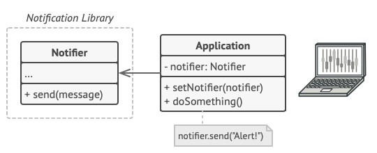
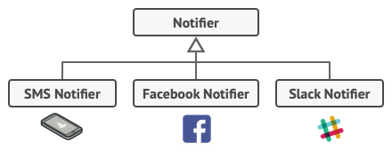
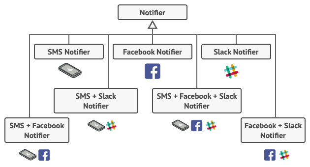
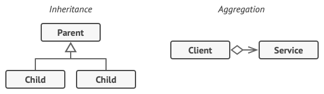
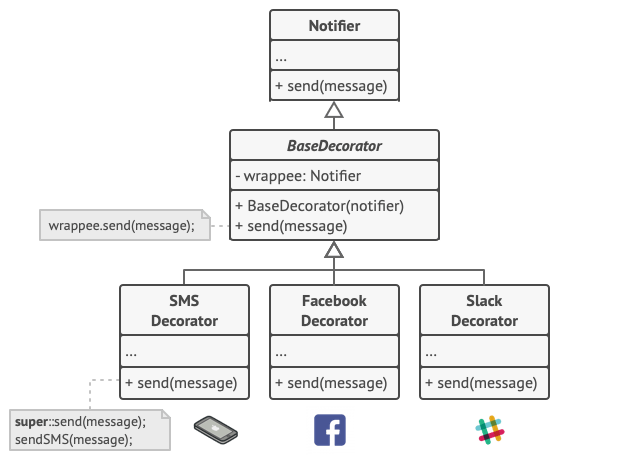
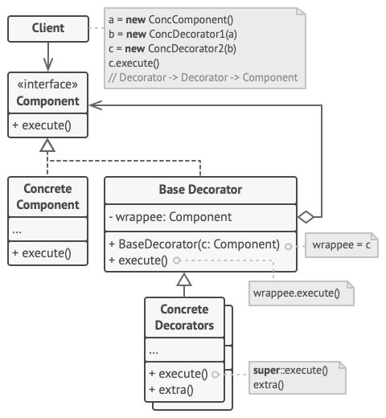
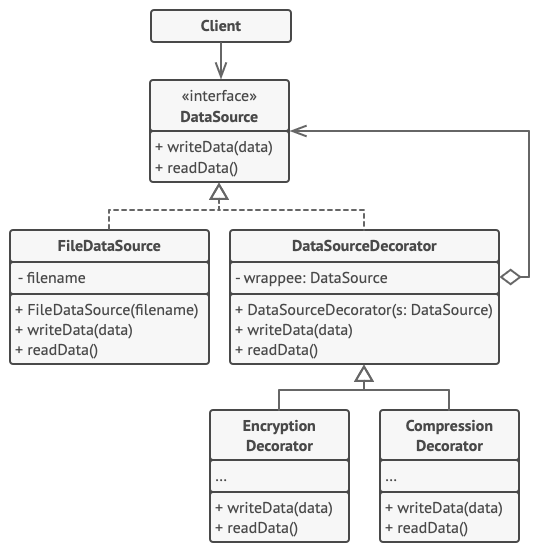

# Decorator

## 📜 Mục đích

**Decorator** là một design pattern thuộc nhóm structural giúp bạn thêm một hành vi mới vào đối tượng bằng cách đặt đối tượng đó vào trong một đối tượng đặc biệt có chứa hành vi đấy


## 😟 Vấn đề

Tưởng tượng bạn đang làm việc với một thư viện thông báo, nơi hỗ trợ các ứng dụng thông báo cho người dùng của họ khi có sự kiện quan trọng.

Phiên bản ban đầu của thư viện dựa trên lớp `Notifier` chỉ gồm một vài trường, hàm khởi tạo và phương thức `send` duy nhất. Phương thức này nhận các tham số tin nhắn từ client và gửi tin đến danh sách email đã được truyền đến `notifier` thông qua hàm khởi tạo. Ứng dụng bên thứ ba sẽ hành động như một client, tạo và cấu hình đối tượng `notifier` một lần, sau đó sử dụng nó cho tất cả các sự kiện quan trọng diễn ra.



Vào một thời điểm nào đó, bạn nhận về góp ý từ người dùng là họ mong muốn nhiều hơn thông báo từ email. Phần lớn họ muốn nhận thêm thông báo SMS. Số khác muốn thông báo trên Facebook, và một vài doanh nghiệp sử dụng muốn nhận thông báo từ Slack.



Điều này phải thay đổi như thế nào? Bạn phải mở rộng lớp `Notifier` và thêm các phương thức thông báo bổ sung vào lớp con mới. Bây giờ client sẽ tạo lớp thông báo mong muốn và sử dụng nó cho tất cả thông báo trong tương lai.

Nhưng lại có thêm một góp ý nữa là "Tại sao bạn không gửi nhiều kiểu thông báo cùng lúc? Nếu nhà bạn đang cháy, bạn có muốn nhận được thông tin từ mọi phương tiện không?"

Bạn sẽ phải giải quyết thêm vấn đề này bằng cách tạo lớp con đặc biệt là kết hợp tất cả phương thức thông báo trong một lớp. Tuy nhiên, rất nhanh chóng để nhận ra là cách tiếp cận này làm cho code phình to lên, không chỉ là ở thư viện mà cả ở code client.



Bạn cần tìm cách khác để cấu trúc lớp thông báo sao cho số lượng của chúng không vô tình phá vỡ kỷ lục Guinnesss.

## 😊 Giải pháp

Mở rộng lớp bằng kế thừa là điều đầu tiên người ta nghĩ đến khi cần thay đổi hành vi đối tượng. Tuy nhiên, kế thừa có nhiều vấn đề mà ta cần phải biết:
- Kế thừa là tĩnh. Bạn không thể thay đối hành vi của đối tượng đã tồn tại khi chạy. Bạn chỉ có thể thay thế đối tượng đấy với đối tượng khác được tạo từ lớp con khác.
- Lớp con có thể chỉ có một lớp cha. Trong hầu hết ngôn ngữ, một lớp không thể kế thừa từ nhiều lớp cha vào cùng thời điểm.

Một trong những cách khắc phục các vấn đề trên là sử dụng Aggregation(tổng hợp) hoặc Composition(phức hợp) thay vì kế thừa. Cả hai thay thế đều hoạt động giống nhau là tạo đối tượng tham chiếu đến đối tượng khác và uỷ quyền một số công việc cho đối tượng đấy. 
Ở kế thừa, bản thân đối tượng có thể thực hiện các công việc đó, bằng cách kế thừa hành vi từ lớp cha của nó.

Với cách tiếp cận mới bạn có thể dễ dàng thay thế liên kết giữa đối tượng với một đối tượng khác, để thay đổi hành vi của chúng khi đang chạy. Một đối tượng có thể sử dụng hành vi của các lớp khác nhau, có tham chiều đến nhiều đối tượng và uỷ thác cho nó tất cả loại công việc.

*Aggregation/composition* là nguyên tắc quan trọng đằng sau khá nhiều design pattern, bao gồm cả Decorator. Tuy nhiên, ta sẽ thảo luận về điều này sau.



**Wrapper** là tên thay thế cho Decorator đễ diễn đạt rõ ràng ý tưởng chính của pattern. Một Wrapper là một đối tượng có thể liên kết với một vài đối tượng đích(target). Wrapper chứa cùng một tập hợp phương thức như là target và ủy quyền cho nó tất cả các yêu cầu mà nó nhận được. Tuy nhiên, Wrapper có thể thay đổi kết quả bằng một vài hành động trước hoặc sau khi truyền yêu cầu đến target.

Khi nào một wrapper đơn giản trở thành một decorator? Như đã nhấn mạnh, wrapper triển khai cùng một interface như một đối tượng được bọc. Đấy là lý do tại sao từ góc nhìn client tất cả đối tượng là như nhau. Các trường tham chiếu của wrapper chấp nhận bất kỳ đối tượng nào theo sau interface đấy. Điều này giúp bạn có thể bọc một đối tượng trong nhiều wrapper và thêm các hành vi kết hợp của tất cả wrapper cho nó.

Trong ví dụ thư viện thông báo, ta chỉ chuyển phương thức thông báo email vào lớp cơ sở `Notifier`, và chuyển tất cả phương thức thông báo khác vào decorator.



Code client chỉ cần bọc đối tượng notifier đơn giản vào tập hợp của decorato ứng với mong muốn client. Đối tượng kết quả sẽ có cấu trúc như một ngăn xếp.


Decorator cuối cùng của ngăn xếp sẽ là đối tượng mà client thực sự làm việc. Vì tất cả decorator triển khai cùng interface, nên phần code client còn lại không quan tâm nó đang làm việc với đối tượng `notifier` thuần hay là decorator.

Ta có thể áp dụng cách tiếp cận này cho các hành vi khác như định dạng tin nhắn hoặc tạo danh sách người nhận. Client có thể tuỳ chỉnh đối tượng với bất kỳ decorator nào, miễn là nó theo cùng interface với những cái khác.

## 🚗 Thế Giới Thực


Mặc quần áo là ví dụ rõ ràng nhất sử dụng decorator. Khi bạn lạnh, bạn bọc cơ thể bằng áo len, khi vẫn còn lạnh bạn mặc thêm áo có mũ trên đầu. Nếu mưa bạn có thể dùng áo mưa. Tất cả những trang phục này “mở rộng” hành vi của bạn nhưng không phải là một phần của bạn và bạn có thể dễ dàng cởi bỏ bất kỳ bộ quần áo nào bất cứ khi không cần đến.

## 🏢 Cấu trúc



1. **Component** khai báo interface chung cho wrapper và đối tượng được bọc.
2. **Concrete Component** là lớp của đối tượng đang được bọc. Nó xác định các hành vi cơ bản, có thể bị thay đổi bởi decorator.
3. **Base Decorator** là lớp có có trường tham chiếu đến đối tượng được bọc. Trường này tham chiếu đến interface component, thế nên nó có thể bao gồm concrete components và decorator. Base decorator uỷ thác tất cả công việc cho đối tượng được bọc.
4. **Concrete Decorator** xác định hành vi mở rộng có thể thêm vào component một cách linh động. Concrete Decorator ghi đè phương thức của base decorator và thực thi hành vi của nó trước hoặc sau khi gọi phương thức cha.
5. **Client** có thể bọc component trong nhiều lớp của decorator, miễn là nó làm việc với tất cả đối tượng thông qua interface chung.

## 👨‍💻 Mã giả

Trong ví dụ này, Decorator cho phép bạn nén và mã hóa dữ liệu quan trọng độc lập với phần code sử dụng dữ liệu này.



Ứng dụng bọc đối tượng nguồn dữ liệu bằng một cặp decorator. Cả hai thay đổi cách dữ liệu được ghi và đọc từ ổ đĩa:
- Trước khi ghi dữ liệu vào ổ đĩa, decorator mã hoá và nén nó lại. Lớp gốc ghi dữ liệu - đã được mã hoá và bảo vệ - vào file mà không cần biết về bất kỳ thay đổi gì.
- Sau khi dữ liệu được đọc từ ổ đĩa, nó đi đến cùng decorator, nơi giải nén và giải mã nó.

Decorator và lớp nguồn dữ liệu triển khai cùng interface, điều này làm cho tất cả chúng có thể hoán đổi cho nhau trong code client.

```c
// Interface component xác định hành vi có thể
// thay đổi bởi decorator.
interface DataSource is
    method writeData(data)
    method readData():data

// Concrete component cung cấp triển khai mặc định cho
// các hành vi. Nó có thể có một số lớp biến thể khác
// nhau trong chương trình.
class FileDataSource implements DataSource is
    constructor FileDataSource(filename) { ... }

    method writeData(data) is
        // Ghi dữ liệu vào file

    method readData():data is
        // Đọc dữ liệu từ file.


// Lớp base decorator theo cùng một interface như là component
// khác. Mục đích chính của lớp này là xác định interface bọc
// cho tất cả concrete decorator. Triển khai mặc định của code
// bọc gồm một trường lưu trữ component được bọc và phương
// thức để khởi tạo nó.
class DataSourceDecorator implements DataSource is
    protected field wrappee: DataSource

    constructor DataSourceDecorator(source: DataSource) is
        wrappee = source

    // Base decorator uỷ thác tất cả công việc cho các 
    // component được bọc. Các hành vi mở rộng có thể
    // thêm vào concrete decorator.
    method writeData(data) is
        wrappee.writeData(data)

    // Concrete decorator có thể gọi đến cha để triển khai 
    // hoạt động thay vì gọi trực tiếp đối tượng được bọc. 
    // Cách tiếp cận này đơn giản hoá việc mở rộng lớp decorator.
    method readData():data is
        return wrappee.readData()


// Concrete decorator phải gọi phương thức trên đối tượng
// được bọc, nhưng phải thêm một vài thứ của nó vào kết
// quả. Docerator thực thi hành vi được thêm vào trước 
// hoặc sau khi gọi đối tượng được bọc.
class EncryptionDecorator extends DataSourceDecorator is
    method writeData(data) is
        // 1. Mã hoá dữ liệu truyền vào.
        // 2. Truyên dữ liệu đã mã hoá vào phương thức
        // writeData của wrappee

    method readData():data is
        // 1. Lấy dữ liệu từ phương thức readData của wrappee
        // 2. Giải mã nếu nó được mã hoá
        // 3. Trả về kết quả.

// Bạn có thể bọc đối tượng trong nhiều lớp decorators.
class CompressionDecorator extends DataSourceDecorator is
    method writeData(data) is
        // 1. Nén dữ liệu truyền vào.
        // 2. Truyền dữ liệu đã nén vào phương thức writeData
        // của wrappee

    method readData():data is
        // 1. Lấy dữ liệu từ phương thức readData của wrappee
        // 2. Giải nén nếu dữ liệu được nén
        // 3. Trả về kết quả

// Lựa chọn 1. Ví dụ đơn giản của decorator.
class Application is
    method dumbUsageExample() is
        source = new FileDataSource("somefile.dat")
        source.writeData(salaryRecords)
        // File đích đã ghi dữ liệu thuần.

        source = new CompressionDecorator(source)
        source.writeData(salaryRecords)
        // File đích đã ghi dữ liệu được nén.

        source = new EncryptionDecorator(source)
        // Biến source bây giờ bao gồm:
        // Encryption > Compression > FileDataSource
        source.writeData(salaryRecords)
        // File đã ghi dữ liệu được nén và mã hoá.


// Lựa chọn 2. Code client sử dụng nguồn dữ liệu bên ngoài.
// Đối tượng SalaryManager không biết và cũng không quan tâm
// nơi lưu trữ dữ liệu cụ thể. Nó làm việc với nguồn dữ liệu
// cấu hình trước từ ứng dụng.
class SalaryManager is
    field source: DataSource

    constructor SalaryManager(source: DataSource) { ... }

    method load() is
        return source.readData()

    method save() is
        source.writeData(salaryRecords)
    // ...Các phương thức hữu ích khác...


// Ứng dụng có thể lắp ghép các decorator khác nhau của
// ngăn xếp khi đang chạy, phù thuộc vào cấu hình hay
// môi trường.
class ApplicationConfigurator is
    method configurationExample() is
        source = new FileDataSource("salary.dat")
        if (enabledEncryption)
            source = new EncryptionDecorator(source)
        if (enabledCompression)
            source = new CompressionDecorator(source)

        logger = new SalaryManager(source)
        salary = logger.load()
    // ...
```

## 💡 Ứng dụng

**🐞 Sử dụng Decorator khi bạn cần thêm các hành vi bổ sung cho đối tượng khi đang chạy mà không làm ảnh hưởng đến code sử dụng đối tượng đó**

⚡ Decorator cho phép bạn cấu trúc logic nghiệp vụ thành các lớp(layer), tạo decorator cho từng lớp và tạo đối tượng với các kết hợp khác nhau theo logic đấy khi đang chạy. Code client có thể xử lý mọi đối tượng giống nhau vì chúng theo cùng interface.

**🐞 Sử dụng Decorator khi bạn cảm thấy khó khăn hoặc không thể mở rộng hành vi đối tượng bằng kế thừa**

⚡ Một vài ngôn ngữ lập trình có từ khoá `final` để ngăn chặn mở rộng thêm lớp. Đối với lớp final, chỉ có một cách để mở rộng hành vi là bọc lớp đấy lại bằng Decorator.

## 📋 Triển khai

1. Đảm bảo rằng phần code nghiệp vụ có thể biểu diễn bằng một component chính với các lớp tuỳ chọn trên nó.
2. Tìm ra phương thức chung cho component chính và các lớp tuỳ chọn. Tạo interface component và khai báo các phương thức cho nó.
3. Tạo lớp concrete component và xác định hành vi cơ sở của nó.
4. Tạo lớp decorator cơ sở. Nó nên có trường lưu trữ tham chiếu đến các đối tượng được bọc. Trường này nên khai báo cùng kiểu interface component để cho phép liên kết đến concrete component cũng như các decorator. Decorator cơ sở sẽ uỷ thác tất cả công việc cho các đối tượng được bọc.
5. Đảm bảo tất cả lớp triển khai theo interface component.
6. Tạo concrete decorator bằng cách mở rộng nó từ decorator cơ sở. Concrete decorator phải thực thi hành vi của nó trước hoặc sau gọi đến phương thức cha (nơi lưu uỷ thác công việc cho đối tượng được bọc).
7. Code client phải chịu trách nhiệm tạo decorator và cấu trúc chúng khi cần sử dụng.

## ⚖️ Ưu nhược điểm

### Ưu điểm

✔️ Bạn có thể mở rộng hành vi của đối tượng mà không cần lớp con.

✔️ Bạn có thể thêm hoặc xoá hành vi khỏi đối tượng khi đang chạy.

✔️ Bạn có thể kết hợp nhiều hành vi bằng cách bọc đối tượng trong nhiều decorator.

✔️ *Single Responsibility Principle*. Bạn có thể chia một khối lớp thành nhiều hành vi cho các lớp con.

### Nhược điểm

❌ Gặp khó khi xoá một wrapper cụ thể khỏi ngăn xếp.

❌ Gặp khó khi triển khai decorator nếu hành vi của nó không theo thứ tự trong ngăn xếp.

❌ Code cấu hình ban đầu của lớp sẽ rất tệ.

## 🔁 Quan hệ với các pattern khác

**Adapter** thay đổi interface của một đối tượng hiện có, trong khi **Decorator** nâng cao một đối tượng mà không thay đổi interface của nó. Ngoài ra, **Decorator** hỗ trợ thành phần đệ quy, điều này không thể thực hiện được khi bạn sử dụng **Adapter**.

**Adapter** cung cấp một interface khác cho đối tượng được bọc, **Proxy** cung cấp cho nó một interface tương tự và **Decorator** cung cấp cho nó một interface nâng cao.

**Chain of Responsibility** và **Decorator** có cấu trúc lớp rất giống nhau. Cả hai pattern đều dựa vào thành phần đệ quy để truyền việc thực thi qua một loạt các đối tượng. Tuy nhiên, có một số khác biệt quan trọng.

Các trình xử lý **CoR** có thể thực hiện các hoạt động tùy ý độc lập với nhau. Nó cũng có thể ngừng chuyển yêu cầu thêm vào bất kỳ lúc nào. Mặt khác, các **Decorator** khác nhau có thể mở rộng hành vi của đối tượng trong khi vẫn giữ cho nó nhất quán với interface cơ sở. Ngoài ra, **Decorator** không được phép phá vỡ quy trình của yêu cầu.

**Composite** và **Decorator** có các sơ đồ cấu trúc tương tự vì cả hai đều dựa vào thành phần đệ quy để tổ chức một số lượng các đối tượng kết thúc mở.

- **Decorator** giống như **Composite** nhưng chỉ có một thành phần con. Sự khác biệt đáng kể khác là **Decorator** thêm các trách nhiệm bổ sung cho đối tượng được bao bọc, trong khi **Composite** chỉ "tính tổng" các kết quả con của nó.

- Tuy nhiên, các pattern cũng có thể hợp tác: bạn có thể sử dụng **Decorator** để mở rộng hành vi của một đối tượng cụ thể trong cây **Composite**.

Các thiết kế sử dụng nhiều **Composite** và **Decorator** thường có thể được hưởng lợi từ việc sử dụng **Prototype**. Áp dụng pattern cho phép bạn sao chép các cấu trúc phức tạp thay vì xây dựng lại chúng từ đầu.

**Decorator** cho phép bạn thay đổi vẻ ngoài của một đối tượng, trong khi **Strategy** cho phép bạn thay đổi ruột.

**Decorator** và **Proxy** có cấu trúc tương tự, nhưng nội dung rất khác nhau. Cả hai pattern đều được xây dựng trên cùng nguyên tắc, trong đó một đối tượng được cho là ủy quyền một số công việc cho đối tượng khác. Sự khác biệt là **Proxy** thường tự quản lý vòng đời của đối tượng dịch vụ của nó, trong khi thành phần của **Decorator** luôn được kiểm soát bởi client.

# Nguồn 

[**refactoring**](https://refactoring.guru/design-patterns/decorator)