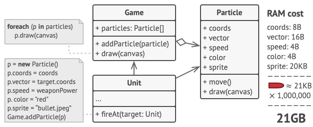
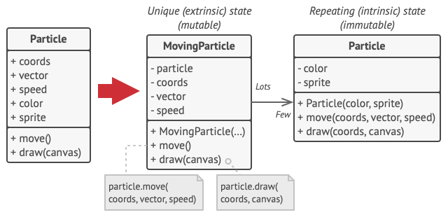
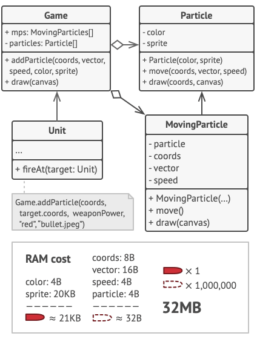
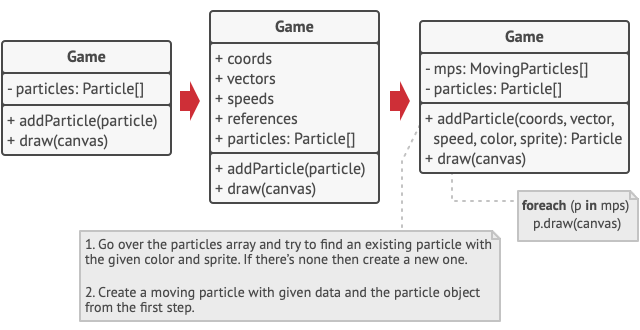
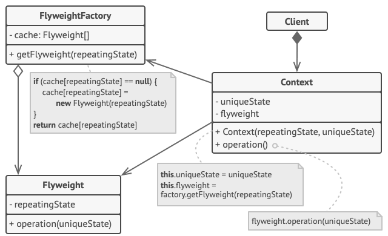

# Flyweight

## 📜 Mục đích

**Flyweight** là design pattern thuộc nhóm structural giúp bạn chỉnh các đối tượng phù hợp với dung lượng RAM bằng cách chia sẻ trạng thái chung giữa các đối tượng thay vì giữ tất cả dữ liệu ở một đối tượng.


## 😟 Vấn đề

Để tìm điều gì vui vẻ sau thời gian dài làm việc, bạn quyết định tạo một video game đơn giản: người chơi di chuyển vòng quanh bản đồ và bắn hạ các đối thủ. Bạn chọn triển khai hệ thống hạt (hệ thống phổ biến nhất dùng làm game effect trong Unity 3d)  và tạo các tính năng đặc biệt cho game. Sẽ có rất nhiều mảnh đạn, tên lửa và mảnh bom từ các vụ nổ văng khắp bản đồ và mang lại trải nghiệm ly kỳ cho người chơi.

Sau hoàn thành, bạn commit lần cuối, tạo game và gửi nó cho người bạn để kiểm tra thử. Mặc dù game chạy hoàn hảo trên máy bạn, nhưng người bạn của bạn lại không thể chơi trong thời gian dài. Vì nó bị crash sau vài phút trên máy anh ta. Sau nhiều giờ tìm hiểu debug log, bạn nhận ra game bị crash vì nó không đủ RAM. Bởi vì máy tính của anh ta không mạnh như máy bạn, nên các sự cố mới xảy ra.

Thực ra vấn đề này có liên quan đến hệ thống hạt. Với mỗi hạt, ví dụ như đạn, tên lửa hay mảnh bom sẽ được biểu diễn bởi một đối tượng riêng bao gồm nhiều dữ liệu. Cùng thời điểm đó, nếu người chơi tàn sát lẫn nhau trên màn hình, các hạt mới tạo ra không vừa với dung lượng RAM còn lại, nên chương trình bị crash. 



## 😊 Giải pháp

Khi kiểm tra kỹ hơn các lớp `Particle`, bạn sẽ nhận ra các trường `color` và `sprite`(ảnh biểu diễn hạt) tiêu thụ nhiều bộ nhớ hơn các trường khác. Điều tệ ở đây là hai trường này lưu trữ phần lớn dữ liệu giống hệt nhau ở tất cả hạt. Ví dụ, tất cả đạn đều có cùng màu sắc và sprite.



Mặt khác các trạng thái hạt như `coords`(toạ độ), `vector`(hướng chuyển động) và `speed`(tốc độ) là không trùng cho mỗi hạt. Đồng thời, giá trị các trường này sẽ thay đổi theo thời gian. Dữ liệu biểu diễn nó luôn thay đổi khi hạt tồn tại, trong khi màu sắc và sprite không đổi cho mỗi hạt.

Dữ liệu không đổi này của một đối tượng thường được gọi là *intrinsic state(trạng thái nội tại)*. Nó ở bên trong đối tượng; các đối tượng khác chỉ có thể đọc nó, không thể thay đổi nó. Phần còn lại của trạng thái của đối tượng, thường bị thay đổi “từ bên ngoài” bởi các đối tượng khác, được gọi là *extrinsic state(trạng thái bên ngoài)*.

Ý tưởng của Flyweight là thay vì lưu trữ các trạng thái bên ngoài trong đối tượng. Bạn truyền trạng thái đó vào một phương thức cụ thể. Chỉ giữ lại trạng thái nội tại bên trong đối tượng, sử dụng nó cho các bối cảnh khác nhau. Do đó, bạn sẽ cần ít các đối tượng này hơn vì chúng chỉ khác nhau ở trạng thái nội tại, thứ có ít biến thể hơn nhiều so với trạng thái bên ngoài.



Quay lại với trò chơi ở trên. Giả sử rằng ta đã trích xuất trạng thái bên ngoài khỏi lớp `Particle`,  giờ chỉ còn ba đối tượng khác nhau là đủ để đại diện cho tất cả các hạt trong trò chơi: một viên đạn, một tên lửa và một mảnh bom. Như bạn có thể đã đoán, một đối tượng chỉ lưu trữ trạng thái bên trong được gọi là *flyweight*.

### Lưu trữ trạng thái bên ngoài

Vậy trạng thái bên ngoài được chuyển đi đâu? Một vài lớp sẽ lưu trữ nó? Đúng vậy, đa số trường hợp nó được chuyển đến đối tượng container, thứ tổng hợp các đối tượng trước khi áp dụng pattern.

Ở trường hợp này, đối tượng chính `Game` là nơi lưu trữ tất cả các hạt ở trường `particles`. Để chuyển trạng thái bên ngoài vào lớp này, bạn cần tạo nhiều trường kiểu mảng cho lưu trữ toạ độ, vector và tốc độ cho từng hạt. Đồng thời, bạn sẽ cần một mảng khác cho lưu trữ tham chiếu đến flyweight riêng để biểu diễn hạt. Các mảng này phải đồng bộ với nhau nên bạn phải truy cập tất cả dữ liệu của hạt với cùng một chỉ số.



Giải pháp gọn gàng hơn là tạo lớp ngữ cảnh riêng để lưu trữ trạng thái bên ngoài cùng với tham chiếu đến đối tượng flyweight. Cách tiếp cận này chỉ yêu cầu một mảng duy nhất trong lớp container.

Đợi đã! Chúng ta không cần tất cả đối tượng ngữ cảnh như ban đầu sao? Về mặt kỹ thuật, thì đúng là như vậy. Nhưng hãy nhìn lại, các đối tượng bây giờ đã nhỏ hơn trước rất nhiều. Các trường tiêu thụ nhiều bộ nhớ nhất đã được chuyển vào các đối tượng flyweight. Bây giờ một ngàn đối tượng ngữ cảnh có thể sử dụng lại một đối tượng flyweight thay vì phải tự lưu trữ hàng ngàn bản sao dữ liệu.

### Flyweight và tính bất biến

Vì cùng một đối tượng flyweight có thể dùng trong các bối cảnh khác nhau, bạn phải đảm bảo rằng nó không thể bị sửa đối. Một flyweight nên khởi tạo trạng thái một lần duy nhất, thông qua tham số từ hàm khởi tạo.Nó không được để lộ bấy kỳ setter hay trường công khai nào với đối tượng khác.

### Flyweight factory

Để truy cập các flyweight khác nhau tiện lợi hơn, bạn có thể tạo phương thức factory để quản lý pool của đối tượng flyweight đã tồn tại. Phương thức chấp nhận trạng thái nội tại của flyweight mong muốn từ client, tìm kiếm flyweight đã tồn tại ứng với trạng thái này, và trả về nếu tìm gặp. Nếu không nó sẽ tạo flyweight mới và thêm vào pool.

Ở đây có khá nhiều lựa chọn để đặt phương thức này. Đa số là ở flyweight container. Một vài trường hợp, bạn có thể tạo lớp factory mới. Hoặc bạn có thể tạo phương thức factory tĩnh và đặt vào trong nó lớp flyweight.

## 🏢 Cấu trúc



Flyweight chỉ là một sự tối ưu hoá. Trước khi áp dụng nó, hãy đảm bảo chương trình của bạn có vấn đề tiêu thụ RAM liên quan đến số lượng khổng lồ các đối tượng giống nhau trong bộ nhớ cùng lúc. Đồng thời vấn đề này không thể giải quyết bằng bất kỳ cách nào khác.

1. **Flyweight** lớp bao gồm phần trạng thái gốc của đối tượng có thể được chia sẻ giữa nhiều đối tượng. Cùng đối tượng flyweight có thể được sử dụng trong nhiều ngữ cảnh khác nhau. Trạng thái lưu trữ trong flyweight được gọi là *intrinsic*(nội tại). Trạng thái được chuyền đến phương thức của flyweight được gọi là *extrinsic*(bên ngoài).
2. **Context** lớp bao gồm trạng thái bên ngoài, duy nhất trên tất cả đối tượng gốc. Khi context được ghép nối với một đối tượng flyweight, nó biểu diễn tất cả trạng thái của đối tượng gốc.
3. Thông thường, hành vi của đối tượng gốc tồn tại trong lớp flyweight. Trong trường hợp này, bất cứ ai gọi phương thức của flyweight cũng phải truyền các bit phù hợp của trạng thái bên ngoài vào tham số của phương thức. Mặt khác, hành vi có thể được chuyền đến lớp context, nới sử dụng liên kết flyweight đơn thuần như một đối tượng dữ liệu.
4. **Client** tính toán hoặc lưu trữ trạng thái bên ngoài của flyweight. Từ góc nhìn client, một flyweight là một đối tượng mẫu thứ có thể được cấu hình khi đang chạy bằng cách truyền một vài dữ liệu ngữ cảnh vào tham số của phương thức của nó.

## 👨‍💻 Mã giả

Trong ví dụ này, Flyweight giúp giảm mức sử dụng bộ nhớ khi hiển thị hàng triệu đối tượng dạng cây trên canvas.


Pattern mở rộng trạng thái nội tại bị lặp của lớp `Tree` và chuyển nói vào lớp flyweight `TreeType`.

Bây giờ thay vì lưu trữ cùng một dữ liệu trong nhiều đối tượng, nó chỉ lưu trong vài đối tượng flyweight và liên kết đến đối tượng `Tree` phù hợp,thứ hành động như một context. Code client tạo đối tượng cây mới sử dụng flyweight factory, thứ gói gọn sự phức tạp của việc tìm kiếm đối tượng phù hợp và sử dụng lại nó nếu cần.

```c
// Lớp flyweight bao gồm một phần trạng thái của cây. Các
// trường lưu trữ giá trị đơn nhất cho từng cây riêng biêt.
// Ví dụ, bạn sẽ không tìm thấy ở đây toạ độ cây. Nhưng ở đây
// sẽ có cấu hình và màu sắc được dùng cung giữa nhiều cây. 
// Vì dữ liệu này thường rất LỚN, bạn không muốn lãng phí phần
// lớn bộ nhớ để lưu trữ nó cho từng đối tượng cây. Vì thế mà,
// bạn trích xuất kết cấu, màu sắc và các dữ liệu lặp lại khác
// vào một đối tượng riêng biệt mà các cây có thể tham chiếu
// đến.
class TreeType is
    field name
    field color
    field texture
    constructor TreeType(name, color, texture) { ... }
    method draw(canvas, x, y) is
        // 1. Tạo bitmap cho kiểu, màu sắc và kết cấu.
        // 2. Vẽ bitmap trên canvas theo toạ độ X và Y.

// Flyweight factory quyết định xem sử dụng lại flyweight
// hiện có hay tạo đối tượng mới.
class TreeFactory is
    static field treeTypes: collection of tree types
    static method getTreeType(name, color, texture) is
        type = treeTypes.find(name, color, texture)
        if (type == null)
            type = new TreeType(name, color, texture)
            treeTypes.add(type)
        return type


// Đối tượng ngữ cảnh bao gồm phần trạng thái bên ngoài của cây.
// Ứng dụng có thể tạo hàng tỉ cái vì nó rất nhỏ: chỉ bao gồm hai
// số nguyên cho toạ độ và một trường tham chiếu.
class Tree is
    field x,y
    field type: TreeType
    constructor Tree(x, y, type) { ... }
    method draw(canvas) is
        type.draw(canvas, this.x, this.y)


// Lớp Tree và Forest là client của flyweight.
// Bạn có thể gộp chúng nếu không có ý đinh phát
// triển lớp Tree xa hơn.
class Forest is
    field trees: collection of Trees

    method plantTree(x, y, name, color, texture) is
        type = TreeFactory.getTreeType(name, color, texture)
        tree = new Tree(x, y, type)
        trees.add(tree)

    method draw(canvas) is
        foreach (tree in trees) do
            tree.draw(canvas)
```

## 💡 Ứng dụng

**🐞 Sử dụng Flyweight khi chương trình bạn tạo ra một số lượng lớn đối tượng không phù hợp với lượng RAM khả dụng**

⚡ Lợi ích của áp dụng pattern này nằm ở việc nó được dùng như thế nào và ở đâu. Nó sẽ hữu ích nhất khi: 
- ứng dụng cần tạo một số lượng rất lớn đối tượng giống nhau.
- điều này làm cạn RAM khả dụng của thiết bị
- đối tượng bao gồm các trạng thái trùng lặp có thể trích xuất và chia sẻ giữa nhiều đối tượng.

## 📋 Triển khai

1. Chia các trường của lớp sẽ trở thành flyweight, thành hai phần:
    - trạng thái nội tại: các trường dữ liệu không thay đổi trùng lặp với nhiều đối tượng
    - trạng thái bên ngoài: các trường dữ liệu theo ngữ cảnh duy nhất cho mỗi đối tượng.
2. Chuyển các trường biểu diễn trạng thái nội tại vào một lớp. Đảm bảo rằng nó luôn bất biến. Ta chỉ nên tạo trạng thái ban đầu cho nó trong hàm khởi tạo.
3. Đi đến phương thức sử dụng trạng thái bên ngoài. Với từng trường sử dụng phương thức thêm tham số mới và dùng nó thay cho trường.
4. Tuỳ chon, tạo lớp factory để quản lý pool của flyweight. Nó kiểm tra flyweight đã tồn tại trước khi tạo mới. Sau khi factory hoạt động, client nên gửi yêu cầu flyweight thông qua nó. Client có thể mô tả flyweight mong muốn bằng cách truyền trạng thái nội tại của nó đến factory.
5. Client nên lưu trữ hoặc tính toán giá trị của trạng thái bên ngoài (ngữ cảnh) có thể gọi phương thức của đối tượng flyweight. Vì tiện lợi, trạng thái bên ngoài cùng với trường tham chiếu đến flyweight có thể được chuyển đến lớp ngữ cảnh riêng biệt.

## ⚖️ Ưu nhược điểm

### Ưu điểm

✔️ Bạn có thể tiết kiệm rất nhiều RAM, nếu chương trình của bạn có rất nhiều đối tượng giống nhau.

### Nhược điểm

❌ Bạn có thể trao đổi RAM quá mức với các chu kỳ CPU khi một số dữ liệu ngữ cảnh cần được tính toán lại mỗi khi ai đó gọi phương thức flyweight.

❌ Code trở nên phức tạp hơn nhiều. Các thành viên mới trong nhóm sẽ luôn thắc mắc tại sao trạng thái của một thực thể lại được tách ra theo cách như vậy

## 🔁 Quan hệ với các pattern khác

Bạn có thể triển khai các nút leaf chia sẻ của cây **Composite** dưới dạng **Flyweights** để tiết kiệm dung lượng RAM.

**Flyweight** cho thấy cách tạo nhiều đối tượng nhỏ, trong khi **Facade** cho thấy cách tạo một đối tượng duy nhất đại diện cho toàn bộ hệ thống con.

**Flyweight** sẽ giống với **Singleton** nếu bạn bằng cách nào đó giảm được tất cả các trạng thái được chia sẻ của các đối tượng xuống chỉ còn một đối tượng flyweight. Nhưng có hai điểm khác biệt cơ bản giữa các pattern này:

- Chỉ nên có một thực thể **Singleton**, trong khi lớp **Flyweight** có thể có nhiều thực thể với các trạng thái nội tại khác nhau.
- Đối tượng **Singleton** có thể thay đổi được. Đối tượng **Flyweight** là bất biến.

# Nguồn

[**refactoring**](https://refactoring.guru/design-patterns/flyweight)
