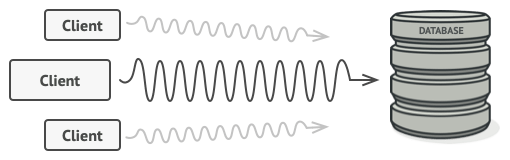
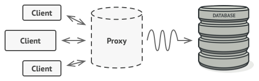
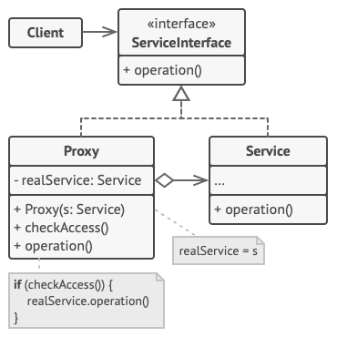

# Proxy

## 📜 Mục đích

**Proxy** là một design pattern thuộc nhóm structural cho phép bạn cung cấp một vật thay thế hoặc vật giữ chỗ cho một đối tượng khác. Một proxy kiểm soát quyền truy cập đến đối tượng ban đầu, cho phép bạn thực hiện điều gì đó trước hoặc sau khi yêu cầu được chuyển đến đối tượng ban đầu.


## 😟 Vấn đề

Tại sao bạn muốn kiểm soát truy cập đến một đối tượng? Hãy xem một ví dụ: nếu bạn có một đối tượng khổng lồ tiêu thụ một lượng lớn tài nguyên hệ thống. Bạn sẽ chỉ cần nó trong một vài thời điểm chứ không phải mọi lúc.



Thế nên bạn có thể triển khai lazy initialization: tạo đối tượng chỉ khi thực sự cần đến nó. Tất cả đối tượng của client sẽ cần thực thi một số code deferred initialization. Thật không may điều này có thể gây ra code trùng lặp.

Nếu như đặt code này trực tiếp vào lớp đối tượng thì chỉ có thể thực hiện ở thế giới lý tưởng, vì thực tế lớp này có thể là một phần của một thư viện bên thứ 3.

## 😊 Giải pháp

Proxy đưa ra ý tưởng rằng bạn nên tạo một lớp proxy mới với interface giống như đối tượng dịch vụ ban đầu. Sau đó, bạn cập nhật ứng dụng của mình để ứng dụng chuyển đối tượng proxy đến tất cả các client của đối tượng ban đầu. Khi nhận được yêu cầu từ client, proxy sẽ tạo một đối tượng dịch vụ thực và ủy thác tất cả công việc cho nó.



*Proxy cải trang bản thân như một đối tượng cơ sở dữ liệu. Nó có thể thực hiện lazy initialization và lưu kết quả vào bộ đêm mà cả cả client và cơ sở dữ liệu thực không hề biết.*

Vậy điều này có lợi ích gì? Nếu bạn cần thực thi điều gì đó trước hoặc sau logic chính của lớp, proxy sẽ giúp bạn làm điều đó mà không cần thay đổi lớp. Vì proxy triển khai cùng interface với lớp gốc, nên nó có thể được truyền đến bất kỳ client nào đang mong đợi một đối tượng dịch vụ thực.

## 🚗 Thế Giới Thực 


Credit card là một proxy cho một tài khoản khoản ngân hàng, thứ là proxy cho một khoản tiền mặt. Cả hai triển khai cùng interface để bạn có thể sử dụng nó cho thanh toán. Điều này làm khách hàng cảm thấy thoải mái vì họ không cần phải mang theo tiền mặt mọi lúc. Đồng thời chủ shop cũng cảm thấy vui vẻ vì số tiền từ một giao dịch điện tử đến tài khoản ngân hàng của shop sẽ giảm nguy cơ bị mất đặt cọc hay bị cướp trên đường. 

## 🏢 Cấu trúc



1. **Service Interface** khai báo interface của **Service**. Proxy phải theo sau interface này để có thể cải trang bản thân như một đối tượng dịch vụ.
2. **Service** lớp cung cấp logic nghiệp vụ hữu ích thực sự.
3. **Proxy** lớp có trường tham chiếu đến một đối tượng dịch vụ. Sau khi proxy kết thúc tiến trình của nó (lazy initialization, logging, điều khiển truy cập, catching,...) nó truyền yêu cầu đến đối tượng dịch vụ thực.
Thông thường, proxy quản lý chu kỳ hoàn chỉnh của đối tượng dịch vụ.
4. **Client** nên làm việc với cả service và proxy thông qua cùng interface. Cách này giúp bạn có thể truyền proxy vào bất kỳ đoạn code nào cần một đối tượng dịch vụ.

## 👨‍💻 Mã giả

Ví dụ này, minh họa cách Proxy có thể giúp lưu vào bộ nhớ cache và lazy initialization với thư viện tích hợp YouTube của bên thứ ba.


Thư viện cung cấp cho ta một lớp để tải video về. Tuy nhiên, nó rất kém hiệu quả. Nếu ứng dụng client yêu cầu cùng một video nhiều lần, thư viện sẽ tải nó nhiều lần thay vì lưu vào bộ nhớ đệm và sử dụng lại file tải về đầu tiên.

Lóp proxy triển khai cùng interface như lớp tải về gốc và uỷ thác cho nó tất cả công việc. Tuy nhiên, nó sẽ theo dõi các file đã tải về và lấy kết quả từ bộ đệm khi ứng dụng yêu cầu cùng một video nhiều lần.

```c
// Interface của dịch vụ từ xa.
interface ThirdPartyYouTubeLib is
    method listVideos()
    method getVideoInfo(id)
    method downloadVideo(id)


// Triển khai cụ thể của dịch vụ kết nối. Phương thức của lớp
// này có thể yêu cầu thông tin từ Youtube. Tốc độ của yêu cầu 
// dựa trên kết nối internet của người dùng cũng như của Youtube.
// Ứng dụng sẽ tải chậm nếu có nhiều yêu cầu cùng lức, kể cả khi
// tất cả yêu cầu cùng một thông tin.
class ThirdPartyYouTubeClass implements ThirdPartyYouTubeLib is
    method listVideos() is
        // Gửi yêu cầu API đến YouTube.

    method getVideoInfo(id) is
        // Lấy metadata về một vài video.

    method downloadVideo(id) is
        // Tải file video từ YouTube.


// Để tiết kiệm brandwidth, bạn có thể lưu kết quả yêu cầu vào 
// bộ đệm và giữ nó cho một vài thời điểm. Nhưng không thể
// đặt code trực tiếp vào lớp service. Ví dụ, nó có thể được
// cung cấp như là một phần của thư viện bên thứ ba đã xác 
// định là `final`. Đó là lý do tại sao ta đặt code caching vào 
// lớp proxy mới, thứ triển khai interface giống như là lớp
// service. Nó uỷ thác cho đối tượng service chỉ khi yêu cầu 
// thực sự cần gửi đi.
class CachedYouTubeClass implements ThirdPartyYouTubeLib is
    private field service: ThirdPartyYouTubeLib
    private field listCache, videoCache
    field needReset

    constructor CachedYouTubeClass(service: ThirdPartyYouTubeLib) is
        this.service = service

    method listVideos() is
        if (listCache == null || needReset)
            listCache = service.listVideos()
        return listCache

    method getVideoInfo(id) is
        if (videoCache == null || needReset)
            videoCache = service.getVideoInfo(id)
        return videoCache

    method downloadVideo(id) is
        if (!downloadExists(id) || needReset)
            service.downloadVideo(id)


// Lớp GUI, thứ đã từng làm việc trực tiếp với đối tượng service,
// không cần thay đổi gì miễn là nó làm việc với đối tượng service
// thông qua một interface. Ta có thể truyền đối tượng proxy thay
// vì đối tượng service thực vì cả hai triển khai cùng interface.
class YouTubeManager is
    protected field service: ThirdPartyYouTubeLib

    constructor YouTubeManager(service: ThirdPartyYouTubeLib) is
        this.service = service

    method renderVideoPage(id) is
        info = service.getVideoInfo(id)
        // Hiển thị trang video.

    method renderListPanel() is
        list = service.listVideos()
        // Hiển thi danh sách hình ảnh của video.

    method reactOnUserInput() is
        renderVideoPage()
        renderListPanel()

// Ứng dụng có thể cấu hình proxy đang chạy.
class Application is
    method init() is
        aYouTubeService = new ThirdPartyYouTubeClass()
        aYouTubeProxy = new CachedYouTubeClass(aYouTubeService)
        manager = new YouTubeManager(aYouTubeProxy)
        manager.reactOnUserInput()
```

## 💡 Ứng dụng

Có rất nhiều cách để sử dụng Proxy. Hãy cùng điểm qua những cách sử dụng phổ biến nhất.

**🐞 Lazy intialization (virtual proxy). Khi bạn có một đối tượng dịch vụ nặng gây lãng phí tài nguyên hệ thống do luôn hoạt động, mặc dù thỉnh thoảng bạn mới cần nó.**

⚡ Thay vì tạo đối tượng khi ứng dụng khởi chạy, bạn có thể trì hoãn việc khởi chạy đối tượng đến thời điểm thực sự cần thiết.

**🐞 Kiểm soát truy cập (protection proxy). Khi bạn muốn chỉ những client cụ thể mới có thể sử dụng đối tượng dịch vụ.**

⚡ Ví dụ: khi các đối tượng của bạn là các phần quan trọng của hệ điều hành và các ứng dụng client là các ứng dụng được khởi chạy khác nhau (bao gồm cả những ứng dụng độc hại).

Proxy có thể chuyển yêu cầu đến đối tượng dịch vụ nếu thông tin đăng nhập của client phù hợp với một số tiêu chí.

**🐞 Thực thi cục bộ một dịch vụ từ xa (remote proxy). Khi đối tượng dịch vụ được đặt trên một máy chủ từ xa.**

⚡ Trong trường hợp này, proxy chuyển yêu cầu của client qua mạng, xử lý tất cả các chi tiết khó chịu khi làm việc với mạng.

**🐞 Logging request (logging proxy). Khi bạn muốn giữ lịch sử của các yêu cầu đối với đối tượng dịch vụ.**

⚡ Proxy có thể ghi lại từng yêu cầu trước khi chuyển nó đến dịch vụ.

**🐞 Lưu kết quả yêu cầu vào bộ đệm (caching proxy). Khi bạn cần lưu vào bộ đệm kết quả của các yêu cầu client và quản lý vòng đời của bộ đệm này, đặc biệt nếu kết quả khá lớn.**

⚡ Proxy có thể triển khai bộ nhớ đệm cho các yêu cầu định kỳ luôn mang lại kết quả giống nhau. Proxy có thể sử dụng các tham số của yêu cầu làm khóa bộ nhớ cache.

**🐞 Tham chiếu thông minh. Khi bạn cần loại bỏ một đối tượng nặng khi không có ứng dụng client nào sử dụng nó.**

⚡ Proxy có thể theo dõi các client nhận được tham chiếu đến đối tượng dịch vụ hoặc kết quả của nó. Đôi khi, proxy có thể đi qua các client và kiểm tra xem chúng có còn hoạt động hay không. Nếu danh sách client trống, proxy có thể loại bỏ đối tượng dịch vụ và giải phóng tài nguyên hệ thống.

Proxy cũng có thể theo dõi xem client đã sửa đổi đối tượng dịch vụ hay chưa. Sau đó, các đối tượng không thay đổi có thể được sử dụng lại bởi các client khác.

## 📋 Triển khai

1. Nếu không có interface dịch vụ nào có sẵn, hãy tạo một interface để làm cho các đối tượng proxy và dịch vụ có thể hoán đổi cho nhau. Không phải lúc nào bạn cũng có thể trích xuất interface khỏi lớp dịch vụ vì bạn cần thay đổi tất cả các client của dịch vụ sử dụng interface đó. Kế hoạch B là làm cho proxy trở thành lớp con của lớp dịch vụ và theo cách này nó sẽ kế thừa interface của dịch vụ.
2. Tạo lớp proxy. Nó phải có một trường để lưu trữ một tham chiếu đến dịch vụ. Thông thường, proxy tạo và quản lý toàn bộ vòng đời của các dịch vụ của họ. Trong những trường hợp hiếm hoi, một dịch vụ được client chuyển tới proxy thông qua một phương thức khởi tạo.
3. Thực hiện các phương pháp ủy quyền theo mục đích của chúng. Trong hầu hết các trường hợp, sau khi thực hiện một số công việc, proxy sẽ ủy quyền công việc cho đối tượng dịch vụ.
4. Xem xét việc thêm một phương pháp tạo quyết định xem client nhận được một proxy hay một dịch vụ thực sự. Đây có thể là một phương thức tĩnh đơn giản trong lớp proxy hoặc một phương thức gốc đầy đủ.
5. Xem xét việc triển khai lazy initialization cho đối tượng dịch vụ.

## ⚖️ Ưu nhược điểm

### Ưu điểm

✔️ Bạn có thể kiểm soát đối tượng dịch vụ mà client không biết về nó.

✔️ Bạn có thể quản lý vòng đời của đối tượng dịch vụ khi client không quan tâm đến nó.

✔️ Proxy hoạt động ngay cả khi đối tượng dịch vụ chưa sẵn sàng hoặc không có sẵn.

✔️ *Open/Closed Principle*. Bạn có thể thêm proxy mới mà không cần thay đổi dịch vụ hoặc ứng dụng client.

### Nhược điểm

❌ Code có thể trở nên phức tạp hơn vì bạn cần giới thiệu nhiều lớp mới.

❌ Phản hồi từ dịch vụ có thể bị trì hoãn.


## 🔁 Quan hệ với các pattern khác

**Adapter** cung cấp một interface khác cho đối tượng được bọc, **Proxy** cung cấp cho nó một interface tương tự và **Decorator** cung cấp cho nó một interface nâng cao.

**Decorator** và **Proxy** có cấu trúc tương tự, nhưng nội dung rất khác nhau. Cả hai pattern đều được xây dựng trên cùng nguyên tắc, trong đó một đối tượng được cho là ủy quyền một số công việc cho đối tượng khác. Sự khác biệt là **Proxy** thường tự quản lý vòng đời của đối tượng dịch vụ của nó, trong khi thành phần của **Decorator** luôn được kiểm soát bởi client.

**Facade** tương tự như **Proxy** ở chỗ cả hai đều đệm một thực thể phức tạp và tự khởi tạo nó. Không giống như **Facade**, **Proxy** có interface giống với đối tượng dịch vụ của nó, điều này làm cho chúng có thể hoán đổi cho nhau.

# Nguồn

[**refactoring**](https://refactoring.guru/design-patterns/proxy)
